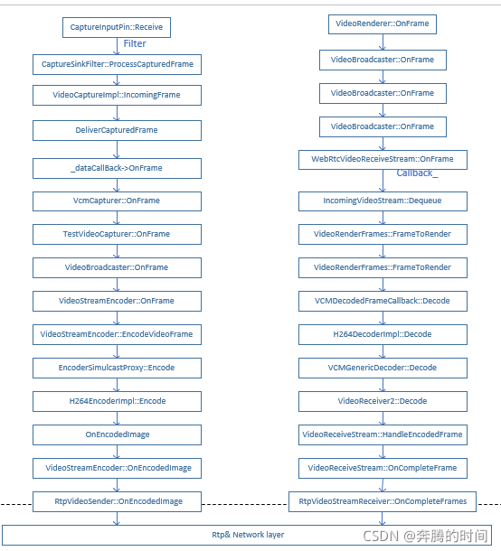
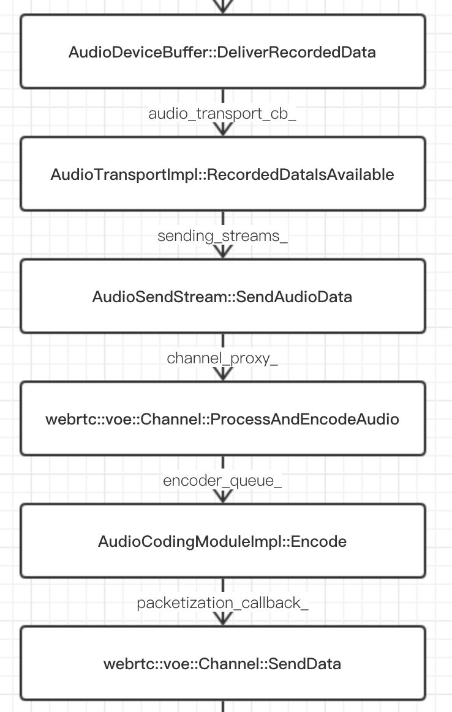
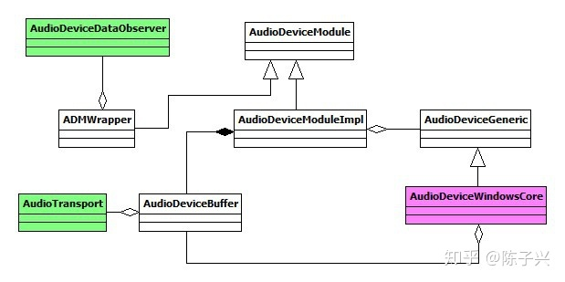

# 参考资料

源码

https://source.chromium.org/chromium/chromium/src

[WebRTC 国内镜像](https://webrtc.org.cn/mirror/)：声网的，包括编译


官方文档   http://webrtc.github.io/webrtc-org/native-code/development/   


## 编译

[windows编译webrtc - shunxiang - 博客园 (cnblogs.com)](https://www.cnblogs.com/shawn-meng/articles/16014199.html)


## 面试


## 音频

[音频管理模块AudioDeviceModule解读 - 知乎 (zhihu.com)](https://zhuanlan.zhihu.com/p/296684134)

[WebRTC系列之音频的那些事 - SegmentFault 思否](https://segmentfault.com/a/1190000023424959)

[webrtc native开发-麦克风设置 - it610.com](https://www.it610.com/article/1275616547095724032.htm)：这个是个音频采集的例子，代码可以看懂

[WebRTC 的音频处理流水线_tq08g2z的专栏-CSDN博客](https://blog.csdn.net/tq08g2z/article/details/103684797)：这个是讲解 AudioTransport的文章

[(2条消息) WebRTC本地音频回调、选用音频采集设备及自定义输入音频_骑着蜗牛上高速_wyt的博客-CSDN博客](https://blog.csdn.net/weixin_39343678/article/details/99948451?utm_medium=distribute.pc_aggpage_search_result.none-task-blog-2~aggregatepage~first_rank_ecpm_v1~rank_v31_ecpm-16-99948451.pc_agg_new_rank&utm_term=webrtc+音频采集+格式&spm=1000.2123.3001.4430)


## 视频

**<font color=navy size=4>摄像头采集</font>**

这篇文章是讲解大体使用的 [WebRTC Native开发实战之数据采集--摄像头 - 星星,风,阳光 - 博客园 (cnblogs.com)](https://www.cnblogs.com/xl2432/p/13851490.html)


**<font color=navy size=4>视频数据编码</font>**

大体上的使用，细节的话（各个类的关系）还需自己看源码 [WebRTC Native开发实战之视频编码 - 星星,风,阳光 - 博客园 (cnblogs.com)](https://www.cnblogs.com/xl2432/p/13864448.html)


## 屏幕捕获

讲解是使用的 很好的一篇文章 [WebRTC Native开发实战之数据采集--屏幕 - 星星,风,阳光 - 博客园 (cnblogs.com)](https://www.cnblogs.com/xl2432/p/13856533.html)


## 源码分析博客

[(3条消息) WebRTC源码分析_邱国禄的博客-CSDN博客](https://blog.csdn.net/qiuguolu1108/category_9644420.html)

**<font color=navy size=4>下面的链接 写的是一些 线程，消息，码率等控制的 源码分析</font>**

[webrtc - 随笔分类 - woder - 博客园 (cnblogs.com)](https://www.cnblogs.com/ishen/category/1619028.html)


## 宏观架构分析

[Webrtc - 文集 - 简书 (jianshu.com)](https://www.jianshu.com/nb/19250913)


## 必须知道的官网

### chrome://webrtc-internals/

调试的时候使用


### chrome://webrtc-internals/

例子


### https://source.chromium.org/chromium/chromium/src

查看源码


# 不懂的地方


## audioTrack

### audiotrack创建

> 1. `audiotrack`  是 在哪里， 以及 `audiosource`
> 2. `audiodevice` 中采集到的数据怎么  流到了  `audiotrack` 中
> 3. 就像 `videodevice` -> `videosource` -> `videotrack`  这样的流程


### audiotrack.setenable()

> 这个使能禁止track 流程是怎么样的，从哪个函数流到那个函数中
>
> 最终是怎么禁止远端听到数据的

## 腾讯demo

[文档中心 - 声网Agora](https://docs.agora.io/cn)


# 一、WebRTC了解

## 1、什么是WebRTC

读者自行百度

个人理解：是一个实时通信的的开源技术，P2P（端到端通信）

**通俗的說**：想要直接用浏览器打电话给另外一个浏览器？WebRTC正是你所需要的，并且可以让你完成以前做不到的很多事情。比如说浏览器内的音视频通话，文件传输，屏幕共享，或者服务器低依赖聊天。

## 2、能干什么


## 3、来源

**“WebRTC，名称源自网页实时通信（Web Real-Time Communication）的缩写，是一个支持网页浏览器进行实时语音对话或视频对话的技术，是谷歌2010年以6820万美元收购Global IP Solutions公司而获得的一项技术，Google开源了这项技术！”**

就冲着6000多万美金的技术，就很值得研究一下！WebRTC提供了视频会议的核心技术，包括音视频采集、编解码、网络传输、显示等功能，并且还支持跨平台：Windows，Linux，Mac，Android，尤其是在实时通信方面的很多技术可以灵活嫁接到非RTC类流媒体系统中，例如，在低带宽下的视频抖动控制，图像效果增强，通用NAT穿透过程等等（后面咱们再具体细说如何嫁接），那么这就需要我们对WEBRTC的整体流程以及深层次的框架进行熟悉和掌控，这一篇里，我们先通过浏览器端WEBRTC视频通话过程，了解WEBRTC浏览器基本接口和一次RealTime视频通话的流程。

## 4、信令

这部分等待了解完流程之后再看

**可以通俗的理解为媒婆，具体的传输数据是不管的，他只是管理指挥，你两成没成，你两断了后又要聊天呢？**


## 5、何为ICE

[WebRTC ICE介绍 - 知乎 (zhihu.com)](https://zhuanlan.zhihu.com/p/351105085)

==**这篇文章讲的通俗易懂**==

[交互式连接建立（ICE） - 知乎 (zhihu.com)](https://zhuanlan.zhihu.com/p/25087606)

[WebRTC TURN协议初识及turnserver实践 - 知乎 (zhihu.com)](https://zhuanlan.zhihu.com/p/71025431)

这部分等待了解完流程之后再看


ICE (Interactive Connecctivity Establishment, 交互式连接建立)，ICE 不是一种协议，而是整合了 STUN 和 TURN 两种协议的框架。

**其中：**STUN（Sesssion Traversal Utilities for NAT, NAT 会话穿越应用程序），它允许位于 NAT（或多重 NAT）后的客户端找出自己对应的公网 IP 地址和端口，也就是俗称的==P2P“打洞”==。

**但是：**如果 NAT 类型是对称型的话，那么就无法打洞成功。这时候 TURN 就派上用场了，TURN（Traversal USing Replays around NAT）是 STUN/[RFC5389](https://www.rfc-editor.org/rfc/rfc5389) 的一个拓展协议在其基础上添加了 Replay(中继)功能。

简单来说：其目的就是解决对称 NAT 无法穿越的问题，在 STUN 分配公网 IP 失败后，可以通过 TURN 服务器请求公网 IP 地址作为中继地址。


### ICE候选者

- 1）**主机候选者**：表示的是本地局域网内的 IP 地址及端口。它是三个候选者中优先级最高的，也就是说在 WebRTC 底层，首先会尝试本地局域网内建立连接；
- 2）**反射候选者**：表示的是获取 NAT 内主机的外网 IP 地址和端口。其优先级低于 主机候选者。也就是说当 WebRTC 尝试本地连接不通时，会尝试通过反射候选者获得的 IP 地址和端口进行连接；
- 3）**中继候选者**：表示的是中继服务器的 IP 地址与端口，即通过服务器中转媒体数据。当 WebRTC 客户端通信双方无法穿越 P2P NAT 时，为了保证双方可以正常通讯，此时只能通过服务器中转来保证服务质量了。

所以说信令的交换不需要所谓的ICE？而ICE是为了媒体数据的实时传输(P2P).


## 6、何为web服务


web服务就是web服务程序对外提供的数据服务。额(⊙o⊙)…，这种教科书式的定义估计你不喜欢，Me too。那就来讲一个案例吧。

**比如：**银行里业务

​	常见的业务有存钱、取钱、开户、改密等。当我们去办理业务时，我们就是客户（**你在你电脑上打开的浏览器**），柜台人员就是服务者；客户向服务者发送办理某种业务的请求（**如同web请求**），如发送取钱的请 求，服务者首先要验证客户提交的资料是否合规，若不合规本次请求被停止，并反馈给客户（**如同服务程序回应客户的web请求**）；如果合规则业务继续办理，同时也给客户反馈结果。虽然是同一个服务者，但是可以办理不同的业务（同web API），可以开户、存钱、取钱、改密码 等。在案例中，web服务就像是银行服务者提供的业务服务， web服务程序就是银行柜台的服务者（软件），银行大厅就是服务器（硬件），我们即将编写的服务程序就像是在“创造”一个服务者。好了，这些关键的概念讲解就到这里，接下来单独讲解最后一个关键概念——数据服务。

**数据服务**：顾名思义就是和数据操作相关的服务，比如读取文章列表、读取某篇文章详情、新增一篇文章到服务器服务等。每一个服务就是一个业务，和在银行中存钱、取钱业务是一样的。web服务的数据服务提供方式就是对外开放URL地址，客户只需要通过URL就可以申请并办理相应的“业务”。

还是上面的例子，我们来模拟这几条web数据服务。

​	假设主机的地址是http://www.abc.com,针对上述这些数据服务，我们可以这样划分：①、http://www.abc.com/article/getArticleList 来表示读取文章列。在这里需要注意，URL的层级划分，一般用“/”来标识，至于这里为什么要用“/article/getArticleList”完全是开发者自定义，就我的个人习惯，觉得这种业务层级划分比较清晰，仅此而已。②、http://www.abc.com/article/getArticle表示读取某篇文章。③、http://www.abc.com/article/addArticle表示新增一篇文章到服务端业务。

　　 **小结下**。web服务器如同银行大厅，硬件，在计算机体系中表现为一台主机；web服务程序如图银行柜台的服务者，软件，在计算机体系中表现为一个程序；web服务如同银行的业务服务，由web服务程序提供， 一个web服务程序会提供很多个web服务，每个web服务对外的表现就是一个URL地址。

## 7、SDP

[WebRTC之SDP篇 - 简书 (jianshu.com)](https://www.jianshu.com/p/48079ba9a96c)

### 理解

用来协商会话能力的**协议**，通过 Offer/Answer 机制进行协商

常说的通信双方要通过single服务器交换SDP数据， 那这些数据是什么数据，干什么用的

通俗的理解：

+ 我本地的编解码器支持的格式     相当于你说的话到我这边我能翻译过来（你说的英语，我就能解码知道，你说的韩语，那我就不能支持）
+ 带宽
+ 网络数据，对方的公网IP、端口、内网IP及端口


**<font size=5>简单的SDP例子</font>**

<table>
    <tr>
        <td bgcolor=#2d2d2d>
            <font color=#999>
v=<font color=red>0</font> <br />                                                     
o=<font color=red>- 5910110687297165449 2 IN IP4 127.0.0.1</font><br /> 
s=-<br />
t=0 0<br />
...<br />
//第一个媒体流，音频流<br />
m=audio 54797 UDP/TLS/RTP/SAVPF 8<br />
...<br />
//第2个媒体流，视频流<br />
m=video 9 UDP/TLS/RTP/SAVPF 125<br />
...<br />
//第3个媒体流， 数据通道<br />
m=application 9 UDP/DTLS/SCTP webrtc-datachannel<br />
                ...<br /></font>
		</td>   
	</tr> 
</table>


### SDP的会话层

> 会话级别部分以 “v=” 行开始并继续到第一个媒体级别部分：示例如下：
>
> ```sdp
> v=0 
> 	//v=<version> （必选）
> 	//这里的v表示SDP的版本，即version的缩写，其值为SDP的版本号
> 	//SDP版本号，一直为0，rfc4566规定
> 	
> o=- 5910110687297165449 2 IN IP4 127.0.0.1
> 	//o=<username> <session id> <version> <network type> <address type> <address>（必选）
> 	//o=表示的是对会话发起者的描述， o是session owner的缩写
> 	//<username> 用户名，当不关心用户名的时候，可以用 - 替代
> 	//<session id> 此会话的标识符，一般使用NTP时间戳
> 	//<version> 表示此会话的版本，会话建立后支持实时修改，此版本号就是一般用修改次数来表示
> 	// <network type> 网络类型，一般用“IN”，表示Internet
> 	//<address type> 地址类型，一般为 "IP4"
> 	// <address> IP地址
> 	//7017624586836067756是整个会话的编号，2表明会话版本，
> 	//若是在会话过程当中有改变编码之类的操作，从新生成sdp时,sess-id不变，sess-version加1
> 	
> s=-
> 	//s=<session name>（必选）
> 	//该行表示此会话的名称，不关心可以用 - 代替。
> 	
> t=0 0
> 	//t=<start time> <stop time>（必选）
> 	//t代表 time the session is active
> 	//t=0 0 表示此会话是一个永久会话，永不失效
> 
> a=group:BUNDLE 0 1 2
> 	// a=<type> 或 a=<type>:<values>
> 	//此行表示属性，用于进一步说明会话信息
> 	//此例子表示将各媒体会话绑定起来创建一个组，用于传输。支持三种媒体流绑定传输
> 	//a表示此行为 attribute line
> 	//需要共用一个传输通道传输的媒体，若是没有这一行，音视频，数据就会分别单独用一个udp端口来发送
> 	
> a=msid-semantic: WMS
> 	//WMS是WebRTC Media Stream简称，这一行定义了本客户端支持同时传输多个流，
> 	//一个流能够包括多个track,通常定义了这个，后面a=ssrc这一行就会有msid,mslabel等属性
> ```
>


### SDP的媒体层

> 每个媒体级别部分都以“m=”行开头，继续到下一个媒体级别部分或整个会话结束;
>
> `m=<media> <port> <proto> <fmt> ...`
>
> ```
> m=audio 9 UDP/TLS/RTP/SAVPF 111 63 103 104 9 0 8 106 105 13 110 112 113 126
> ```
>
> + **media**：媒体类型，可以为 “audio”、“video”、“text”、“application”、“message”，表示音频类型、视频类型、文本类型、应用类型、消息类型等，以后也可能扩展其他类型；
> + **port**： 媒体流发送的传输端口。表示在对应的本地端口上发送流，传输端口的含义取决于在相关的“c=”字段中指定所使用的网络，并在传输在媒体字段的 子字段中定义的协议；媒体应用程序使用的其他端口（例如 (RTCP) 端口) 可以使用同一个(端口复用)或可以在单独的属性中指定“a=rtcp:” ）；注意单独制定的rtcp端口一般在这个端口上+1；
> + **proto**：流传输协议。举例说明：
>   `RTP/SAVPF` 表示用 `UDP` 传输 `RTP` 包；
>   `TCP/RTP/SAVPF` 表示用 `TCP` 传输 `RTP` 包；
>   `UDP/TLS/RTP/SAVPF` 表示用 `UDP` 来传输 `RTP` 包，并且使用 `TLS` 加密；
>   最后的 SAVPF 还有其他几种值：AVP, SAVP, AVPF, SAVPF。
>   AVP 意为 AV profile
>   S 意为 secure
>   F 意为 feedback
> + **fmt** 表示媒体格式描述，它可能是一串数字，代表多个媒体，这个字段的含义与 proto 字段的类型相关。在后面，可以使用"a=rtpmap:"、“a=fmtp:”、“a=rtcp-fb” 等扩展字段来对 fmt 进行说明。
>   示例如下：


> 连接数据（c=）:媒体的连接信息（Connection information）。每个媒体描述中至少包含一个 `c =` 字段，或者在会话描述中包含一个 `c =` 字段。
>
> ```
> c=<nettype> <addrtype> <connection-address>
> ```
>
> - <nettype> 网络类型。IN表示Internet网络类型，目前仅定义该网络类型；
> - <addrtype> 地址类型。目前支持IPV4和IPV6两种地址类型；
> - <unicast-address> 会话发起者的IP地址。


> 属性（a=）：属性（attribute）是扩展SDP的主要手段，分为`会话级`属性和`媒体级`属性:
>
> ```
> a=<attribute> | <attribute>:<value>
> ```
>
> - **会话级属性**：添加在第一个媒体描述之前，传达的信息适用于整个会议而不是单个媒体。
>   
>   - `a=group:BUNDLE audio video` 通过mid标识符把多个媒体属性连接起来；
>   - `a=msid-semantic: WMS ma` 表示是webrtc媒体流（Webrtc Media Streams）；
>   
> - **媒体级属性**：媒体描述中添加有关媒体流的信息。a=有两个特别的属性类型，即下面要介绍rtpmap和fmtp
>   
>   - ```objectivec
>     a=rtpmap:125 H264/90000
>     //rtpmap(可选)。
>     //a=rtpmap:<payload type> <encoding name>/<clock rate> [/<encodingparameters>]
>     //rtpmap是rtp与map的结合，即RTP参数映射表。
>     //<payload type> 负载类型，对应RTP包中的音视频数据负载类型
>     //<encoding name> 编码器名称，如VP8、VP9、OPUS
>     //<sample rate> 采样率，如音频的采样率频率32000、48000等
>     //<encodingparameters> 编码参数，如音频是否是双声道，默认是单声道
>     ```
>   
>   + ```objectivec
>     a=fmtp:125 level-asymmetry-allowed=1;packetization-mode=1;profile-level-id=42e01f
>     //a=fmtp:<payload type> <format specific parameters>
>     //fmtp 格式参数，即format parameters
>     //<payload type> 负载类型，同样对应RTP包中音视频数据负载类型
>     //( level-asymmetry-allowed=1;packetization-mode=1;profile-level-id=42e01f) H264编码的可选附加参数
>     ```
>


### WebRTC中的SDP

> webrtc对标准SDP规范做了一些调整，它将SDP按功能分成几大块：
>
> - Session Metadata，会话元数据
> - Network Description 网络描述
> - Stream Description， 流描述
> - Security Description，安全描述
> - Qos Grouping Description，服务质量描述

```swift
//=============会话描述====================
v=0 
o=- 7017624586836067756 2 IN IP4 127.0.0.1
s=-
t=0 0
...

//================媒体描述=================
//================音频媒体=================
/*
 * 音频使用端口1024收发数据
 * UDP/TLS/RTP/SAVPF 表示使用 dtls/srtp 协议对数据加密传输
 * 111、103 ... 表示本会话音频数据的 Payload Type
 */
 m=audio 1024 UDP/TLS/RTP/SAVPF 111 103 104 9 0 8 106 105 13 126 

//==============网络描述==================
//指明 接收或者发送音频使用的IP地址，由于WebRTC使用ICE传输，这个被忽略。
c=IN IP4 0.0.0.0
//用来设置rtcp地址和端口，WebRTC不使用
a=rtcp:9 IN IP4 0.0.0.0
...

//==============音频安全描述================
//ICE协商过程中的安全验证信息
a=ice-ufrag:khLS
a=ice-pwd:cxLzteJaJBou3DspNaPsJhlQ
a=fingerprint:sha-256 FA:14:42:3B:C7:97:1B:E8:AE:0C2:71:03:05:05:16:8F:B9:C7:98:E9:60:43:4B:5B:2C:28:EE:5C:8F3:17
...

//==============音频流媒体描述================
a=rtpmap:111 opus/48000/2
//minptime代表最小打包时长是10ms，useinbandfec=1代表使用opus编码内置fec特性
a=fmtp:111 minptime=10;useinbandfec=1
...
a=rtpmap:103 ISAC/16000
a=rtpmap:104 ISAC/32000
a=rtpmap:9 G722/8000
...

//=================视频媒体=================
m=video 9 UDP/TLS/RTP/SAVPF 100 101 107 116 117 96 97 99 98
...
//=================网络描述=================
c=IN IP4 0.0.0.0
a=rtcp:9 IN IP4 0.0.0.0
...
//=================视频安全描述=================
//进入连通性检测的用户名
a=ice-ufrag:khLS  
//密码，这两个是用于连通性检查的凭证
a=ice-pwd:cxLzteJaJBou3DspNaPsJhlQ 
//DTLS指纹认证，以识别是否是合法用户
a=fingerprint:sha-256 FA:14:42:3B:C7:97:1B:E8:AE:0C2:71:03:05:05:16:8F:B9:C7:98:E9:60:43:4B:5B:2C:28:EE:5C:8F3:17
...

//================视频流描述===============
a=mid:video
...
a=rtpmap:100 VP8/90000
//================服务质量描述===============
a=rtcp-fb:100 ccm fir //解码出错，请求关键帧
a=rtcp-fb:100 nack //支持丢包重传，参考rfc4585
a=rtcp-fb:100 nack pli  //与fir类似，
a=rtcp-fb:100 goog-remb //使用google的宽带评估算法
a=rtcp-fb:100 transport-cc //启动防拥塞
...
```


### SDP示例

```
v=0
//sdp版本号，一直为0,rfc4566规定
o=- 7017624586836067756 2 IN IP4 127.0.0.1
//username如何没有使用-代替，7017624586836067756是整个会话的编号，2表明会话版本
s=-
//会话名，没有的话使用-代替
t=0 0
//两个值分别是会话的起始时间和结束时间，这里都是0表明没有限制
a=group:BUNDLE audio video data
//须要共用一个传输通道传输的媒体，若是没有这一行，音视频，数据就会分别单独用一个udp端口来发送
a=msid-semantic: WMS h1aZ20mbQB0GSsq0YxLfJmiYWE9CBfGch97C
//WMS是WebRTC Media Stream简称，这一行定义了本客户端支持同时传输多个流，一个流能够包括多个
//track,通常定义了这个，后面a=ssrc这一行就会有msid,mslabel等属性


m=audio 9 UDP/TLS/RTP/SAVPF 111 103 104 9 0 8 106 105 13 126
//m=audio说明本会话包含音频，9表明音频使用端口9来传输，在webrtc中通常不使用，
//若是设置为0，表明不传输音频,UDP/TLS/RTP/SAVPF是表示用户来传输音频支持的协议，
//udp、tls、rtp表明使用udp来传输rtp包，并使用tls加密；
//SAVPF表明使用srtcp的反馈机制来控制通讯过程,
//111 103 104 9 0 8 106 105 13 126表示本会话音频支持的编码，后台几行会有详细补充说明

c=IN IP4 0.0.0.0
//这一行表示你要用来接收或者发送音频使用的IP地址，webrtc使用ice传输，不使用这个地址
a=rtcp:9 IN IP4 0.0.0.0
//用来传输rtcp地地址和端口，webrtc中不使用

a=ice-ufrag:khLS
a=ice-pwd:cxLzteJaJBou3DspNaPsJhlQ
//以上两行是ice协商过程当中的安全验证信息
a=fingerprint:sha-256 FA:14:42:3B:C7:97:1B:E8:AE:0C2:71:03:05:05:16:8F:B9:C7:98:E9:60:43:4B:5B:2C:28:EE:5C:8F3:17
//以上这行是dtls协商过程当中须要的认证信息

a=setup:actpass
//以上这行表明本客户端在dtls协商过程当中，能够作客户端也能够作服务端，参考rfc4145 rfc4572
a=mid:audio
//在前面BUNDLE这一行中用到的媒体标识
a=extmap:1 urn:ietf:params:rtp-hdrext:ssrc-audio-level
//上一行指出我要在rtp头部中加入音量信息，参考 rfc6464
a=sendrecv
//上一行指出我是双向通讯，另外几种类型是recvonly,sendonly,inactive
a=rtcp-mux
//上一行指出rtp,rtcp包使用同一个端口来传输
a=rtpmap:111 opus/48000/2
a=rtcp-fb:111 transport-cc
//上面几行都是对m=audio这一行的媒体编码补充说明，指出了编码采用的编号，采样率，声道等
//以上这行说明opus编码支持使用rtcp来控制拥塞，参考https://tools.ietf.org/html/draft-holmer-rmcat-transport-wide-cc-extensions-01
a=fmtp:111 minptime=10;useinbandfec=1
//对opus编码可选的补充说明,minptime表明最小打包时长是10ms，useinbandfec=1表明使用opus编码内置fec特性
a=rtpmap:103 ISAC/16000
a=rtpmap:104 ISAC/32000
a=rtpmap:9 G722/8000
a=rtpmap:0 PCMU/8000
a=rtpmap:8 PCMA/8000
a=rtpmap:106 CN/32000
a=rtpmap:105 CN/16000
a=rtpmap:13 CN/8000
a=rtpmap:126 telephone-event/8000
a=ssrc:18509423 cname:sTjtznXLCNH7nbRw
//cname用来标识一个数据源，ssrc当发生冲突时可能会发生变化，可是cname不会发生变化，也会出现在rtcp包中SDEC中，
//用于音视频同步
a=ssrc:18509423 msid:h1aZ20mbQB0GSsq0YxLfJmiYWE9CBfGch97C 15598a91-caf9-4fff-a28f-3082310b2b7a
//以上这一行定义了ssrc和WebRTC中的MediaStream,AudioTrack之间的关系，msid后面第一个属性是stream-id,第二个是track-id
a=ssrc:18509423 mslabel:h1aZ20mbQB0GSsq0YxLfJmiYWE9CBfGch97C
a=ssrc:18509423 label:15598a91-caf9-4fff-a28f-3082310b2b7a


m=video 9 UDP/TLS/RTP/SAVPF 100 101 107 116 117 96 97 99 98
//参考上面m=audio,含义相似

c=IN IP4 0.0.0.0
a=rtcp:9 IN IP4 0.0.0.0

a=ice-ufrag:khLS
a=ice-pwd:cxLzteJaJBou3DspNaPsJhlQ
a=fingerprint:sha-256 FA:14:42:3B:C7:97:1B:E8:AE:0C2:71:03:05:05:16:8F:B9:C7:98:E9:60:43:4B:5B:2C:28:EE:5C:8F3:17

a=setup:actpass
a=mid:video
a=extmap:2 urn:ietf:params:rtp-hdrext:toffset
a=extmap:3 http://www.webrtc.org/experiments/rtp-hdrext/abs-send-time
a=extmap:4 urn:3gpp:video-orientation
a=extmap:5 http://www.ietf.org/id/draft-hol ... de-cc-extensions-01
a=extmap:6 http://www.webrtc.org/experiments/rtp-hdrext/playout-delay
a=sendrecv

a=rtcp-mux
a=rtcp-rsize
a=rtpmap:100 VP8/90000
a=rtcp-fb:100 ccm fir
//ccm是codec control using RTCP feedback message简称，意思是支持使用rtcp反馈机制来实现编码控制，
//fir是Full Intra Request简称，意思是接收方通知发送方发送帧过来
a=rtcp-fb:100 nack
//支持丢包重传，参考rfc4585
a=rtcp-fb:100 nack pli
//支持关键帧丢包重传,参考rfc4585
a=rtcp-fb:100 goog-remb
//支持使用rtcp包来控制发送方的码流
a=rtcp-fb:100 transport-cc
//参考上面opus
a=rtpmap:101 VP9/90000
a=rtcp-fb:101 ccm fir
a=rtcp-fb:101 nack
a=rtcp-fb:101 nack pli
a=rtcp-fb:101 goog-remb
a=rtcp-fb:101 transport-cc
a=rtpmap:107 H264/90000
a=rtcp-fb:107 ccm fir
a=rtcp-fb:107 nack
a=rtcp-fb:107 nack pli
a=rtcp-fb:107 goog-remb
a=rtcp-fb:107 transport-cc
a=fmtp:107 level-asymmetry-allowed=1;packetization-mode=1;profile-level-id=42e01f
//h264编码可选的附加说明
a=rtpmap:116 red/90000
//fec冗余编码，通常若是sdp中有这一行的话，rtp头部负载类型就是116，不然就是各编码原生负责类型
a=rtpmap:117 ulpfec/90000
//支持ULP FEC，参考rfc5109
a=rtpmap:96 rtx/90000
a=fmtp:96 apt=100
//以上两行是VP8编码的重传包rtp类型
a=rtpmap:97 rtx/90000
a=fmtp:97 apt=101
a=rtpmap:99 rtx/90000
a=fmtp:99 apt=107
a=rtpmap:98 rtx/90000
a=fmtp:98 apt=116
a=ssrc-group:FID 3463951252 1461041037
//在webrtc中，重传包和正常包ssrc是不一样的，上一行中前一个是正常rtp包的ssrc,后一个是重传包的ssrc
a=ssrc:3463951252 cname:sTjtznXLCNH7nbRw
a=ssrc:3463951252 msid:h1aZ20mbQB0GSsq0YxLfJmiYWE9CBfGch97C ead4b4e9-b650-4ed5-86f8-6f5f5806346d
a=ssrc:3463951252 mslabel:h1aZ20mbQB0GSsq0YxLfJmiYWE9CBfGch97C
a=ssrc:3463951252 label:ead4b4e9-b650-4ed5-86f8-6f5f5806346d
a=ssrc:1461041037 cname:sTjtznXLCNH7nbRw
a=ssrc:1461041037 msid:h1aZ20mbQB0GSsq0YxLfJmiYWE9CBfGch97C ead4b4e9-b650-4ed5-86f8-6f5f5806346d
a=ssrc:1461041037 mslabel:h1aZ20mbQB0GSsq0YxLfJmiYWE9CBfGch97C
a=ssrc:1461041037 label:ead4b4e9-b650-4ed5-86f8-6f5f5806346d


m=application 9 DTLS/SCTP 5000

c=IN IP4 0.0.0.0

a=ice-ufrag:khLS
a=ice-pwd:cxLzteJaJBou3DspNaPsJhlQ
a=fingerprint:sha-256 FA:14:42:3B:C7:97:1B:E8:AE:0C2:71:03:05:05:16:8F:B9:C7:98:E9:60:43:4B:5B:2C:28:EE:5C:8F3:17

a=setup:actpass
a=mid:data
a=sctpmap:5000 webrtc-datachannel 1024
```


## 8、source track sink stream区别与联系

[webrtc源码阅读理解一 - 2BiTT - 博客园 (cnblogs.com)](https://www.cnblogs.com/qwj-sysu/p/15335619.html)      本地目录有保存一份


### 1、source & sink 的关系

source是生产媒体资源的，sink负责消费。

可以理解为 source是提供数据的（不一定是元数据），那么sink就是接受数据的（）

+ 采集类：提供视频数据的，那么它应该是继承VideoSourceInterface，需要把数据传给别人
+ 渲染类：接受数据的，接受到数据后显示出来，应该是继承VideoSinkInterface.

webrtc中 既是source又是sink的类有很多，

+ 他们作为sink：从下层模块接受数据
+ 作为source：推送到上层模块

+ 比如：**videoBroadcaster**、**WebRtcVideoCapture**、**VcmCapturer**..

### 2、source、track、stream

视频数据source要变成track最后要形成 stream

通知接口有三个继承者MediaSourceInterface，MediaStreamTrackInterface，MediaStreamInterface，基本source、track、stream都是通知者

#### MediaSourceInterface

定义了媒体源的基本状态，媒体大类有两个，音频和视频，所以有两个继承者VideoTrackSourceInterface，AudioSourceInterface

#### MediaStreamTrackInterface

videoTrackInterface还继承了videoSourceInterface


#### MediaStreamInterface

stream是videoTrack和audioTrack的组合


### 3、videoTrackSource、videoSource、videoTrack的区别


+ VideoTrackSourceInterface是属于  source 中的，VideoTrackSourceInterface继承 VideoSourceInterface，区别于VideoSourceInterface是因为它里面有了source的一些信息，将与source解耦。    而且  VideoSourceInterface 是一个纯粹的源（保存数据的类）， 但是 VideoTrackSourceInterface 同时继承了通知者类，所以这货还是带逻辑的  

### Track

track（轨道）：音频轨或者视频轨

Track 翻译成轨道, 其实就是对一组source 和 sink 封装

==**如果直接使用source 绑定 sink 不就可以了，为什么还需要Track呢，Track 解决什么问题？**==

+ 如果一个source 可以属于多个track, 这样就可以让不同的sink 绑定同一个source，会导致无法应对多种状态
+ track 中保存了一些状态信息和处理，这样就和source 解耦

说的什么狗几把，还是不懂

通俗的理解：

+ 我有一个摄像头负责采集数据，那么用于显示数据的设备有好几个


### stream

stream（流）：包含音频轨和视频轨的编码流

## 协议

### 网络协议通俗地讲就是网络上两台计算机之间通信所要遵守的共同标准。

这么讲还是不够通俗易懂，所以我们可以打个比方：

有两个人，一个中国人，一个法国人，如下：

​             	(用英语交流)

中国人------------------------------------法国人

（讲中文）                     （讲法语）

  [会英语]                       	 [会英语]

 <英语协议>                  	<英语协议>


这两个人要想交流，必须讲一门双方都懂的语言。如果大家都不会讲对方的民族语言，那么可以选择双方都懂的第三方的语言来交流，比如“讲英语”。那么这时候“英语”实际上就成为一种“网络协议”。

把网络协议比做通用语言只是一种形象比喻，实际上协议本身比自然语言要简单的多，但是却比自然语言更严谨。协议规定了一种交流信息的格式或者说规范，比如：字符“LOVE”表示什么意思，第2个字节表示什么含义等……只要大家都按同样的规范来表达自己的意思，对方就能“听懂”你的意思。

同一种“规范”遵守的人多了，就成为一种事实上的“标准”。比如TCP/IP协议就成为了一种最流行的网络协议。

# 二、WebRTC通信流程


## 1、webrtc的通信架构

**在实际的应用场景中，音视频的通信场景大体可以分为这几种：**

### Mesh

#### 1）1对1通信图

 一对一的实时音视频互动，如微信电话，在==webrtc==技术规范中，通信方式推荐以P2P为主，即通信双方的音视频流数据直接点到点传输，无需经过服务端程序的中转，网络拓扑图如下图2.1.1。


#### 2）多人通信图

这种p2p模式的有优点：无需服务端中转，服务器的开销低；传输质量好（传输质量依赖客户端自身的带宽情况）；缺点是端结构简单。如果再有第三个人加入进来群聊，则拓扑图如下图所示。

多人通信架构.png)


**上行，下行的概念**

两端通信，每端需要维护2个连接，一个上行一个下行，

当三端通信时， 每个端需要维护4个连接， 两个上行，两个下行，

以此类推，以这种完全P2P的模式下通信，在人数较少时比较不错，但是人数较多时就不太适合，每个端要维护的连接数剧增，带宽资源消耗大，而且每个连接产生的音视频数据都需要编解码，还得考虑编解码的CPU消耗，每个端的网络资源和CPU资源消耗较多。这种以P2P为主的通信模式我们称之为Mesh。优点够明显，缺点也不可忽略。在实际的场景应用中，该模式可以支持4到6人。

### SFU

Mesh架构在人数较少的通信场景中表现良好，但应对多人的场景就比较吃力，为了支持多人的场景，如人数较多的视频群聊/视频会议，于是演化出新得架构——SFU。


在SFU架构中，音视频发送方只需维护一个上行连接，由SFU服务器自行分发流数据到对应的接收端；如上图中，A向B和C发送数据，无需单独一个一个发，而是统一发到SFU服务器即可，较Mesh架构来说，在发送端节约了上行的资源。但是在接收端，即下行连接还是没有解决，有N个发送端就有N-1（不包含自己，自己看自己的视频无需网络传输）个下行连接。

**总体来讲，SFU架构较Mesh来讲，节省了发送端的上行连接，带来的代价就是部署SFU服务，SFU服务只做转发，不涉及编解码，所以服务端的压力较小，在多人的同时通信中推荐使用 。**

### MCU

在MCU架构中，每个端只需要上行下行连接各一路流，编解码以及合流（因为每个端只有一个下行连接，但这个连接里含有多个发送端的流，所以需要合起来传输）由MCU Server来承担，虽然从带宽上解决了客户端问题，但是**服务器的压力很大**，这种模式也就是传统的视频会议的架构。


## 2、通信流程

#### 流程图


**==理解：==就像你在路上看到个美女，你回家之后念念不忘，就想跟人家说话（打个视频电话），然后你得托媒婆（==可以理解为信令服务器==）去打听这个人的姓名，身高，地址（==IP，设备==），然后媒婆找到了这个美女，也把你的信息告诉女方，也给你反馈回来女方的信息，然后你就说写封信吧，但是你不知道女方那边使用什么快递服务（京东还是邮政），然后你还得跟媒婆说，让媒婆选择个你们都支持的快递公司（==媒体协商SDP==）,但是有时候媒婆没有那个能力，就得找当地的服务了（==STUN/TURN服务，主要是为了音视频通信链路==），这样你就能写信了，写信你采用什么格式或者什么语言，中文，英文，俄语（==采集==），写完后觉得写的字不好看，想变好看，加点炫彩（音视频处理）？或者你还想送个花，但是你写的信太多了，花也太大了，快递员送不了，得给你压缩一下（==音视频压缩==）  最后把这些东西封装起来（==媒体封装==），接下来就是==传输==了，传输也涉及了好多技术。**

### 1.）webrtc通信大体过程

1. 你先发起通信请求向某人，服务器获取你的地址和设备的型号 (会创建一个房间，抽象的理解)  **发起连接，寻找到对方**

2. 服务器会去找到这个这个人的地址，找到之后会告诉他，然后再获取他的设备类型，网速，宽带等属性，这个查找过程也用到了上图的STUN/TURN服务器，后续讲解(可以理解为你要相亲，找某个女的，你的有媒婆来帮助)    **信息协商**
3. 至此，你们双方建立连接，可以直接通信，通信的架构采用上面介绍的几种  **媒体通信**

### 2.）音视频传输的技术

1. 客户端的音视频流的采集(在不同的平台调用的API不同，设备的型号不同，整个对于webrtc好像是封装好了，自动获取)。

2. 音视频的处理（图形增强，音频回声消除，降噪等，图形的渲染等）

3. 音视频的压缩和解压
4. 音视频的传输

## 3、WebRTC的P2P通信流程和原理（重要）

### P2P通信的技术难点

P2P通信即点对点通信。

要实现两个不同网络环境（具有麦克风、摄像头设备）的客户端（可能是不同的 Web 浏览器或者手机 App）之间的实时音视频通信的难点在哪里、需要解决哪些问题？

==**总结一下，主要是下面这3个问题：**==  (这三个问题就完美的结合了上面我说的webrtc的通信流程)

- 1）**怎么知道彼此的存在也就是如何发现对方？**
- 2）**彼此音视频编解码能力如何沟通？**
- 3）**音视频数据如何传输，怎么能让对方看得自己？**

### 1. 怎么知道彼此的存在

WebRTC 虽然支持端对端通信，但是这并不意味着 WebRTC 不再需要服务器。

在P2P通信的过程中，双方需要交换一些==元数据比如媒体信息、网络数据==等等信息,我们通常称这一过程叫做“==信令(signaling)==”。

对应的服务器即“==信令服务器== (signaling server)”，通常也有人将之称为“房间服务器”，因为它不仅可以交换彼此的媒体信息和网络信息，同样也可以管理房间信息。

**比如：**

- 1）通知彼此 who 加入了房间；
- 2）who 离开了房间
- 3）告诉第三方房间人数是否已满是否可以加入房间。

**下面有讲解信令服务器的一小节**

### 2. 彼此音视频编解码能力如何沟通？

我们首先要知道的是，不同浏览器对于音视频的编解码能力是不同的。

**比如:** Peer-A 端支持 [H264、VP8](http://www.52im.net/thread-274-1-1.html) 等多种编码格式，而 Peer-B 端支持 H264、VP9 等格式。为了保证双方都可以正确的编解码，最简单的办法即取它们所都支持格式的交集-H264。

**在 WebRTC 中：**有一个专门的协议，称为Session Description Protocol(==SDP==)，可以用于描述上述这类信息。

**因此：参与音视频通讯的双方想要了解对方支持的媒体格式，必须要交换 SDP 信息。而交换 SDP 的过程，通常称之为**==**媒体协商**==。

==（那这个SDP的协商是怎么完成的）==,是通过信令么？

### 3. 音视频数据如何传输，怎么能让对方看得自己？

（这里说的链路，那信令的交换就不需要知道对方的IP地址么？）

其本质上就是网络协商的过程，即参与音视频实时通信的双方要了解彼此的网络情况，这样才有可能找到一条相互通讯的链路。

理想的网络情况是每个浏览器的电脑都有自己的私有公网 IP 地址，这样的话就可以直接进行点对点连接。 

**但实际上：**出于网络安全和 IPV4 地址不够的考虑，我们的电脑与电脑之间或大或小都是在某个局域网内，需要NAT（“Network Address Translation,” 中文译为“网络地址转换”），有关NAT的知识读者自己百度。在 WebRTC 中我们使用 ICE 机制建立网络连接。

## 4. 通信的建立

首先，两个客户端（Alice & Bob）想要创建连接，一般来说需要有一个双方都能访问的服务器来帮助他们交换连接所需要的信息。有了交换数据的中间人之后，他们首先要交换的数据是SDP。

==**简而言之：**就是通过 WebRTC 提供的 API 获取各端的媒体信息 SDP 以及 网络信息 candidate ，并通过信令服务器交换，进而建立了两端的连接通道完成实时视频语音通话。==

1. 连接双方（Peer）通过第三方服务器来交换（**Signalling**）各自的SessionDescription数据。 

2. 连接双方（Peer）通过STUN协议从STUN Server那里获取到自己的NAT结构，子网IP和公网IP，端口，这里的IP和端口对我们称之为ICE Candidate。 
3. 连接双方（Peer）通过第三方服务器来交换（Signalling）各自ICE Candidates，如果连接双方在同一个NAT下那他们仅通过内网Candidate就能建立起连接，反之如果他们处于非对称型NAT下，就需要STUN Server识别出的公网Candidate进行通讯。 
4. 如果仅通过STUN Server发现的公网Candidate仍然无法建立连接，换句话说就是连接双方（Peer）中至少有一方处于对称NAT下，这就需要处于对称NAT下的客户端（Peer）去寻求TURN Server提供的转发服务，然后将转发形式的Candidate共享（Signalling）给对方（Peer）。
5. 连接双方（Peer）向目标IP端口发送报文，通过SessionDescription中涉及的密钥以及期望传输的内容，建立起加密长连接。

## 5、媒体协商


# 三、WebRTC设计架构


**webrtc的架构可以大致分为5层。**

图中分为两大部分，分别是深紫色、绿色。浅紫色部分不属于webrtc架构组成。浅紫色的箭头为Your web app，表示的是用户基于webrtc技术规范开发的应用程序；深紫色为Web API层，表示的是WebRTC开放给应用层开发人员的JavaScript API ,在这层中开发者无需关心复杂的底层技术，只需知其原理，调其API即可，这也是本书的重点。

重点来看块绿色部分——webrtc的核心层， 在核心层中分为四个子核心层


## 1、Web API层

最上层（应用层）：Web API层主要是以浏览器环境为主，基于JavaScript API的应用开发；	(C++不用看)


## 2、WebRTC C++ API层

+ 即 C++接口层
+ **作用：**把webrtc的核心功能暴露出来，如设备管理，音视频流数据采集等，方便各个软件厂商集成到自家应用中，比如浏览器厂商。
+ 其中 **PeerConnection**是该层最核心的一个模块，即对等连接模块；该模块中实现了很多功能，如P2P 穿洞、通信链路的建立和优选、流数据传输、**非**音视频数据传输、传输质量报告和统计等。 


## 3、Session management 会话管理层

在通信应用中，会话管理是一个非常重要的功能，每个会话中都有对应的上下文环境。这一层提供了会话功能管理功能，可进行创建会话、管理会话、管理上下文环境等。


## 4、引擎层

引擎层分为三大模块，分别是**Voice Engine**（音频引擎）、**Video Engine**（视频引擎）、**Transport**（传输模块）。 这三大模块分别处理音频、视频、传输。在webrtc中，音频、视频、传输时是分在不同的模块中处理，由此可以看出webrtc的设计哲学，各类业务分而治之，却又相互紧密联系。接下来分析引擎层的每个模块。

### Voice Engine 音频引擎

**Voice Engine是一个包含了系列音频处理功能的框架，如音频编解码、音频优化等。分别来陈述这几个功能**

+ **编解码器**：ebrtc内置的音频编码器有iSAC、iLBC。iSAC是针对VoIP（Voice over Internet Protocol，即基于IP的语音传输）和音频流在宽带和超宽带环境中进行音频传输的编解码器 ，是WebRTC音频引擎的默认的编解码器，技术成熟，且被广泛应用在各种实时通信软件中，如Skype、QQ；iLBC则是VoIP在窄带环境中的语音编解码器，在网络丢包较为严重的情况下仍能保持较好通话质量，该编解码器应用广泛。
+ NetEQ是网络语音信号处理的组件，其算法能自适应网络环境的变化，有效的处理因网络抖动而导致数据丢包所造成的音频质量问题，这一技术可谓是GIPS的看家本领，在webrtc中占据着至关重要的位置。
+ Echo Canceler/Noise Reduction，Echo Canceler是处理回声消除模块，能有效的消除采集音频带来的回声影响；Noise Reduction是抑制噪音模块，如有效的抑制多种噪音（如嘶嘶声，风扇噪音等）。总而言之，在音频引擎中各种语音处理模块/组件都非常优秀，并且广泛在各类工程应用软件中。


### Video Engine 视频引擎

**Video Engine是一个包含了系列视频处理功能的框架，如编码、防网络抖动、图像处理等。**

+ **编解码器**：VP8是专为解决网络传输延时设计的视频编解码器，基于此编解码技术可以凭借更少的数据量得到更高的视频质量，其数据压缩率和性能方面比市场上其他编解码器高，其功能特点非常适合实时通信，是webrtc中默认的视频编解码器。
+ **Video Jitter Buffer**：视频抖动缓冲器，实时视频通信难免会因为网络的原因导致视频的抖动或者视频数据的丢失，视频抖动缓冲器依靠独特的算法，有效的解决这类情况对视频质量造成的影响。
+ **Image enhancements**：图像质量增强模块，本模是用来做图像处理以提升视频画面质量的，如图像明暗度检测、颜色增强、降噪处理等。

### Transport 传输模块

**在webrtc中，数据传输除了音视频流数据之外，还可以传输文件、文本、图片等其他二进制数据。我们在使用webrtc底层开源代码时，完全可以根据需求有针对性的选择某些模块单独使用，比如单独选择传输模块来帮我们解决复杂的传输问题，我们无需考虑传输时的P2P链路搭建，链路优选，数据丢包重传等问题。**

+ **传输协议**：在webrtc中

  + 底层传输协议基于UDP（关于UDP和TCP，请读者自行查阅资料）
  + 上层基于RTP/SRTP协议。
    + RTP 是(Real Time Protocol)提供了具有实时特征的、端到端的数据传送服务协议，适用于传输声音，图像数据，更多关于RTP协议的资料可以自行查阅。但在RTP中，并未考虑到数据传输的安全性，所以不符合安全性要求较高的应用需求，为了解决此问题，SRTP应运而生。
    + SRTP(SecureReal-time Transport Protocol)是在RTP的基础上加入了安全机制的传输协议，SRTP为数据提供了加密、消息认证、完整性保证和重放保护等功能，最大程度保障了数据传输的安全性。
  + **注意**，RTP/SRTP协议本身并不能保证传输质量，即数据传输过程中丢失是很常见的。传输质量由下层的网络质量决定，但即使网络质量能保证足够好，RTP/SRTP也不能保证数据包的按顺序到达，于是引入了RTCP/SRTCP
  + RTCP控制协议（RTP Control Protocol），该协议用于数据传输时的服务质量监视与反馈、媒体间同步，以及多播组中成员的标识，一句话来讲就是监控RTP传输的质量，例如数据发送端或者接收端通过RTCP数据检测此刻网络传输的效果不理想，丢包率较高，发送端和接收端会自动调整收发数据包的速率，必要的情况下还会更换通信链路，以此来尽可能的提高传输质量。SRTCP如同 SRTP一样，属于对应协议的加密版，这里不在赘述。

+ **Multiple exing**：通道复用，即多个流数据传输共用一个通道， 以此提高传输效率。

+ **P2P相关技术**，实现P2P通信需要用到这些技术：**STUN、TURN、ICE**； 为了把握内容展开的节奏，尽可能的做到循序渐进，深入浅出，所以我决定，在没有讲清楚相关计算机网络知识的情况下，暂不会深入的讲解这几个技术，在第三章里专门讲解这一块内容，可见其重要程度。在这里你只需要知道通过这三个技术就可以实现数据通信：P2P优先，中转次之。

  

## 5、驱动层

虚线蓝框部分，本层有三个部分组成

+ Audio Capture/Render，音频的采集和渲染模块。
+ Video Capture，视频采集模块，在webrtc中，视频的渲染在应用层。
+ Network I/O，网络IO模块，所有网络传输的数据都在这里“进进出出”。

## 总结

本文的内容到此就结束了，接下来做个小结。webrtc的架构分为两大部分， 第一部分为 Web API ,属于上层应用层，该层为应用开发者提供JavaScript接口，丰富多彩的应用在这一层诞生。第二部分为webrtc核心层，核心层又分为了四个子核心层，分别是C++ 接口层、会话管理层、 引擎层、驱动层。C++接口层主要提供给浏览器厂商，浏览器厂商基于此层来适配出对应的JavaScript API ，共同为上层应用层的开发者提供便利；会话管理层我们不太关注，真正用到的都对我们透明了；引擎层是webrtc的心脏，重要程度不言而喻；驱动层和底层硬件打交道。

# 四、WebRTC的源码目录结构介绍


.png)

.png)


.png)

.png)

# 五、概念理解

## Source & Sink

> 要看懂webrtc的源码 首先需要了解  source 和 sink的 区别

**<font color=blue>又分为 Audio 和 Video，这里以Video为例 了解一下</font>**

**==VideoSourceInterface和VideoSinkInterface==**

**<font color=navy size=4>抽象理解</font>**

> 对于流媒体系统来说，产生数据的装置叫`Source`，接收数据的装置叫`Sink`
>
> webrtc中抽象了`VideoSourceInterface`和`VideoSinkInterface`分别表示`Source`和`Sink`，但是它们是相对的概念，比如某一抽象可能对底层是`Sink`，但是对上层是`Source
>
> 如果能够提供视频数据，需要实现`VideoSourceInterface`，此接口类暴露了**AddOrUpdateSink**,可以将`Sink`注册给`Source`
>
> 如果想要接收视频数据，需要实现`VideoSinkInterface`，此接口暴露了**OnFrame**函数，只要将`Sink`通过`AddOrUpdateSink`函数注册给`Source`，那么`Source`就会通过`OnFrame`接口将数据传给`Sink`
>
> VideoCapture采集摄像头时，既是`VideoSinkInterface`也是`VideoSourceInterface`
>
> **<font color=red size=3.5>提供数据的就继承VideoSourceInterface</font>**
>
> **<font color=red size=3.5>接受数据的就继承VideoSinkInterface</font>**

**<font color=navy size=4>查看理解源码</font>**

```C++
//VideoSourceInterface

template <typename VideoFrameT>
class VideoSourceInterface {
 public:
  virtual void AddOrUpdateSink(VideoSinkInterface<VideoFrameT>* sink, const VideoSinkWants& wants) = 0;
  virtual void RemoveSink(VideoSinkInterface<VideoFrameT>* sink) = 0;
};

//VideoSinkInterface
template <typename VideoFrameT>
class VideoSinkInterface {
 public:   
	virtual void OnFrame(const VideoFrameT& frame) = 0;
};
```


**<font color=navy size=4>例子</font>**

> **==VcmCapturer==** 需要从 VideoCaptureModule 接受数据，就继承了  **VideoSinkInterface**，负责给VideoBroadcaster发送数据，就继承 **VideoSourceInterface**


## Track

**<font color=navy size=4>理解时候的问题</font>**

> 这里的 Track 真的不知道 是怎么理解的， 对应到类的话有好几个 **VideoTrackInterface、VideoTrackSourceInterface**
>
> 还有  **MediaTrack**  又是什么东西   不明白
>
> 我感觉我纠结的点  在   他说track  数据是怎么流到 track的，而且 这个track是 那个类

**<font color=navy size=4>抽象理解</font>**

> 我们常说的一个流里面 包含的 多个 轨道，这里所说的 流是媒体流   **MediaStream**  （一个链路只有一个媒体流），所说的 轨道  是   **MediaStreamTrack**，音频轨和视频轨都属于 媒体轨，这是对的

> **<font color=red size=4>对于videoTrack我有个通俗的理解（关于数据流向的）：Track 认识 Source，也认识Sink，所以Sink接受数据是经过Track创建的  道路，直接从Source拿数据，至于我Track可以观察 数据的 状态，也可以禁止Sink从我这儿走，我不让你从我这儿走，那你就接收不到数据了</font>**

**<font color=navy size=4>VideoTrackSourceInterface</font>**

> 有个 结构体  表示 数据的      
>
> 继承了   **VideoSourceInterface**    表示作为一个源  提供数据
>
> **CreateVideoSource**   返回值就是这个 对象
>
> ==个人理解：理解这个类的时候不能把它 跟 VideoSourceInter 放到一块 来谈，可以理解成 这个类是 webrtc内部的类了，而VideoSourceInter 只是作为源头把数据流到webrtc内部的，这样就把 它理解为**webrtc内存的数据源，具有状态通知的功能**==

```c++
class VideoTrackSourceInterface : public MediaSourceInterface,
                                  public rtc::VideoSourceInterface<VideoFrame> {
public:
	struct Stats {
    	// Original size of captured frame, before video adaptation.
    	int input_width;
    	int input_height;
	};
     
    //获取数据的表示                                 
    virtual bool GetStats(Stats* stats) = 0;                                 
                                  
};
```


**<font color=navy size=4>VideoTrackInterface</font>**

> + 我理解哈   这个 类就是 我们常说的  轨道，分为视频轨和音频轨，因为不管是 音频轨还是视频轨，都属于 媒体轨，而且addTrack的时候 的抽象定义是将媒体轨添加进去，所以  都需要继承  MediaStreamTrackInterface。
>
> + 这个类是一个基类
> + 继承了  **VideoSourceInterface**， 表明是要提供数据的类么？    它要给谁提供，难道是 **MediaStream** ❓
> + 还能  获取   源对象    ，说明 实现类中 包含了   **VideoTrackSourceInterface**
> + 实现者   **<font color=red>VideoTrack</font>**


**<font color=red size=4.5>VideoTrack</font>**

> 1. 获取Track的状态。    你这条路 是不是 通的   能不能让接受数据。  默认是通的，你可以调用  set_enabled，禁止了这条路，不让数据流通，这个函数最终也是  修改 Track状态的函数，     除了你调用之外   Source的状态发生改变也是会改变Track的状态吧
> 2. 实现了添加 Sink ， 最后都介绍给  source了，调用source来添加的，source再调用底层的 最终将接受数据的对象 介绍给  底层
> 3. 获取    Source   对象

## Stream & Track & Source

[webRTC学习笔记（二） - 简书 (jianshu.com)](https://www.jianshu.com/p/066147190d30)

[WebRTC研究：MediaStream概念以及定义 - 剑痴乎 (jianchihu.net)](https://blog.jianchihu.net/webrtc-research-media-stream-track.html)


### MediaStreamInterface

> + MediaStream的构造函数可以合并一系列Track媒体资源，然后将这些媒体资源存储在一个track set中，其中track的顺序是浏览器定义的，唯一能找到一个track对象的方法就是去查看它的id
> + MediaStream对象的消费者就是去读取这个对象数据的对象，如媒体标签<video>和<audio>，RTCPeerConnection对象等。
>
> 其实可以把这个类理解为MediaStreamTrack媒体资源类的容器，可以合并视频资源和音频资源，并可以对媒体资源进行增删改查操作，同时它也是一个观察者。

### MediaStreamTrackInterface

> MediaStreamTrack类代表了浏览器中的媒体通道。
>
> + 生命周期
>
>   一个MediaStreamTrack对象有两个状态：**live和ended**, 一个新创建的MediaStreamTrack对象的状态依赖于它是怎么被创建的，当前的状态反映在它的readyState属性中，当track处于live状态时，这个媒体资源是可以被消费者使用的。
>
>   ```c++
>   class MediaStreamTrackInterface : public rtc::RefCountInterface,
>                                     public NotifierInterface {
>    public:
>     //传输轨道状态
>     enum TrackState {
>       kLive,   //媒体通道可用
>       kEnded,   //媒体通道不可用
>     };
>   
>     static const char kAudioKind[];
>     static const char kVideoKind[];
>   
>     // 当传输音频轨道时返回kAudioKind，由浏览器定义
>     // 当传输视频轨道时返回kVideoKind，由浏览器定义
>     //通常可以用来将其父类对象转化为响应的子类对象
>     virtual std::string kind() const = 0;
>   
>     // 读取轨道的唯一标识
>     virtual std::string id() const = 0;
>   
>     //判断轨道是否可用，当音频轨道不可用时，将会静音；当视频轨道不可用时，将会黑屏
>     virtual bool enabled() const = 0;
>   
>     //开启或关闭媒体轨道
>     virtual bool set_enabled(bool enable) = 0;
>   
>     // 读取轨道当前状态，kLive或kEnded，轨道终止后将不能被重新激活
>     virtual TrackState state() const = 0;
>   
>    protected:
>     //为多态基类声明一个虚析构函数
>     virtual ~MediaStreamTrackInterface() {}
>   };
>   ```
>
>  + VideoTrackInterface类
>    表示视频轨道，继承自类MediaStreamTrackInterface，可以设置和获取视频渲染器
>
>    ```c++
>    class VideoTrackInterface
>        : public MediaStreamTrackInterface,
>          public rtc::VideoSourceInterface<VideoFrame> {
>     public:
>      //视频轨道内容提示，如这个视频是包含运动的视频，还是包含细节的视频
>      enum class ContentHint { kNone, kFluid, kDetailed };
>                                                                            
>      //设置视频接收器，来将视频通道和视频播放器连接起来
>      void AddOrUpdateSink(rtc::VideoSinkInterface<VideoFrame>* sink,
>                           const rtc::VideoSinkWants& wants) override {}
>                                                                            
>      //移除视频接收器
>      void RemoveSink(rtc::VideoSinkInterface<VideoFrame>* sink) override {}
>                                                                            
>      //获取视频来源对象
>      virtual VideoTrackSourceInterface* GetSource() const = 0;
>                                                                            
>      //获取视频内容提示
>      virtual ContentHint content_hint() const { return ContentHint::kNone; }
>                                                                            
>      //设置视频内容
>      virtual void set_content_hint(ContentHint hint) {}
>                                                                            
>     protected:
>      //为多态基类声明一个虚析构函数
>      virtual ~VideoTrackInterface() {}
>    };
>    ```
>
>  + AudioTrackInterface类
>    表示音频轨道，继承自类MediaStreamTrackInterface，可以设置和获取视频接收器
>    其接口同VideoTrackInterface类
>
>    ```c++
>    class AudioTrackInterface : public MediaStreamTrackInterface {
>     public:
>      virtual AudioSourceInterface* GetSource() const =  0;
>                                                                            
>      virtual void AddSink(AudioTrackSinkInterface* sink) = 0;
>      virtual void RemoveSink(AudioTrackSinkInterface* sink) = 0;
>                                                                            
>      //获取信号电平（强度），这里有错误，修改后会返回int类型
>      virtual bool GetSignalLevel(int* level) { return false; }
>                                                                            
>     //获取音频处理器
>      virtual rtc::scoped_refptr<AudioProcessorInterface> GetAudioProcessor() {
>        return nullptr;
>      }
>                                                                            
>     protected:
>      virtual ~AudioTrackInterface() {}
>    };
>    ```

**<font color=navy size=4>MediaSourceInterface</font>**

> 定义了媒体源的基本状态，媒体大类有两个，音频和视频，所以有两个继承者 **VideoTrackSourceInterface，AudioSourceInterface**

```c++
class RTC_EXPORT MediaSourceInterface : public rtc::RefCountInterface,
                                        public NotifierInterface {
public:
  	enum SourceState { kInitializing, kLive, kEnded, kMuted};

  	virtual SourceState state() const = 0;

  	virtual bool remote() const = 0;

protected:
  	~MediaSourceInterface() override = default;
};

```

**<font color=navy size=4>MediaStreamTrackInterface</font>**

> `MediaStreamTrack`对象代表单一类型的媒体流，产生自客户端的`media source`，可以是音频或者视频，但只能是其中一种，是音频称作`audio track`，视频的话称作`video track`，这其实就是我们平时所说的音轨与视频轨。

> 这个就是   addTrack  中添加的 类对象

### MediaSourceInterface

> 这里的source 抽象 含义 跟 上面 的与sink对立的source 是不一样的
>
> 我的理解：这里的source已经是webrtc 内部的东西了，而 与sink为一对的source是作为 最底层 包含了capture的 容器源
>
> VideoTrackSource另外实现了视频源状态相关的接口，以及状态通告相关的接口NotifierInterface，用于向更高一层（VideoTrack）通告视频源的状态。因为与数据流的讨论无关

> **`MediaSourceInterface`**：定义了媒体源的基本状态，媒体大类有两个，音频和视频，所以有两个继承者 `VideoTrackSourceInterface`，`AudioSourceInterface`

### Source->Track

> + CreateVideoTrack()  请查看   [createVideoTrack的理解](##createVideoTrack的理解)
> + CreateAudioTrack()
>
> 都是  [PeerConnectionFactory](##PeerConnectionFactory) 的方法   


```c++
//以CreateVideoTrack 为例      最终会创建   VideoTrack
rtc::scoped_refptr<VideoTrackInterface> PeerConnectionFactory::CreateVideoTrack(
    												const std::string& id, VideoTrackSourceInterface* source) 
{
  	RTC_DCHECK(signaling_thread()->IsCurrent());
  	rtc::scoped_refptr<VideoTrackInterface> track = VideoTrack::Create(
      				id, rtc::scoped_refptr<VideoTrackSourceInterface>(source),	 worker_thread());
    
 	 return VideoTrackProxy::Create(signaling_thread(), worker_thread(), track);
}
```


## 全局的函数API

只了解API的使用，至于函数的源码本人实力有限，不对源码进行分析

### 1.CreatePeerConnectionFactory()

## 类图

## PeerConnectionFactory

**PeerConnectionFactory    PeerConnectionFactoryInterface**

### 图


这个图片了解了解就行，涉及的细节太多，看多了反而不容易理解和使用，当前的任务主要是会使用API，知道API的作用就行


### PeerConnectionFactory的数据成员

```C++
  bool wraps_current_thread_;     // 信令线程是否Wrap而来
  rtc::Thread* network_thread_;   // 网络线程
  rtc::Thread* worker_thread_;    // 工作者线程
  rtc::Thread* signaling_thread_; // 信令线程
  std::unique_ptr<rtc::Thread> owned_network_thread_; // 持有网络线程
  std::unique_ptr<rtc::Thread> owned_worker_thread_;  // 持有工作者线程
  Options options_;    // 选项
  std::unique_ptr<cricket::ChannelManager> channel_manager_;               // 通道管理器
  std::unique_ptr<rtc::BasicNetworkManager> default_network_manager_;      // 网络管理器
  std::unique_ptr<rtc::BasicPacketSocketFactory> default_socket_factory_;  // Socket工厂
  std::unique_ptr<cricket::MediaEngineInterface> media_engine_;            // 媒体引擎
  std::unique_ptr<webrtc::CallFactoryInterface> call_factory_;             // Call工厂
  std::unique_ptr<RtcEventLogFactoryInterface> event_log_factory_;         // EventLog工厂
  std::unique_ptr<FecControllerFactoryInterface> fec_controller_factory_;  // Fec控制工厂
  std::unique_ptr<NetworkControllerFactoryInterface>                       // 网络控制工厂
      injected_network_controller_factory_;
  std::unique_ptr<MediaTransportFactory> media_transport_factory_;         // 媒体传输工厂

```

### PeerConnectionFactory的方法

```c++
CreatePeerConnection()：创建PeerConnection；
GetRtpSenderCapabilities()：获取发送方能力，包括编解码，RTP扩展头，FEC策略；
GetRtpReceiverCapabilities()：获取接收方能力，与上方相同；
CreateLocalMediaStream()：创建本地媒体流MediaStream；
CreateAudioSource()：创建音频源；
CreateVideoTrack()：创建视频轨VideoTrack；
CreateAudioTrack()：创建音频轨AudioTrack；
StartAecDump()：开始dump回声消除的数据到本地文件；
StopAecDump()：停止dump
CreateSctpTransportInternalFactory()：创建SCTP协议的工厂类
```


### ==CreatePeerConnection()==

#### 声明

```c++
  rtc::scoped_refptr<PeerConnectionInterface> CreatePeerConnection(
      const PeerConnectionInterface::RTCConfiguration& configuration,
      std::unique_ptr<cricket::PortAllocator> allocator,
      std::unique_ptr<rtc::RTCCertificateGeneratorInterface> cert_generator,
      PeerConnectionObserver* observer) override;

  rtc::scoped_refptr<PeerConnectionInterface> CreatePeerConnection(
      const PeerConnectionInterface::RTCConfiguration& configuration,
      PeerConnectionDependencies dependencies) override;
```

#### 解释

实际上，第一个方法的后三个参数用于填充PeerConnectionDependencies结构体，然后作为了第二个方法的入参。因此，可以将CreatePeerConnection的参数分为两类：

1. **RTCConfiguration**： 表征PeerConnection的全局配置项。全局配置项是提供给WebRTC内部使用的参数信息，可以通过参数来控制WebRTC的内部逻辑、行为方式；RTCConfiguration配置参数==目前不需要看，也不需要理解，只需要知道调用函数的时候要传这个参数==
2. **PeerConnectionDependencies**：表征PeerConnection的依赖项。依赖定义了由用户提供的可执行代码，用于执行用户定义的逻辑，其中最重要的就是**<font color=blue>PeerConnectionObserver</font>，是PeerConnection的事件回调，应用层通过实现这些回调方法来作出自己想要实现的逻辑**。

#### 总结：

至此，PeerConnection对象的创建过程已经阐述完毕，也对PeerConnection对象提供的能力也做了基本的介绍。简单回顾下整个源码分析过程，有这么几点提炼出来以作最后的总结：

+ PeerConnection的创建需要两方面的数据：依赖项参数(`PeerConnectionDependencies`) 和 全局配置项参数(`RTCConfiguration`)
+ 依赖项参数PeerConnectionDependencies是应用层提供的源码级别的内容，
  + 要么作为某个功能模块提供给WebRTC内部调用来影响WebRTC的行为，比如PortAllocator；
  + 要么是作为PeerConnection的事件回调，监听PeerConnection的状态，在应用层来做出某些响应，比如PeerConnectionObserver。

+ 全局配置项参数RTCConfiguration是应用层提供给WebRTC全局参数，WebRTC内部通过检查这些参数值做出不同的行为。其中比较重要的参数为SdpSemantics 、IceServers 、IceTransportsType 、BundlePolicy 、RtcpMuxPolicy 、ice_candidate_pool_size等。
+ 与PeerConnectionFactory的创建一样，对于应用层，返回的并非是PeerConnection实体对象，而是PeerConnectionProxy。通过代理方式使得应用层可以安全、方便的使用PeerConnection所带来的功能。
+ 注意CNAME的概念与作用。

## PeerConnection

**PeerConnectionObserver、PeerConnectionInterface**

### UML图


### 简介

PeerConnection对象是WebRTC对应用层暴露的重要的API对象，其持有了大量的低层次内部对象，并提供了相当多的功能。着重分析CreatePeerConnection方法中调用的PeerConnection构造函数以及PeerConnection初始化函数Initialize。

### 数据成员

#### RTCConfiguration

RTCConfiguration声明的源码如下，由于源码太长，此处删减了RTCConfiguration的构造函数，删减了RTCConfiguration的getter和setter方法。参数罗列如下，分四类：

静态参数3个；
标准参数6个：与W3C标准提供RTCConfiguration参数一致https://w3c.github.io/webrtc-pc/#rtcconfiguration-dictionary，是最常用的控制参数。
Deprecated参数8个：提供给约束使用；
非标准参数31个：涉及到ICE过程相关的参数，音频jitterbuffer的参数，Sdp语法设置等等，这些给与Native开发提供更多的定制化选项。

```c++
 struct RTC_EXPORT RTCConfiguration {
 	// 静态参数
    static const int kUndefined = -1;
    // Default maximum number of packets in the audio jitter buffer.
    static const int kAudioJitterBufferMaxPackets = 50;
    // ICE connection receiving timeout for aggressive configuration.
    static const int kAggressiveIceConnectionReceivingTimeout = 1000;
    
    // 标准参数
    IceServers servers;
    IceTransportsType type = kAll;
    BundlePolicy bundle_policy = kBundlePolicyBalanced;
    RtcpMuxPolicy rtcp_mux_policy = kRtcpMuxPolicyRequire;
    std::vector<rtc::scoped_refptr<rtc::RTCCertificate>> certificates;
    int ice_candidate_pool_size = 0;
		
	// 提供给约束使用的参数，已被放弃
    bool disable_ipv6 = false;
    bool disable_ipv6_on_wifi = false;
    int max_ipv6_networks = cricket::kDefaultMaxIPv6Networks;
    bool disable_link_local_networks = false;
    bool enable_rtp_data_channel = false;
    absl::optional<int> screencast_min_bitrate;
    absl::optional<bool> combined_audio_video_bwe;
    absl::optional<bool> enable_dtls_srtp;

	// 非标准参数
    TcpCandidatePolicy tcp_candidate_policy = kTcpCandidatePolicyEnabled;
    CandidateNetworkPolicy candidate_network_policy =
        kCandidateNetworkPolicyAll;
    int audio_jitter_buffer_max_packets = kAudioJitterBufferMaxPackets;
    bool audio_jitter_buffer_fast_accelerate = false;
    int audio_jitter_buffer_min_delay_ms = 0;
    bool audio_jitter_buffer_enable_rtx_handling = false;
    int ice_connection_receiving_timeout = kUndefined;
    int ice_backup_candidate_pair_ping_interval = kUndefined;
    ContinualGatheringPolicy continual_gathering_policy = GATHER_ONCE;
    bool prioritize_most_likely_ice_candidate_pairs = false;
    struct cricket::MediaConfig media_config;
    bool prune_turn_ports = false;
    bool presume_writable_when_fully_relayed = false;
    bool enable_ice_renomination = false;
    bool redetermine_role_on_ice_restart = true;
    absl::optional<int> ice_check_interval_strong_connectivity;
    absl::optional<int> ice_check_interval_weak_connectivity;
    absl::optional<int> ice_check_min_interval;
    absl::optional<int> ice_unwritable_timeout;
    absl::optional<int> ice_unwritable_min_checks;
    absl::optional<int> ice_inactive_timeout;
    absl::optional<int> stun_candidate_keepalive_interval;
    absl::optional<rtc::IntervalRange> ice_regather_interval_range;
    webrtc::TurnCustomizer* turn_customizer = nullptr;
    absl::optional<rtc::AdapterType> network_preference;
    SdpSemantics sdp_semantics = SdpSemantics::kPlanB;
    bool active_reset_srtp_params = false;
    bool use_media_transport = false;
    bool use_media_transport_for_data_channels = false;
    absl::optional<CryptoOptions> crypto_options;
    bool offer_extmap_allow_mixed = false;
```

#####  ICE服务器信息列表 IceServers

##### IceTransportsType type

##### BundlePolicy bundle_policy

```c++
 enum BundlePolicy {
    kBundlePolicyBalanced,   // 多路音频，多路视频按照媒体类型分别绑定传输
    kBundlePolicyMaxBundle,  // 多路音频，多路视频都绑定到一个传输通道
    kBundlePolicyMaxCompat   // 每路音频，每路视频都分开传输。
  };
```

##### RtcpMuxPolicy rtcp_mux_policy

### 成员函数

| AddTrack() | :添加音视频轨到 PeerConnection对象中 |
| ---------- | ------------------------------------ |
|            |                                      |
|            |                                      |
|            |                                      |

### 声明

```c++
// PeerConnection is the implementation of the PeerConnection object as defined 		通过PeerConnectionInterface API表面。
// by the PeerConnectionInterface API surface. 					PeerConnection是定义的PeerConnection对象的实现
// The class currently is solely responsible for the following:	该类目前仅负责以下事项：
// - Managing the session state machine (signaling state).			管理会话状态机（信令状态）。
// - Creating and initializing lower-level objects, like PortAllocator and BaseChannels.
																	//创建和初始化较低级别的对象，如PortAllocator和BaseChannels。
// - Owning and managing the life cycle of the RtpSender/RtpReceiver and track objects.
																	//拥有和管理RtpSender/RTPreciver和track对象的生命周期。
// - Tracking the current and pending local/remote session descriptions.
																	//跟踪当前和挂起的本地/远程会话描述。
// The class currently is jointly responsible for the following:
															//该班目前共同负责以下事项：
// - Parsing and interpreting SDP.						
																	//-解析和解释SDP。
// - Generating offers and answers based on the current state.
																	//-根据当前状态生成报价和答案。
// - The ICE state machine.
																	//-冰状态机。
// - Generating stats.
																	//-生成统计数据。

class PeerConnection : public PeerConnectionInternal,
                       public JsepTransportController::Observer,
                       public RtpSenderBase::SetStreamsObserver,
                       public rtc::MessageHandler,
                       public sigslot::has_slots<> {
                       ...
}

```


## PeerConnectionObserver

UML类图请查看上一小节

PeerConnectionObserver是PeerConnection的回调接口，应用层可以必须提供回调接口的实现，以便响应PeerConnection的事件。这些接口大致分为如下几类：

**数据成员**：

```c++
enum StateType {
    kSignalingState,
    kIceState,
};
```

**几个状态相关回调**：

- OnSignalingChange：信令状态改变。
- OnConnectionChange：PeerConnection状态改变。

**远端流或者轨道的添加或者移出**：

+ OnAddStream：收到远端Peer的一个新stream。
+ OnRemoveStream：收到远端Peer移出一个stream。
+ OnAddTrack：当一个receiver和它的track被创建时。Plan B 和 Unified Plan语法下都会被调用，但是Unified Plan语法下更建议使用OnTrack回调，OnAddTrack只是为了兼容之前的Plan B遗留的接口，二者在同样的情况下被回调。
+ OnTrack：该方法在收到的信令指示一个transceiver将从远端接收媒体时被调用，实际就是在调用SetRemoteDescription时被触发。该接收track可以通过transceiver->receiver()->track()方法被访问到，其关联的streams可以通过transceiver->receiver()->streams()获取。只有在Unified Plan语法下，该回调方法才会被触发。
+ OnRemoveTrack：该方法在收到的信令指示某个track中将不再收到媒体数据时触发。Plan B语法下，对应的receiver将被从PeerConnection中移出，并且对应track将被设置为muted状态；Unified Plan语法下, 对应的receiver将被保留，对应的transceiver将改变direction为仅发送sendonly 或者非活动inactive状态
  

**ICE过程相关**：

+ OnRenegotiationNeeded：需要重新协商时触发，比如重启ICE时。
+ OnIceCandidate：收集到一个新的ICE候选项时触发。
+ OnIceCandidateError：收集ICE选项时出错。
+ OnIceCandidatesRemoved：当候选项被移除时触发。
+ OnStandardizedIceConnectionChange：符合标准的ICE连接状态改变。
+ OnIceGatheringChange：ICE收集状态改变。
+ OnIceConnectionReceivingChange：ICE连接接收状态改变。
+ OnIceSelectedCandidatePairChanged：ICE连接所采用的候选者对改变。
  

**DataChannel相关**：

- OnDataChannel：当远端打开data channel通道时触发。

## Offer-answer

### CreateOffer()

#### 1.声明

```c++
void CreateOffer(CreateSessionDescriptionObserver* observer,
                   const RTCOfferAnswerOptions& options) override;
```

#### 2.参数

参数CreateSessionDescriptionObserver    请查看这一节

参数RTCOfferAnswerOptions

```C++
  struct RTCOfferAnswerOptions {
    static const int kUndefined = -1;
    static const int kMaxOfferToReceiveMedia = 1;
    // The default value for constraint offerToReceiveX:true.
    static const int kOfferToReceiveMediaTrue = 1;

    // These options are left as backwards compatibility for clients who need
    // "Plan B" semantics. Clients who have switched to "Unified Plan" semantics
    // should use the RtpTransceiver API (AddTransceiver) instead.
    //
    // offer_to_receive_X set to 1 will cause a media description to be
    // generated in the offer, even if no tracks of that type have been added.
    // Values greater than 1 are treated the same.
    //
    // If set to 0, the generated directional attribute will not include the
    // "recv" direction (meaning it will be "sendonly" or "inactive".
    int offer_to_receive_video = kUndefined;
    int offer_to_receive_audio = kUndefined;

    bool voice_activity_detection = true;
    bool ice_restart = false;

    // If true, will offer to BUNDLE audio/video/data together. Not to be
    // confused with RTCP mux (multiplexing RTP and RTCP together).
    bool use_rtp_mux = true;

    // If true, "a=packetization:<payload_type> raw" attribute will be offered
    // in the SDP for all video payload and accepted in the answer if offered.
    bool raw_packetization_for_video = false;

    // This will apply to all video tracks with a Plan B SDP offer/answer.
    int num_simulcast_layers = 1;

    // If true: Use SDP format from draft-ietf-mmusic-scdp-sdp-03
    // If false: Use SDP format from draft-ietf-mmusic-sdp-sdp-26 or later
    bool use_obsolete_sctp_sdp = false;
  };

```


## CreateSessionDescriptionObserver类

从类名上看。这是一个创建会话层的观察者类

比如：创建Offer的回调就是这个类

```c++
class RTC_EXPORT CreateSessionDescriptionObserver
    						: public rtc::RefCountInterface 
{
 public:
  	virtual void OnSuccess(SessionDescriptionInterface* desc) = 0;
  	virtual void OnFailure(RTCError error);
  	virtual void OnFailure(const std::string& error);

 protected:
  	~CreateSessionDescriptionObserver() override = default;
};

```

==**注意**==：CreateSessionDescriptionObserver只是一个接口，没有具体实现。一般用户层需要继承，并实现CreateSessionDescriptionObserver的方法，以便用户侧感知CreateOffer状态。

另外，WebRTC内部提供了两个实现了CreateSessionDescriptionObserver接口的类，ImplicitCreateSessionDescriptionObserver && CreateSessionDescriptionObserverOperationWrapper。在后续分析过程中再来聊聊这两个实现所起的作用。

# 六、流程分析

## 1、流程逻辑图

1. 


2. 


3. 


## 2、代码流程分析

### 1.创建PeerConnectionFactory

[(1条消息) WebRTC源码分析——呼叫建立过程之二(创建PeerConnectionFactory)_ice_ly000的博客-CSDN博客](https://blog.csdn.net/ice_ly000/article/details/103168181)

当WebRTC的端与信令服务器建立连接之后，可以通过与服务器的信令交互获知对等端点的存在，进一步通过信令向对端发起呼叫。在发起呼叫之前，发起方需要在本地做一些初始化工作，创建两个重要的对象：PeerConnectionFactory和PeerConnection，这两个C++对象提供了建立WebRTC会话的API


```c++
调用全局的函数创建CreatePeerConnectionFactory
peer_connection_factory_ = webrtc::CreatePeerConnectionFactory(
      nullptr /* network_thread */, nullptr /* worker_thread */,
      nullptr /* signaling_thread */, nullptr /* default_adm */,
      webrtc::CreateBuiltinAudioEncoderFactory(),
      webrtc::CreateBuiltinAudioDecoderFactory(),
      webrtc::CreateBuiltinVideoEncoderFactory(),
      webrtc::CreateBuiltinVideoDecoderFactory(), nullptr /* audio_mixer */,
      nullptr /* audio_processing */);
```

PeerConnectionFactory提供的重要的功能比较少：创建PeerConnection，创建音频源CreateAudioSource，创建音频轨CreateAudioTrack，创建视频轨CreateVideoTrack。

### 2.创建PeerConnection

[(1条消息) WebRTC源码分析——呼叫建立过程之三(创建PeerConnection)_ice_ly000的博客-CSDN博客](https://blog.csdn.net/ice_ly000/article/details/103204327)

当WebRTC的端与信令服务器建立连接之后，可以通过与服务器的信令交互获知对等端点的存在，进一步通过信令向对端发起呼叫。在发起呼叫之前，发起方需要在本地做一些初始化工作，创建两个重要的对象：PeerConnectionFactory和PeerConnection，这两个C++对象提供了建立WebRTC会话的API。


调用CreatePeerConnection()来创建，这个函数是PeerConnectionFactory的成员函数

```C++
  rtc::scoped_refptr<PeerConnectionInterface> CreatePeerConnection(
      const PeerConnectionInterface::RTCConfiguration& configuration,
      std::unique_ptr<cricket::PortAllocator> allocator,
      std::unique_ptr<rtc::RTCCertificateGeneratorInterface> cert_generator,
      PeerConnectionObserver* observer) override;

  rtc::scoped_refptr<PeerConnectionInterface> CreatePeerConnection(
      const PeerConnectionInterface::RTCConfiguration& configuration,
      PeerConnectionDependencies dependencies) override;

```


### 3.创建并添加本地音频轨到PeerConnection


**创建完PeerConnectionFactory 和 PeerConnection这两个API层的操盘对象之后，紧接着需要初始化本地的媒体，也即创建本地的音频轨、视频轨、数据通道，并将这些本地的媒体轨道添加到PeerConnection对象中。如图中红色标注所示。**


1. 创建视频轨道源——CapturerTrackSource是示例工程中实现了VideoTrackSourceInterface接口的应用层类，非WebRTC内部提供的对象。该类不是直接实现VideoSourceInterface接口，而是VideoTrackSourceInterface接口。
2. 创建视频轨——PeerConnectionFactory::CreateVideoTrack。
3. 添加视频轨到PeerConnection——PeerConnection::AddTrack。


.png)


**音频轨的创建**：

调用PeerConnectionFactory对象的 成员函数CreateAudioTrack()：创建音频轨AudioTrack；

```C++
rtc::scoped_refptr<webrtc::AudioTrackInterface> audio_track(
      peer_connection_factory_->CreateAudioTrack(
          kAudioLabel, peer_connection_factory_->CreateAudioSource(
                           cricket::AudioOptions())));

auto result_or_error = peer_connection_->AddTrack(audio_track, {kStreamId});
```

### 4.创建并添加本地视频轨到PeerConnection

创建完PeerConnectionFactory 和 PeerConnection这两个API层的操盘对象之后，紧接着需要初始化本地的媒体，也即创建本地的音频轨、视频轨、数据通道，并将这些本地的媒体轨道添加到PeerConnection对象中。如图中红色标注所示。

.png)


```C++
  rtc::scoped_refptr<CapturerTrackSource> video_device =
      CapturerTrackSource::Create();
  if (video_device) {
    rtc::scoped_refptr<webrtc::VideoTrackInterface> video_track_(
        peer_connection_factory_->CreateVideoTrack(kVideoLabel, video_device));
    main_wnd_->StartLocalRenderer(video_track_);

    result_or_error = peer_connection_->AddTrack(video_track_, {kStreamId});
    if (!result_or_error.ok()) {
      RTC_LOG(LS_ERROR) << "Failed to add video track to PeerConnection: "
                        << result_or_error.error().message();
    }
  } else {
    RTC_LOG(LS_ERROR) << "OpenVideoCaptureDevice failed";
  }

```

### 5.创建Offer

创建完PeerConnectionFactory 和 PeerConnection这两个API层的操盘对象之后；紧接着需要初始化本地的媒体，也即创建本地的音频轨、视频轨、数据通道，并将这些本地的媒体轨道添加到PeerConnection对象中。然后即可调用PeerConnection::CreateOffer()创建本地SDP对象。

==**发起端创建 Offer，并将其作为本地 SDP 设置给 PC 对象，然后把 Offer 通过 Signaling Server交给应答端。**==

#### CreateOffer


```
创建offer需要传入一个会话层的 观察者
请查看CreateOffer源码
```

#### 2.onSuccess

创建完offer会有一个回调

包含了把 SDP 设置给 PC 和把 Offer 发送给应答端

设置本地的SDP，并且开始启动 ICE Candidate 收集过程,收集完成也会触发回调函数，请到ICE一节查看

```C++
peer_connection_->SetLocalDescription(DummySetSessionDescriptionObserver::Create(), desc);
```

==**疑惑**==：不知道为什么这个回调需要用户来写

**这个类的函数： 创建会话描述观察者**

```C++
class CreateSessionDescriptionObserver : public virtual rtc::RefCountInterface {
 public:
  // This callback transfers the ownership of the |desc|.
  // TODO(deadbeef): Make this take an std::unique_ptr<> to avoid confusion
  // around ownership.
  virtual void OnSuccess(SessionDescriptionInterface* desc) = 0;
  virtual void OnFailure(const std::string& error) = 0;

 protected:
  ~CreateSessionDescriptionObserver() {}
};
```

#### 2.创建answer

### 6.ICE回调

在创建完offer时，设置本地的SDP 就启动了 ICE Candidate 收集过程

收集完成之后触发回调OnIceCandidate

```
PeerConnectionObserver<<接口类>>

// A new ICE candidate has been gathered.
virtual void OnIceCandidate(const IceCandidateInterface* candidate) = 0;
```

1. 交换完SDP数据后，就是交换设置ICE Candidate，   收到本地 ICE Candidate 的回调函数为 OnIceCandidate
2. 设置本地 SDP（SetLocalDescription）会启动 ICE Candidate 收集过程，收集到之后会回调该函数
3. 处理也是 把 ICE Candidate 发 送给对端。对端收 到 ICE Candidate 后 ， 会添加给 PC 对象

发送ICE到对端（其实还是通过signal服务器转发）

```C++
Json::StyledWriter writer;
Json::Value jmessage;
jmessage[kCandidateSdpMidName] = candidate->sdp_mid();
jmessage[kCandidateSdpMlineIndexName] = candidate->sdp_mline_index();
std::string sdp;
if (!candidate->ToString(&sdp)) {
 RTC_LOG(LS_ERROR) << "Failed to serialize candidate";
 return;
}
jmessage[kCandidateSdpName] = sdp;
SendMessage(writer.write(jmessage));
```

收到对端的ICE后添加

```c++
peer_connection_->AddIceCandidate(candidate.get());
```

```c++
void OnIceCandidate(const IceCandidateInterface* candidate) 
{
    Json::StyledWriter writer;
	Json::Value jmessage;
	jmessage[kCandidateSdpMidName] = candidate->sdp_mid();
	jmessage[kCandidateSdpMlineIndexName] = candidate->sdp_mline_index();
	std::string sdp;
	if (!candidate->ToString(&sdp)) 
    {
 		RTC_LOG(LS_ERROR) << "Failed to serialize candidate";
 	return;
	}
	jmessage[kCandidateSdpName] = sdp;
	SendMessage(writer.write(jmessage));
    
    
	std::unique_ptr<webrtc::IceCandidateInterface> candidate(
 				webrtc::CreateIceCandidate(sdp_mid, sdp_mlineindex, sdp, &error));
	if (!peer_connection_->AddIceCandidate(candidate.get())) 		
	{
		 RTC_LOG(WARNING) << "Failed to apply the received candidate";
 		return;
	}
}
```

### 7.ICE 连接状态回调

交换了 SDP 后，通话两端就开始建立 P2P 连接了。对于这个过程的状态变化，我们可以监听PC 的 ICE 连接状态回调。

**常用的ICE状态**

```c++
PeerConnectionInterface
{
	enum IceConnectionState {
    kIceConnectionNew,
    kIceConnectionChecking,
    kIceConnectionConnected,		//ICE 连接建立成功的状态，这种状态下可以收发音视频数据。
    kIceConnectionCompleted,		
    kIceConnectionFailed,			//ICE 连接建立失败的状态。
    kIceConnectionDisconnected,		//ICE 连接断开后的状态。
    kIceConnectionClosed,
    kIceConnectionMax,
  };

}
```

**ICE状态的回调**

```c++
class PeerConnectionObserver {
    
	virtual void OnIceConnectionChange(      PeerConnectionInterface::IceConnectionState new_state) = 0;
}
```

# 源码分析


## CreatePeerConnectionFactory

> [PeerConnectionFactoryUML类图 - ProcessOn](https://www.processon.com/diagraming/617ce1940791295c8578e57b)
>
> 为全局的API，目的：创建出PeerConnectionFactory对象，这是通信建立的第一步，PeerConnectionFactory对象的了解请看别的章节

```C++
peer_connection_factory_ = webrtc::CreatePeerConnectionFactory(
      nullptr /* network_thread */, 
      nullptr /* worker_thread */,
      nullptr /* signaling_thread */, 
      nullptr /* default_adm */,
      webrtc::CreateBuiltinAudioEncoderFactory(),
      webrtc::CreateBuiltinAudioDecoderFactory(),
      webrtc::CreateBuiltinVideoEncoderFactory(),
      webrtc::CreateBuiltinVideoDecoderFactory(), 
      nullptr /* audio_mixer */,
      nullptr /* audio_processing */);
```

头文件为api/create_peerconnection_factory.h；

源文件为api/create_peerconnection_factory.cc。

对于应用层而言，对WebRTC可调用的方法，要么是API层的全局方法，要么是PeerConnectionFactory和PeerConnection这两个对象的公有方法

**参数**：我看着这几个参数都是PeerConnectionFactory的数据成员

```C++
3个重要线程：
	– Thread* signaling_thread：信令线程，示例工程中为UI主线程（当然也可以不是主线程）；
	– Thread* worker_thread：工作者线程，负责耗时操作；
	– Thread* network_thread：网络线程，处理网络相关的操作；
7个音视频相关对象（5个音频相关，2个视频相关），用于创建多媒体引擎：
	– scoped_refptr<AudioDeviceModule> default_adm：音频设备模块adm；
	– scoped_refptr<AudioEncoderFactory> audio_encoder_factory：音频编码器工厂；
	– scoped_refptr<AudioDecoderFactory> audio_decoder_factory：音频解码器工厂；
	– scoped_refptr<AudioMixer> audio_mixer：混音器；
	– scoped_refptr<AudioProcessing> audio_processing：音频处理器；
	– unique_ptr<VideoEncoderFactory> video_encoder_factory：视频编码器工厂；
	– unique_ptr<VideoDecoderFactory> video_decoder_factory：视频解码器工厂；
```

**返回值**：PeerConnectionFactoryInterface对象，为对外暴露的接口，PeerConnectionFactory是它的实例

==**使用**==：

在使用这个函数之前，传入的参数应该先创建好  就比如得先创建好    音频设备模块、音频编解码器等    所以在创建PeerConnectionFactory对象之前得先创建好这些对象，至于这些对象怎么创建（以及了解）后续学习了再说，现在就知道要传入这些东西就行。

## PeerConnectionFactory


# 七、视频模块分析

## WebRtcVideoEngine

[WebRTC VideoEngine超详细教程（一）——视频通话的基本流程_越战越勇v的博客-CSDN博客_webrtc视频教程](https://blog.csdn.net/liuweihui521/article/details/79471750)

### 创建使用

> **阐述一下步骤流程，具体的源码留待以后分析**
>
> ​	过程处于创建  调用`CreatePeerConnectionFactory`函数创建`PeerConnectionFactory`对象的过程中。
>
> 1. 在 `CreatePeerConnectionFactory` 函数中 会创建媒体引擎，之后会调用  `CreateModularPeerConnectionFactory`，在第4步分析
>
> 2. 在 `CreateMediaEngine` 中会 创建 音视频引擎  `WebRtcVideoEngine` 和 `WebRtcVoiceEngine`，最终会创建出媒体引擎 `CompositeMediaEngine`
>
> **创建过程就完成了，还需要初始化  **
>
> 3. 掉入 `CreateModularPeerConnectionFactory` 函数中

```c++
//1. third_party/webrtc/api/create_peerconnection_factory.cc
rtc::scoped_refptr<PeerConnectionFactoryInterface> CreatePeerConnectionFactory(...)
{
    dependencies.media_engine = cricket::CreateMediaEngine(std::move(media_dependencies));
  	return CreateModularPeerConnectionFactory(std::move(dependencies));
}

//2. third_party/webrtc/media/engine/webrtc_media_engine.cc
namespace cricket {
	std::unique_ptr<MediaEngineInterface> CreateMediaEngine(MediaEngineDependencies dependencies) 
	{
    	//创建 音频引擎
  		auto audio_engine = std::make_unique<WebRtcVoiceEngine>(
      		dependencies.task_queue_factory, dependencies.adm.get(),
      		std::move(dependencies.audio_encoder_factory),
      		std::move(dependencies.audio_decoder_factory),
      		std::move(dependencies.audio_mixer),
      		std::move(dependencies.audio_processing),
      		dependencies.audio_frame_processor, trials);
	#ifdef HAVE_WEBRTC_VIDEO  
        //创建 视频引擎
  		auto video_engine = std::make_unique<WebRtcVideoEngine>(
      		std::move(dependencies.video_encoder_factory),
      		std::move(dependencies.video_decoder_factory), 
            trials);
	#else
  		auto video_engine = std::make_unique<NullWebRtcVideoEngine>();
	#endif
        //最终会创建出  媒体引擎
  		return std::make_unique<CompositeMediaEngine>(std::move(fallback_trials),
                                                std::move(audio_engine),
                                                std::move(video_engine));
	}  
}
```

## 7.1、视频采集

> 这里只涉及 底层的 采集模块的使用，是可以分离出来的，同时会涉及到 一些 中转 数据的  类，是必须要了解的
>
> 这节介绍的也只是webrtc 封装了底层平台的 接口处理，不对底层的 设备采集 做详细的 分析。
>
> 至于采集到的数据怎么流出到`tracksource` 中的 话请查看 [视频数据流水线](###采集->TrackSource)

### windows/Linux采集

> 这两个平台的采集还是 在  module目录下面，调用的还是   VideoCaptureaModule模块。
>
> `VideoCaptureModule`类为采集模块的虚基类，
>
> `VideoCaptureImpl`为具体的实现类，（策略模式），底下有具体的平台实现视频的采集


**<font color=navy size=4>数据在VideoCaptureModule模块内部的流转</font>**

> VideoCaptureaModule 类中有个 注册 回调的 函数，顺着这个 找下去就能找到了，因为我了解了 ，所以就不仔细分析了，等以后需要这块的细致研究再来写吧

### ios/mac 采集

> 底层的相机采集逻辑：[(3条消息) WebRTC Native 源码导读 - iOS 相机采集实现分析_ReyZhang的博客-CSDN博客_native webrtc](https://blog.csdn.net/zhanglei5415/article/details/122436968)

**<font color=navy size=4>1、了解</font>**

> 不知道在哪个版本之后 mac的采集就  归结到   sdk/objc 目录下了，跟IOS 使用同一套底层采集的接口了
>
> 之前的版本采集解析：[「音视频直播技术」iOS视频采集_设备 (sohu.com)](https://www.sohu.com/a/321893842_120122487)
>
> 想要把现在的 mac相机采集也按照原来的 方式使用，需要自己动手写个继承关系的中间类了。

> `WebRTC`的相机采集主要涉及到以下几个类：
>
> - `AVCaptureSession`
> - `RTCCameraVideoCapturer`
> - `RTCVideoFrame`
>
> `AVCaptureSession` 是 iOS 和 macOS 系统提供的`采集管理类`，位于 `AVFoundation.framework` 中，在 `RTCCameraVideoCapturer` 中完成了对 `AVCaptureSession` 的使用，`RTCVideoFrame` 则是对`视频数据的封装`。
>
> 进去一看就知道 怎么开始采集了


**<font color=navy size=4>2、数据在Mac/IOS 的流转</font>**

> + ❓数据怎么从   `RTCCameraVideoCapturer` 类中流出来?   ==》 从 下面这个函数中 流出来的
>
>   ```objective-c
>   - (void)captureOutput:(AVCaptureOutput *)captureOutput
>       didOutputSampleBuffer:(CMSampleBufferRef)sampleBuffer
>              fromConnection:(AVCaptureConnection *)connection {
>                                                                                 //外面想要获取到 采集出来的原始数据，从这里派生接口传出去
>   }
>                                                                 ```
> 

### android 采集

视频采集模块是数据流水线的起始点，负责从视频源采集原始视频帧，推送给流水线的下一站：

+ 可以是本地渲染模块进行本地回显
+ 也可以是编码模块进行数据编码压缩。

### 采集视频数据->TrackSource

视频采集模块作为底层模块，需要和上层模块协作才能把采集到的视频数据发送到上层的显示和编码模块，为数据流水线提供源源不断的视频数据。从控制流来讲，视频采集模块在初始化阶段由上层模块进行创建并开启视频采集，在结束的时候由上层模块停止视频采集并销毁模块。从数据流来讲，采集到的视频数据通过回调接口传递到上层模块，进行数据流水线上的下一步处理。


#### VideoCapture->VideoTrack

从数据流来讲


#### 步骤： 将数据推出  采集模块

1.  以VideoCaptureDS为例，平台相关的采集模块采集到一帧视频后，平台相关的函数ProcessCapturedFrame()方法进行处理。ProcessCapturedFrame()将视频帧直接传递给VideoCaptureImpl::IncomingFrame()方法
2. VideoCaptureImpl::IncomingFrame()方法将对视频帧按需求进行旋转，并利用libyuv库转换成I420类型，再给视频帧加上ntp时间戳。经过上述处理后，IncomingFrame()将视频帧进一步传递给VideoCaptureImpl::DeliverCapturedFrame()
3. VideoCaptureImpl::DeliverCapturedFrame()将调用==**VideoSinkInterface**==::OnFrame()，将视频帧传递给回调对象_dataCallBack，即数据的下一站，从而将视频帧推送出采集模块。
4. 上面提到的VideoSinkInterface   在源代码中就是==**VcmCapturer**==， 他继承VideoSinkInterface（需要从VideoCaptureModule中接受数据）还继承 VideoSourceInterface（又要推送到流水站的下一站）     这个类   可以说成是  VideoSource

#### VideoCaptureModule -> VideoSource

1. **VcmCapturer** 作为 VideoSinkInterface的子类    被添加到    VideoCaptureModule 中，   VideoCaptureModule 调用

​		virtual void RegisterCaptureDataCallback(rtc::VideoSinkInterface<VideoFrame> *dataCallback) = 0;     这个函数 

2. 那数据就会被接受到    VcmCapturer 的  onFrame函数中     

   **VcmCapturer** 

   ```c++
   
   rtc::scoped_refptr<VideoCaptureModule> vcm_; 被VcmCapturer 对象所持有
   
   //在init的时候被创建     那init在哪里被调用的 现在不清楚
   bool VcmCapturer::Init(size_t width,
                          size_t height,
                          size_t target_fps,
                          size_t capture_device_index) 
   {
     	vcm_ = webrtc::VideoCaptureFactory::Create(unique_name);
   }
   
   
   
   //VcmCapturer 的 onFrame函数      接受数据
       
   void VcmCapturer::OnFrame(const VideoFrame& frame) 
   {
     	TestVideoCapturer::OnFrame(frame);
   }    
   
   
   //注册自己的代码  在Init函数中
   bool VcmCapturer::Init(size_t width,
                          size_t height,
                          size_t target_fps,
                          size_t capture_device_index) 
   {
   	vcm_ = webrtc::VideoCaptureFactory::Create(unique_name);
   	if (!vcm_) {
       	return false;
     	}
     	vcm_->RegisterCaptureDataCallback(this);
   }
   ```

   会调TestVideoCapturer对象的OnFrame

3. 会流到TestVideoCapturer对象的OnFrame函数中

   **TestVideoCapturer**

   ```c++
   class TestVideoCapturer : public rtc::VideoSourceInterface<VideoFrame>
   {
       void AddOrUpdateSink(rtc::VideoSinkInterface<VideoFrame>* sink, const rtc::VideoSinkWants& wants) override;
       
       void OnFrame(const VideoFrame& frame);
       
       
       rtc::VideoBroadcaster broadcaster_;			//保存了一个非常重要的成员    这个成员是真正持有 视频数据的对象   由它往下一站流水线推送
   }
   
   
   //回调用  VideoBroadcaster对象的OnFrame所以数据流到了     VideoBroadcaster对象中
   void TestVideoCapturer::OnFrame(const VideoFrame& original_frame)
   {
       broadcaster_.OnFrame(frame);    
   }
   
   //将接受数据的下一站 对象 注册 给   VideoBroadcaster对象    这里不知道在哪里调用的 ，但是这个sink是谁  
   void TestVideoCapturer::AddOrUpdateSink(rtc::VideoSinkInterface<VideoFrame>* sink, const rtc::VideoSinkWants& wants) 
   {
     	broadcaster_.AddOrUpdateSink(sink, wants);
     	UpdateVideoAdapter();
   }
   
   
   
   ```

4. 被VideoBroadcaster对象中持有数据

   ```c++
   class VideoBroadcaster : public VideoSourceBase,
                            public VideoSinkInterface<webrtc::VideoFrame> 
   {
   	void AddOrUpdateSink(VideoSinkInterface<webrtc::VideoFrame>* sink,
                          const VideoSinkWants& wants) override;	                             
   		                             
   	void OnFrame(const webrtc::VideoFrame& frame) override;                             
                                
                                
   //VideoSourceBase中 有外面等待接受的 sink(是一个数组， 接受数据的好几个)
                                
   }
   
   //会调用 VideoSourceBase的函数
   void VideoBroadcaster::AddOrUpdateSink(
       				VideoSinkInterface<webrtc::VideoFrame>* sink,
       				const VideoSinkWants& wants) 
   {
     	VideoSourceBase::AddOrUpdateSink(sink, wants);
     	UpdateWants();
   }
   
   //接受数据并分发  
   void VideoBroadcaster::OnFrame(const webrtc::VideoFrame& frame) 
   {
       //sink_pairs 是 一个 保存所有sink的vector
   	for (auto& sink_pair : sink_pairs()) 
   	{
   		sink_pair.sink->OnFrame(frame);	
   	}
   }
   ```


#### VideoSource->VideoTrackSource

VideoTrackSource没有实现VideoSinkInterface接口，因此，实质上视频数据是不会流入到VideoTrackSource中的，但其组合了VideoSource对象，并且实现了VideoSourceInterface接口，添加到VideoTrackSource中的VideoSink会被添加到VideoSource，然后进一步添加到VideoBroadcast中。对外部来说，VideoTrackSource就是视频源。

VideoTrackSource另外实现了视频源状态相关的接口，以及状态通告相关的接口NotifierInterface，用于向更高一层（VideoTrack）通告视频源的状态。由于与数据流的讨论无关，此处只提及，不详述。

**CapturerTrackSource**

```c++
//这个类持有   VcmCapturer capturer_;   对象， 所以数据是从   VcmCapturer 流到  这个里，但是数据不被它持有，只是转发


class CapturerTrackSource : public webrtc::VideoTrackSource 
{
	public:
		static rtc::scoped_refptr<CapturerTrackSource> Create() 
		{
    		const size_t kWidth = 640;
    		const size_t kHeight = 480;
    		const size_t kFps = 30;
    		std::unique_ptr<webrtc::test::VcmCapturer> capturer;
    		std::unique_ptr<webrtc::VideoCaptureModule::DeviceInfo> info(
        	webrtc::VideoCaptureFactory::CreateDeviceInfo());
        	
    		if (!info) 
    		{
      			return nullptr;
    		}
    		int num_devices = info->NumberOfDevices();
    		for (int i = 0; i < num_devices; ++i) 
    		{
      			capturer = absl::WrapUnique(
          		webrtc::test::VcmCapturer::Create(kWidth, kHeight, kFps, i));
      			if (capturer) 
      			{
        			return new rtc::RefCountedObject<CapturerTrackSource>(
            		std::move(capturer));
      			}
    		}

    		return nullptr;
  		}

 protected:
  explicit CapturerTrackSource(
      std::unique_ptr<webrtc::test::VcmCapturer> capturer)
      : VideoTrackSource(/*remote=*/false), capturer_(std::move(capturer)) {}

 private:
  rtc::VideoSourceInterface<webrtc::VideoFrame>* source() override {
    return capturer_.get();
  }
  std::unique_ptr<webrtc::test::VcmCapturer> capturer_;
};

}  // namespace
```


####  VideoTrackSource->VideoTrack

如同VideoTrackSource一般，VideoTrack也没有实现VideoSinkInterface接口，因此，视频数据也不会流入到VideoTrack中，但其组合了VideoTrackSource，并且间接实现了VideoSourceInterface接口。想要从VideoTrack中获取视频流的站点，只要实现VideoSinkInterface接口，通过VideoTrack的AddOrUpdateSink()注册进来即可，因为该VideoSink会经过VideoTrackSource->VideoSource->VideoBroadcaster，最终可以从VideoBroadcaster获得视频流。

VideoTrack另外实现了ObserverInterface接口，用于以观察者的身份来接收响应VideoTrackSource关于视频源状态的报告。

VideoTrack还实现了VideoTrackInterface接口，其中提供了一个重要的属性：ContentHint。这个属性告知编码器在码率降低时，应该如何应对：降低帧率？降低分辨率？对于桌面采集应用来说，我们应该设置该属性为kDetailed或者是kText，这样编码器编码该视频流的时候不会降低分辨率，量化参数qp值也不会设置的过大。

**VideoTrack**


```c++
//VideoTrack里有 静态的函数create   这个函数    就是有   peerconnection的 createVideoTrack中调用的   就有track流了 从底层的source流到了track中了

//外部通过AddOrUpdateSink注册类接受数据

//有一个重要的对象是VideoTrackSourceInterface， 在调用create的时候需要传入这个对象，由VideoTrack来持有
//但是这个指针指向的是那个类   外面怎么创建的？


class VideoTrack : public MediaStreamTrack<VideoTrackInterface>,
                   public rtc::VideoSourceBaseGuarded,
                   public ObserverInterface {
                   
public:
  	static rtc::scoped_refptr<VideoTrack> Create(
      		const std::string& label,
      		VideoTrackSourceInterface* source,
      		rtc::Thread* worker_thread);              
       
    void AddOrUpdateSink(rtc::VideoSinkInterface<VideoFrame>* sink,
                       const rtc::VideoSinkWants& wants) override;
                       
                       
private:                       
	const rtc::scoped_refptr<VideoTrackSourceInterface> video_source_;
                   
}
```

## 7.2、视频渲染

### 本地渲染

https://www.cnblogs.com/xl2432/p/13851490.html

### 远程视频渲染


## 7.3、视频编解码

[WebRTC Native开发实战之视频编码 - 星星,风,阳光 - 博客园 (cnblogs.com)](https://www.cnblogs.com/xl2432/p/13864448.html)

从采集到的数据怎么一步步流到编码模块呢？

PeerConnectionInterface->AddTrack();   这个函数中做了什么事

### 编解码工厂模块

> 1. `CreatePeerConnectionFactory`函数中 传进去 音视频的编解码模块，是调用的`CreateBuiltinVideoEncoderFactory`和`CreateBuiltinVideoDecoderFactory`  静态函数来创建出来的，首先看一下这两个对象，这里涉及 视频的，不涉及音频的。
> 2. **<font color=red size=4>疑问：</font>**
>    + 能不能不传，行不行，在Talk的代码中就没传，那在什么地方创建的呢？
>    + 这个对象被谁拿到了，保存在哪里

```c++
peer_connection_factory_ = webrtc::CreatePeerConnectionFactory(
      nullptr /* network_thread */, nullptr /* worker_thread */,
      signaling_thread_.get(), nullptr /* default_adm */,
      webrtc::CreateBuiltinAudioEncoderFactory(),
      webrtc::CreateBuiltinAudioDecoderFactory(),
      webrtc::CreateBuiltinVideoEncoderFactory(),
      webrtc::CreateBuiltinVideoDecoderFactory(), nullptr /* audio_mixer */,
      nullptr /* audio_processing */);
```


> 接下来看看这个类，UML类图请查看   [视频编码模块 - ProcessOn](https://www.processon.com/diagraming/625401f163768946f27dd03d)
>
> 这个类用了 **代理模式** ，很有意思，不太清楚为什么要用这个模式。
>
> 具体的实例对象类 是  `InternalEncoderFactory`  在 `third_party/webrtc/media/engine/internal_encoder_factory.h`，在新版的webrtc代码中 更改了，这个类后面还封了一层调用。具体的请看源码研究吧，我也不懂怎么做的

**<font color=navy size=3.5>从webrtc中开始一步一步看代码</font>**开始

> 1. CreatePeerConnectionFactory函数 传入参数的时候就需要     传入  编解码工厂， **能传入NULL**，函数中会 创建一下媒体引擎
>
>    VideoEncoderFactory
>
>    VideoDecoderFactory
>
> 2. CreateMediaEngine,这个函数中   会  创建 Video引擎，函数的最后会将   音视频引擎  对象 交给  **MediaEngineInterface** 来保存。
>
> 3. WebRtcVideoEngine 的构造函数  中 保存了     VideoEncoderFactory
>
> 4. MediaEngineInterface 只是 作为一个容器 来保存了  引擎对象，什么也没干，应该是由 保存引擎对象的 对象使用了
>
> 5. CreateModularPeerConnectionFactory    函数中 调用了    PeerConnectionFactory

```c++
//1. CreatePeerConnectionFactory    third_party/webrtc/api/create_peerconnection_factory.cc
rtc::scoped_refptr<PeerConnectionFactoryInterface> CreatePeerConnectionFactory(...)
{
    ...
    cricket::MediaEngineDependencies media_dependencies;
    ...
    dependencies.media_engine = cricket::CreateMediaEngine(std::move(media_dependencies));
    
    
    return CreateModularPeerConnectionFactory(std::move(dependencies));
}


//2.CreateMediaEngine   third_party/webrtc/media/engine/webrtc_media_engine.cc
std::unique_ptr<MediaEngineInterface> CreateMediaEngine(...)
{
     auto video_engine = std::make_unique<WebRtcVideoEngine>(
      	std::move(dependencies.video_encoder_factory),
      	std::move(dependencies.video_decoder_factory), trials);
    
    
    return std::make_unique<CompositeMediaEngine>(std::move(fallback_trials),
                                                std::move(audio_engine),
                                                std::move(video_engine));
}
```

### 编解码模块

> **<font color=red size=4>疑问：</font>**谁调用 ` CreateVideoEncoder` 来创建出 模块的，传的参数是哪里来的？  ✔

> webrtc中的视频编解码部分的主要实现是位于`modules/video_coding`. 我们初步能看到的编码器的接口是位于`api/video_codecs/video_encoder.h`,这里定义了`webrtc::VideoEncoder`，不过这是个虚类，只是用于进行接口定义和部分接口的实现。


**<font color=navy size=4>编码模块的创建</font>**

```c++
void VideoStreamEncoder::ReconfigureEncoder() 
{
	//在这个类中创建出来的
    //settings_ 是在创建这个类的时候 传进来的
    encoder_ = settings_.encoder_factory->CreateVideoEncoder(encoder_config_.video_format);
}
```


### VideoStreamEncoder


## 视频流水线分析





**<font color=navy size=5>很好的一篇文章</font>**

[架构 - WebRTC源码分析——视频流水线建立（上） - 好未来技术团队 - SegmentFault 思否](https://segmentfault.com/a/1190000022578652)

[WebRTC源码分析——视频流水线创建（上） - JavaShuo](http://www.javashuo.com/article/p-dwezvbux-nx.html)

[webrtc源码分析-视频发送流程_mb5fd86cce321a9的技术博客_51CTO博客](https://blog.51cto.com/u_15057843/4384596)

[webrtc源码分析(4)-视频发送流程 - woder - 博客园](https://www.cnblogs.com/ishen/p/15154959.html)

> **这里说的数据流向已经脱离底层模块了，相对的属于上层模块。属于webrtc的内部模块了**


### 渲染/编码 接受采集数据

> **这个模块 分析 渲染对象 和   编码对象 怎么从 采集接受到数据**
>
> 需要了解一下 这个 `VideoBroadcaste` 这个类，至于 采集到的数据怎么流到 `Source`中   请查看对应章节的分析


**<font color=blue size=5>使用方式</font>**

> 先把使用方式写在最前面，下面的代码都是分析整个过程的，使用的话很简单的
>
> 拿到 视频的 track， 接受数据的对象 添加到track中，**编码的接受类不是咱们自己创建的，所以放在本节最后 分析的**
>
> ```c++
> //这里以 渲染的 为例
> class VideoRender : public rtc::VideoSinkInterface<webrtc::VideoFrame>
> {
>  	void VideoRender::setTrackToRender(webrtc::VideoTrackInterface* track_to_render)
> 	{
>     	if (track_to_render.get()) //这里调用就行
>         	track_to_render->AddOrUpdateSink(this, rtc::VideoSinkWants());
> 	}   
>    	
>     void VideoRender::OnFrame(const webrtc::VideoFrame& frame)
>     {
>         //这里接受数据就行
>     }
> }
> ```


------


```c++
class VideoSourceBase : public VideoSourceInterface<webrtc::VideoFrame> 
{
public:
	VideoSourceBase();
    
  	~VideoSourceBase() override;
    
    //最终调用这个函数 将  sink对象 添加进去
  	void AddOrUpdateSink(VideoSinkInterface<webrtc::VideoFrame>* sink, const VideoSinkWants& wants) override;
    
  	void RemoveSink(VideoSinkInterface<webrtc::VideoFrame>* sink) override;

protected:
  	struct SinkPair {
    	SinkPair(VideoSinkInterface<webrtc::VideoFrame>* sink, VideoSinkWants wants)
        : sink(sink), 
        wants(wants) 
        {}
        
        //这个就是 源对象，被 封装在 SinkPair 中 
    	VideoSinkInterface<webrtc::VideoFrame>* sink;
        
    	VideoSinkWants wants;
  	};
    
 	SinkPair* FindSinkPair(const VideoSinkInterface<webrtc::VideoFrame>* sink);

  	const std::vector<SinkPair>& sink_pairs() const { return sinks_; }

private:
    //这个很重要，  这个vector 里的数据 就是接受的对象。
  	std::vector<SinkPair> sinks_;
};


//路径：third_party/webrtc/media/base/video_broadcaster.h
class VideoBroadcaster : public VideoSourceBase,
                         public VideoSinkInterface<webrtc::VideoFrame> 
{
    //添加想要接受的对象
	void AddOrUpdateSink(VideoSinkInterface<webrtc::VideoFrame>* sink, const VideoSinkWants& wants) override;
                             
  	void RemoveSink(VideoSinkInterface<webrtc::VideoFrame>* sink) override;               
      
    //从这个函数中接受到了来自 采集模块  的数据，并分发给接受的 对象      对象被保存在	   VideoSourceBase 类中的成员变量   sinks_中，至于sinks_的更新是 在 基类 VideoSourceBase 中    
    void OnFrame(const webrtc::VideoFrame& frame) override;
                                           
};
```


**<font color=navy size=4>接受到数据</font>**

> `VideoBroadcaste` 的 `onFrame` 函数接受到 从采集模块发送来的数据


```c++
void VideoBroadcaster::OnFrame(const webrtc::VideoFrame& frame) 
{
 	...
    //循环遍历 sinks_
  	for (auto& sink_pair : sink_pairs()) 
    {
    	...//做了很多判断
            
		sink_pair.sink->OnFrame(frame);  //调用这个函数发送出去
		...
  	}
  	previous_frame_sent_to_all_sinks_ = !current_frame_was_discarded;
}

```


**<font color=navy size=4>怎么将接受的对象注册给VideoBroadcaster</font>**

> 看源码是调用 `VideoBroadcaster`  对象的 `AddOrUpdateSink()` 函数，但是谁调呢？ 
>
> 1. 先说一下   对外提供的是   Track对象，所以sink 拿到 Track 之后，会调用 track的  `AddOrUpdateSink` 函数，将自己注册进来，所以看一看 Track 类
>
>    ```c++
>    //路径：third_party/webrtc/pc/video_track.h
>    class VideoTrack : public MediaStreamTrack<VideoTrackInterface>,
>                       public rtc::VideoSourceBaseGuarded,
>                       public ObserverInterface {
>       
>    	void AddOrUpdateSink(rtc::VideoSinkInterface<VideoFrame>* sink,
>                           const rtc::VideoSinkWants& wants) override
>        {
>    		VideoSourceBaseGuarded::AddOrUpdateSink(sink, wants);
>      		rtc::VideoSinkWants modified_wants = wants;
>      		modified_wants.black_frames = !enabled_w_;
>            
>            //
>      		video_source_->internal()->AddOrUpdateSink(sink, modified_wants);
>        }
>                           
>    private:
>        //保存了 Source 对象                   
>    	const rtc::scoped_refptr<VideoTrackSourceProxyWithInternal<VideoTrackSourceInterface>> video_source_;
>                           
>    }                       
>    ```
>
> 2. 因为 Track 保存了  Source  对象，所以会调到  Source对象 的  `AddOrUpdateSink` 函数，但是这个Source 是自己创建的，这里基于 webrtc的 example来分析
>
>    ```c++
>    //路径：third_party/webrtc/pc/video_track_source.cc
>    void VideoTrackSource::AddOrUpdateSink(rtc::VideoSinkInterface<VideoFrame>* sink, const rtc::VideoSinkWants& wants) 
>    {
>      	source()->AddOrUpdateSink(sink, wants);
>    }
>                                                                         
>    //路径：third_party/webrtc/examples/peerconnection/client/conductor.cc
>    //CapturerTrackSource 继承了VideoTrackSource，所以 source() 返回的是 VcmCapturer 对象
>    class CapturerTrackSource : public webrtc::VideoTrackSource {    
>    private:
>      	rtc::VideoSourceInterface<webrtc::VideoFrame>* source() override {
>        	return capturer_.get();
>      	}
>                                                                             
>      	std::unique_ptr<webrtc::test::VcmCapturer> capturer_;      
>    }
>    
>    
>    ```
>
> 3. `VcmCapturer`的基类`TestVideoCapturer`中保存了 `VideoBroadcaster`对象，所以就会调到 `AddOrUpdateSink`，最终注册进来
>
>    ```c++
>    class TestVideoCapturer : public rtc::VideoSourceInterface<VideoFrame> {
>    public:
>        void AddOrUpdateSink(rtc::VideoSinkInterface<VideoFrame>* sink, const rtc::VideoSinkWants& wants) override
>        {
>            //最终调到这个对象
>            broadcaster_.AddOrUpdateSink(sink, wants);
>    		...
>        }
>        
>        
>    private:
>      	rtc::VideoBroadcaster broadcaster_;    
>    }
>    ```


**<font color=navy size=4>编码模块接受 数据</font>**

> 1. 在 `class VideoSendStreamImpl` 下拥有两个重要对象： `video_stream_encoder_ ` 和 `rtp_video_sender_`
>
>    ```c++
>    class VideoSendStreamImpl{
>        ...
>        VideoStreamEncoderInterface* const video_stream_encoder_;	
>        RtpVideoSenderInterface* const rtp_video_sender_;
>    }
>    ```
>
> 2. `video_stream_encoder_` 是负责视频编码的类，其从媒体源获取视频帧然后进行编码，类为 `class VideoStreamEncoder`
>
>    + 这个类中有个对象 `VideoSourceSinkController` ，这个对象继承了管理了sink.
>    + 有个函数 `SetSource.`
>
>    ```c++
>    //third_party/webrtc/video/video_stream_encoder.cc
>    class VideoStreamEncoder : public VideoStreamEncoderInterface,
>                               private EncodedImageCallback,
>                               public VideoSourceRestrictionsListener {
>    public:
>          void SetSource(rtc::VideoSourceInterface<VideoFrame>* source, const DegradationPreference& degradation_preference) 
>          {
>              //会调用这个就收数据的类 来将Track设置进去
>              video_source_sink_controller_.SetSource(source);
>          }
>      private:
>          	VideoSourceSinkController video_source_sink_controller_;                            
>       }                          
>
>    ```c++
>    //third_party/webrtc/video/video_source_sink_controller.h
>    void VideoSourceSinkController::SetSource(rtc::VideoSourceInterface<VideoFrame>* source) 
>    {
>        ...
>        //这里的sink_ 是VideoStreamEncoder 创建的时候传进来的
>      	source->AddOrUpdateSink(sink_, CurrentSettingsToSinkWants());
>        ...
>    }   

### createVideoTrack的理解

**<font color=navy size=4>webrtc源码理解</font>**

> 1. 是由  **peerConnectionFactoryInterface** 接口来掉的  **createVideoTrack**， 底层实现的是 **VideoTrack** 这个类
> 2. ==addTrack  是怎么从 track拿到数据的    这个没发现源码， 以至于  peerConnectionInterface->addTrack   也不知道把 Track 添加到哪里去了==
> 3. 本地的视频 是 调用了 Track->addOrUpdateSink 添加进去的

```c++
//1.创建  PeerConnectionFactoryInterface
rtc::scoped_refptr<PeerConnectionFactoryInterface> CreatePeerConnectionFactory()
{
     return CreateModularPeerConnectionFactory(std::move(dependencies));
}

//2. 由  PeerConnectionFactory 来实现
class PeerConnectionFactory : public PeerConnectionFactoryInterface {
    
   rtc::scoped_refptr<VideoTrackInterface> CreateVideoTrack(
      const std::string& id,
      VideoTrackSourceInterface* video_source) override
   {
       rtc::scoped_refptr<VideoTrackInterface> track = VideoTrack::Create(id, rtc::scoped_refptr<VideoTrackSourceInterface>																			(source),  worker_thread());
   }
}

//3. VideoTrack::Create
class VideoTrack : public MediaStreamTrack<VideoTrackInterface>,
                   public rtc::VideoSourceBaseGuarded,
                   public ObserverInterface {
              
    rtc::scoped_refptr<VideoTrack> VideoTrack::Create(
        		const std::string& id,
    			rtc::scoped_refptr<VideoTrackSourceInterface> source,
    			rtc::Thread* worker_thread) { 
        
        //到这里  我就看不懂了  没有细研究过 代理类
        //
        
    }                     
}

//4.VideoTrack的构造函数
VideoTrack::VideoTrack(const std::string& label,
                       VideoTrackSourceInterface* video_source,
                       rtc::Thread* worker_thread)
    : MediaStreamTrack<VideoTrackInterface>(label),
      worker_thread_(worker_thread),
      video_source_(video_source),
      content_hint_(ContentHint::kNone) {
  video_source_->RegisterObserver(this);
}
```

**<font color=navy size=4>视频轨VideoTrack的继承树</font>**


> 从上VideoTrack类的UML类图我们可以得知如下几个结论：
>
> + VideoTrack一方面要实现ObserverInterface接口，让自己可以成为视频源的观察者，让自己的状态可以随着源的状态进行同步改变；另一方面又要实现NotifierInterface接口，让自己成为一个通知者，当自己的状态改变时，能够通知那些观察自己状态变化的对象。
> + 如同VideoTrackSource一般，VideoTrack也没有实现VideoSinkInterface接口，因此，视频数据也不会流入到VideoTrack中，但其组合了VideoTrackSource，并且间接实现了VideoSourceInterface接口。想要从VideoTrack中获取视频流的站点，只要实现VideoSinkInterface接口，通过VideoTrack的AddOrUpdateSink()注册进来即可，因为该VideoSink会经过VideoTrackSource->VideoSource->VideoBroadcaster，最终可以从VideoBroadcaster获得视频流。
> + VideoTrack还实现了VideoTrackInterface接口，其中提供了一个重要的属性：ContentHint。这个属性告知编码器在码率降低时，应该如何应对：降低帧率？降低分辨率？对于桌面采集应用来说，我们应该设置该属性为kDetailed或者是kText，这样编码器编码该视频流的时候不会降低分辨率，量化参数qp值也不会设置的过大。
> + 我认为VideoTrack没有直接继承实现VideoSourceInterface接口，或者像AudioTrack那样直接提供AddOrUpdateSink/RemoveSink方法，而是继承了VideoSourceBase类，这样，往VideoTrack中的添加的VideoSink在VideoBroadcaster保存一份，也会在VideoTrack中保存一份。在VideoTrack保存这一份实质上没有什么作用，并且这样的继承关系跟AudioTrack的继承关系不对称，毫无美感而言。
>   

### addTrack

**<font color=navy size=4>理解</font>**

> 创建了 **VideoTrack** 之后 需要将 Track 添加到 进去 这里的添加有两种方式，不清楚是不是用一个效果
>
> 1. webrtc官方例子中的     调用 **PeerConnectionInterface->AddTrack()**
> 2. talksdk中用到的   **PeerConnectionFactoryInterface->CreateLocalMediaStream()** --> **MediaStreamInterface->AddTrack()**


**先以官方例子的方法去 找一下 视频数据流的 去向**

>  [(2条消息) WebRTC源码分析-呼叫建立过程之四（上）(创建并添加本地音频轨到PeerConnection)_ice_ly000的博客-CSDN博客](https://blog.csdn.net/ice_ly000/article/details/105763733)    
>
> 这篇文章链接中 有讲到   addtrack 
>
> 但是看了还是不知道 数据流向哪里

## VideoAdapter

> 1. 这个类在哪里使用
> 2. 这个类的作用
> 3. 怎么使用这个类
>
> 带着上面的三个问题我们往下看


**<font color=navy size=4>1.这个类在哪里使用</font>**

> 在摄像头采集出原始数据 之后会  流到这个类中


**<font color=navy size=4>2.这个类的作用</font>**

> 1. 计算合适的分辨率     ；  没太明白    根据OnOutputFormatRequest（）接口设置进去的 分辨率     计算出最合适的分辨率
>
>    //按照合适的分辨率进行缩放、裁剪 (看代码没有这个功能)


**<font color=navy size=4>3.怎么使用这个类</font>**

> 源码

**<font color=blue size=4>列子</font>**

```
void TestVideoCapturer::OnFrame(const VideoFrame& original_frame) {
......
  //获取视频缩放大小
  if (!video_adapter_.AdaptFrameResolution(
          frame.width(), frame.height(), frame.timestamp_us() * 1000,
          &cropped_width, &cropped_height, &out_width, &out_height)) {
   }
 ......
  if (out_height != frame.height() || out_width != frame.width()) {
   ......
    if (frame.has_update_rect()) {
      //视频缩放
      VideoFrame::UpdateRect new_rect = frame.update_rect().ScaleWithFrame(
          frame.width(), frame.height(), 0, 0, frame.width(), frame.height(),
          out_width, out_height);
      new_frame_builder.set_update_rect(new_rect);
    }
    broadcaster_.OnFrame(new_frame_builder.build());

  } else {
    // No adaptations needed, just return the frame as is.
    broadcaster_.OnFrame(frame);
  }
}
```

## 需要理解实现的功能

### 修改摄像头的分辨率

**<font color=navy size=4>疑惑点</font>**

> 是否需要重新拿到track，需要释放旧的track么？，查看talksdk的代码

**<font color=navy size=4>步骤</font>**

> 1. 拿到这个流的track
> 2. 从webrtc的 media中移除track
> 3. 重新打开摄像头 也就是从新 创建 **VideoDeviceModule** 然后 **CreateVideoTrack**

```c++
//1.
rtc::scoped_refptr<webrtc::VideoTrackInterface> vcurrentTrack = local_connection->getVideoTrack();
//2.从webrtc的 media中移除track
local_connection->getMediaStream()->RemoveTrack(vcurrentTrack);
//3.看创建VideoDeviceModule 的代码 
```

### 禁止摄像头

> 从talksdk playvideo和unplayvideo 想到的


**<font color=navy size=4>疑惑点</font>**

> + 是否需要移除track,    talksdk中好像是延时移除track，防止立即关闭就有打开摄像头
>
> + 至于webrtc中的  

### 在不释放track的情况下修改分辨率

**<font color=navy size=3.5>疑惑点</font>**

> 这个需要修改webrtc的源码， 给上层抛出一个接口，需要底层修改很多东西，不是很简单的
>
> + 释放track的时候 webrtc 干了什么事 你需要自己去了解  也就是对底层采集模块干了什么事

> 就是我释放了本地  **track** 和 从media中  removeSink 后    怎么就让 **VideoCaptureModule** 给注销掉了？    从那一步来的
>
> + 我释放掉 采集模块   会不会对  source  Track  的状态进行改变等？  这个也不清楚

**<font color=navy size=3.5>一种思路：没实践，还存在上述的问题</font>**

> 查看webrtc源码示例，发现修改分辨率的 释放 **track** 其实跟 释放 摄像头 **VideoCaptureModule** 没什么联系
>
> 按照我的想法  你修改分辨率就是重新 打开摄像头 进行初始化，其实这样完全可以 直接 创建个 **VideoCaptureModule** 模块，然后重新调用 **StartCapture** 函数，并且将  **VcmCapture** 注册给 采集模块


```c++
bool VcmCapturer::Init(size_t width,
                       size_t height,
                       size_t target_fps,
                       size_t capture_device_index) {
  std::unique_ptr<VideoCaptureModule::DeviceInfo> device_info(
      VideoCaptureFactory::CreateDeviceInfo());

 //1.创建出 VideoCaptureModule 模块
  vcm_ = webrtc::VideoCaptureFactory::Create(unique_name);
  if (!vcm_) {
    return false;
  }
  //2.将我注册给 VideoCaptureModule   我要接受数据，至于分发是下个流水站管的事了，你又没有销毁掉所以不用管
  vcm_->RegisterCaptureDataCallback(this);

  device_info->GetCapability(vcm_->CurrentDeviceName(), 0, capability_);

  capability_.width = static_cast<int32_t>(width);
  capability_.height = static_cast<int32_t>(height);
  capability_.maxFPS = static_cast<int32_t>(target_fps);
  capability_.videoType = VideoType::kI420;

  //3.开始采集，传入参数
  if (vcm_->StartCapture(capability_) != 0) {
    Destroy();
    return false;
  }

  RTC_CHECK(vcm_->CaptureStarted());

  return true;
}
```

### 添加支持的编解码器

> 怎么设置使用 那个编解码器

[Webrtc新增FFmpeg视频编解码模块_响箭零零一的博客-CSDN博客_webrtc用到ffmpeg了吗](https://blog.csdn.net/qq_38731735/article/details/123776945)


## 功能理解


### 开始采集

> 开始采集 这个是 由谁调的？==》 vcmCapture 初始化调的 
>
> 


### 分辨率

> 1. **摄像头的打开分辨率** 先看看webrtc中的  分辨率是在哪里设置的   
> 1. 查看摄像头支持的分辨率


[基于 WebRTC 实现自定义编码分辨率发送_音视频 (sohu.com)](https://www.sohu.com/a/446124319_100189839)

**<font color=navy size=4>1.摄像头打开分辨率</font>**

> 1. 新版的 webrt 在 调用  **StartCapture(const VideoCaptureCapability& capability)** 传入的参数就是  你打开的摄像头分辨率
> 2. videodevicemodule->startcapture()，谁调用 就   传给谁   

**<font color=navy size=4>2.查看摄像头支持的分辨率</font>**

```shell
#webrtc 的  VideoDeviceModule模块  中的    DeviceInfo 类，这个类中的 GetCapability()函数
```


# 八、音频模块分析


## 学习资料网站

[WebRTC 的音频处理流水线 - 灰信网（软件开发博客聚合） (freesion.com)](https://www.freesion.com/article/9054232547/)

[WebRTC 中的基本音频处理操作 - 灰信网（软件开发博客聚合） (freesion.com)](https://www.freesion.com/article/18231030446/)

## 整体流程图


## 音频引擎 Voice Engine


### <font color=navy> 引擎成员 </font>

>  音频引擎主要包含：
>
> + 音频设备模块ADM
> + 音频编码器工厂
> + 音频解码器工厂
> + 混音器Mixer
> + 音频前处理APM。


> 音频引擎WebrtcVoiceEngine主要包含音频设备模块AudioDeviceModule、音频混音器AudioMixer、音频3A处理器AudioProcessing、音频管理类AudioState、音频编码器工厂AudioEncodeFactory、音频解码器工厂AudioDecodeFactory、语音媒体通道包含发送和接受等。

+ **音频设备模块AudioDeviceModule**主要负责硬件设备层，包括音频数据的采集和播放，以及硬件设备的相关操作。
+ **音频混音器AudioMixer**主要负责音频发送数据的混音（设备采集和伴音的混音）、音频播放数据的混音（多路接受音频和伴音的混音）。
+ **音频3A处理器AudioProcessing**主要负责音频采集数据的前处理，包含回声消除AEC、自动增益控制AGC、噪声抑制NS。APM分为两个流，一个近端流，一个远端流。近端（Near-end）流是指从麦克风进入的数据；远端（Far-end）流是指接收到的数据。
+ **音频管理类AudioState**包含音频设备模块ADM、音频前处理模块APM、音频混音器Mixer以及数据流转中心AudioTransportImpl。
+ **音频编码器工厂AudioEncodeFactory**包含了Opus、iSAC、G711、G722、iLBC、L16等codec。
+ **音频解码器工厂AudioDecodeFactory**包含了Opus、iSAC、G711、G722、iLBC、L16等codec。


### <font color=navy> 音频工作逻辑图</font>


1. 发起端通过麦克风进行声音采集

2. 发起端将采集到的声音信号输送给APM模块，进行回声消除AEC，噪音抑制NS，自动增益控制处理AGC

3. 发起端将处理之后的数据输送给编码器进行语音压缩编码

4. 发起端将编码后的数据通过RtpRtcp传输模块发送，通过Internet网路传输到接收端

5. 接收端接受网络传输过来的音频数据，先输送给NetEQ模块进行抖动消除，丢包隐藏解码等操作
6. 接收端将处理过后的音频数据送入声卡设备进行播放


> WebRTC 的音频处理流水线，不是一次性建立起来的，而是分阶段分步骤建立的。整体而言，可以认为这个流水线分两个阶段建立，或者可以认为这个流水线分为两部分：
>
> ​	一部分可称为静态流水线，
>
> ​	另一部分可称为动态流水线，或者也可以称为前端和后端。
>
> 静态流水线，在某个时间点建立一次，随后在整个 WebRTC 通信过程中基本保持不变；
>
> 动态流水线则在通信过程中，可能出现较为频繁的变动，如本地打开或禁用录制启动发送或停止发送音频数据，远端发送者加入或退出频道等，都会改变动态流水线。


> WebRTC 音频的静态流水线，建立之后，其相关节点状态由 `AudioState` 维护和管理。WebRTC 音频的静态流水线，主要包括 `AudioDeviceModule`，`AudioProcessing`，和 `AudioMixer` 等，其中 `AudioDeviceModule` 用于采集和播放音频数据，`AudioProcessing` 主要用于对录制的音频数据做初始处理，如回声消除，降噪等，`AudioMixer` 主要用于对远端发送过来的音频数据做混音。
>
> WebRTC 音频的静态流水线在 `WebRtcVoiceEngine` 初始化时建立：


### 数据





### WebRtcVoiceEngine


**<font color=navy size=5> 成员变量</font>**

```c++
rtc::scoped_refptr<webrtc::AudioDeviceModule> adm_;						// 采集设备模块
rtc::scoped_refptr<webrtc::AudioEncoderFactory> encoder_factory_;		//编码模块
rtc::scoped_refptr<webrtc::AudioDecoderFactory> decoder_factory_;		//解码模块
rtc::scoped_refptr<webrtc::AudioMixer> audio_mixer_;					//混音器
rtc::scoped_refptr<webrtc::AudioProcessing> apm_;						//音频3A处理器


rtc::scoped_refptr<webrtc::AudioState> audio_state_;	//不知道这个类是干什么的
```


**<font color=navy size=5> 成员函数 </font>**

**<font color=blue size=3>初始化Init()</font>**

**<font color=red>调用</font>**

> 


> WebRTC 音频的静态流水线在 `WebRtcVoiceEngine` 初始化时建立：
>
> WebRTC 音频的静态流水线，建立之后，其相关节点状态由 `AudioState` 维护和管理。WebRTC 音频的静态流水线，主要包括 `AudioDeviceModule`，`AudioProcessing`，和 `AudioMixer` 等，其中 `AudioDeviceModule` 用于采集和播放音频数据，`AudioProcessing` 主要用于对录制的音频数据做初始处理，如回声消除，降噪等，`AudioMixer` 主要用于对远端发送过来的音频数据做混音。
>
> 1. 创建出AudioDeviceModule   如果外部没有创建采集模块的话
> 2. 混音器AudioMixer 创建
> 2. ADM 注册AudioTransport类 最终交给底层，请查看 采集模块分析
> 3. 最后静态流水线 都交由  AudioState 来保管

```c++
//third_party/webrtc/media/engine/webrtc_voice_engine.h
//这些是我能看明白的，还有看不明白的  我就没写出来

//初始化的时候
void WebRtcVoiceEngine::Init() {
   
    
    //1. 创建出 AudioDeviceModule   如果外部没有创建采集模块的话
    if (!adm_) {
    	adm_ = webrtc::AudioDeviceModule::Create(webrtc::AudioDeviceModule::kPlatformDefaultAudio, task_queue_factory_);
	}
    
    //这句函数 看源码 像是 初始化 ADM ，设置播放的设备 和 采集的设备， VCM 的话 是自己控制的
    webrtc::adm_helpers::Init(adm());	//这句函数很重要，看源码可知，在这里设置了    扬声器和麦克风的设备
    
    
    // Set up AudioState.
    //2. 混音器AudioMixer 创建，交由  AudioState 类 来管理，不知道这个类是干什么的，而且都保存了一份指针
  	{
    	webrtc::AudioState::Config config;
    	if (audio_mixer_) {
      		config.audio_mixer = audio_mixer_;
    	} 
        else {
      		config.audio_mixer = webrtc::AudioMixerImpl::Create();
    	}
    	config.audio_processing = apm_;
    	config.audio_device_module = adm_;
        
        //创建出AudioState
    	audio_state_ = webrtc::AudioState::Create(config);
  	}
    
    // Connect the ADM to our audio path. 注册AudioTransport类
  	adm()->RegisterAudioCallback(audio_state()->audio_transport());
}

```


**<font color=navy size=5>被创建</font>**

> 1. 从 **webrtc::CreatePeerConnectionFactory** 说起，从这个函数 中 调用了 一个函数  **CreateMediaEngine**
> 2. 在  CreateMediaEngine  函数中会  创建    音频引擎 `WebRtcVoiceEngine` 和 视频引擎 `WebRtcVideoEngine`，最后 返回  CompositeMediaEngine  这个对象， 这个对象是 继承了 `MediaEngineInterface`  类， 
> 3. 


```c++
//1. 
rtc::scoped_refptr<PeerConnectionFactoryInterface> CreatePeerConnectionFactory(
    rtc::Thread* network_thread,
    rtc::Thread* worker_thread,
    rtc::Thread* signaling_thread,
    rtc::scoped_refptr<AudioDeviceModule> default_adm,
    rtc::scoped_refptr<AudioEncoderFactory> audio_encoder_factory,
    rtc::scoped_refptr<AudioDecoderFactory> audio_decoder_factory,
    std::unique_ptr<VideoEncoderFactory> video_encoder_factory,
    std::unique_ptr<VideoDecoderFactory> video_decoder_factory,
    rtc::scoped_refptr<AudioMixer> audio_mixer,
    rtc::scoped_refptr<AudioProcessing> audio_processing,
    AudioFrameProcessor* audio_frame_processor,
    std::unique_ptr<FieldTrialsView> field_trials) {
    
    
  	PeerConnectionFactoryDependencies dependencies;
	......
    //就是这就代码   创建了     媒体引擎
	dependencies.media_engine = cricket::CreateMediaEngine(std::move(media_dependencies));
    
    
} 


//2. 创建音视频引擎
std::unique_ptr<MediaEngineInterface> CreateMediaEngine(MediaEngineDependencies dependencies) 
{
	   
    auto audio_engine = std::make_unique<WebRtcVoiceEngine>(...);
     
    auto video_engine = std::make_unique<WebRtcVideoEngine>(...);
      
    return std::make_unique<CompositeMediaEngine>(std::move(fallback_trials),
                                                std::move(audio_engine),
                                                std::move(video_engine));
}

```


## 1.音频采集模块AudioDeviceModule


### 整体流程




WebRTC 对音频设备部分封装比较简单，结构非常清晰，容易理解。

- AudioDeviceModule 实现了 WebRTC 的模块规范。实现类 AudioDeviceModuleImpl 是各个平台的通用实现。
- AudioDeviceGeneric 是音频设备的一个抽象接口类，提供了一组虚函数，对音频设备的录制和播放做了一层抽象。
- AudioDeviceWindowsCore 是 Windows 系统 Audio Core 的封装。Windows 系统相关 API 调用都封装在此类中，主要是音频采集和播放相关 API 的调用。
- AudioDeviceBuffer 用于保存采集到的音频数据。AudioDeviceBuffer 的实例是由 AudioDeviceModuleImpl 持有，AudioDeviceWindowsCore 只是引用了一个指针。
- AudioTransport 是 Audio Device 模块对外提供数据输出、输入的接口。
- AudioDeviceModule 暴露了 RegisterAudioCallback 函数，用于向AudioDeviceBuffer 注册接收音频数据的实例。
- ADMWrapper 是对 AudioDeviceModule 的一个包装，是为了使用的方便，对外通过 AudioDeviceDataObserver 来实现数据的输入、输出。
- AudioDeviceDataObserver 类似 AudioTransport 的作用。

音频设备既有录音设备也有播放设备。比如，麦克风、耳机、音响等。音频采集也叫录音过程，或者是音频数据捕获（capture）过程。音频播放，有时也叫音频数据渲染（render）过程。采集与播放是两个相反的过程，所以编程实现逻辑也略有差异，我们分两部分来分析。


### AudioDeviceModule

#### 理解

**AudioDeviceModule， 对外接口**： 採音放音接口，音量控制，静音控制等


**AudioDeviceModuleImpl**： 实现类，内部会有一个AudioDeviceGeneric设备的引用（成员），然后把设备相关的调用转到设备对象上。它主要的目的是WebRTC音频的抽象接口定义，并完成不同平台的设备对象的创建。


**AudioDeviceModuleImple**类里面有一个成员变量audio_device_, 在初始化ADM对象时候的CreatePlatformSpecificObjects()方法时候创建不同的平台相关音频设备。


**AudioDeviceModuleImpl**实现了==`AudioDeviceModule`==接口，创建的时候调用`CreatePlatformSpecificObjects`方法创建平台相关的`AudioDeviceGeneric`接口实现。该接口抽象了音频的采集和播放逻辑，在Windows平台下有两种实现方案：

-  `AudioDeviceWindowsWave`实现的是传统的Windows Wave APIs方案。
-  `AudioDeviceWindowsCore`实现的是Vista之后才支持的Windows Core Audio APIs方案。


**AudioDeviceModuleImpl**还维护了一个==`AudioDeviceBuffer`==对象来管理音频数据的缓冲区，由它直接与对外接口==`AudioTransport`==交互。比如：

+ 当`AudioDeviceWindowsWave`或者`AudioDeviceWindowsCore`采集到音频数据后，会调用`AudioDeviceBuffer`的`SetRecordedBuffer`方法将采集到的音频数据传递进去，然后调用DeliverRecordedData方法来派发出去，该派发方法就是通过调用AudioTransport接口的RecordedDataIsAvailable来实现。

- 当`AudioDeviceWindowsWave`或者`AudioDeviceWindowsCore`需要播放音频数据的时候，会调用`AudioDeviceBuffer`的`RequestPlayoutData`方法请求播放数据，然后通过GetPlayoutData方法来获取刚请求到的数据。AudioDeviceBuffer的RequestPlayoutData就是调用AudioTransport接口的NeedMorePlayData方法来请求待播放的音频流数据。


```c++
class AudioDeviceModule : public rtc::RefCountInterface 
{
    //这个数据在 调用create函数时候传入，   意思吧就是你想要什么平台的那种采集方式来采集音频数据  这种不用的方式使用的API不同，具体效果不清楚
    enum AudioLayer {
    	kPlatformDefaultAudio = 0,
    	kWindowsWaveAudio = 1,
    	kWindowsCoreAudio = 2,
    	kLinuxAlsaAudio = 3,
    	kLinuxPulseAudio = 4,
    	kAndroidJavaAudio = 5,
    	kAndroidOpenSLESAudio = 6,
    	kAndroidJavaInputAndOpenSLESOutputAudio = 7,
    	kDummyAudio = 8
  	};
    
    //创建静态的方法  这个函数是在 AudioDeviceModuleImpl类.cc函数中实现的，里面调用了个AudioDeviceModule::CreateForTest
    static rtc::scoped_refptr<AudioDeviceModule> Create(AudioLayer audio_layer, TaskQueueFactory* task_queue_factory)
    {
        return AudioDeviceModule::CreateForTest(audio_layer, task_queue_factory);//这个函数什么也没做，不知道具体的实例在哪里创建的
    }
    static rtc::scoped_refptr<AudioDeviceModuleForTest> CreateForTest(AudioLayer audio_layer, 		TaskQueueFactory*task_queue_factory) 
    {
  		// The "AudioDeviceModule::kWindowsCoreAudio2" audio layer has its own
  		// dedicated factory method which should be used instead.
  		if (audio_layer == AudioDeviceModule::kWindowsCoreAudio2) {
    	RTC_LOG(LS_ERROR) << "Use the CreateWindowsCoreAudioAudioDeviceModule() "
                         "factory method instead for this option.";
    	return nullptr;
 	 }

    
    //获取音频采集设备个数
	virtual int16_t RecordingDevices() = 0;
    
	//跟据设备索引获取设备名称和GUID(有的设备名称可能是一样，但GUID唯一)
	virtual int32_t RecordingDeviceName(uint16_t index,
	                                      char name[kAdmMaxDeviceNameSize],
	                                      char guid[kAdmMaxGuidSize]) = 0;
	//更换音频采集设备
	virtual int32_t SetRecordingDevice(uint16_t index) = 0;
	//初始化采集设备
	virtual int32_t InitRecording() = 0;
	//开始采集音频
	virtual int32_t StartRecording() = 0;
	//停止采集音频
	virtual int32_t StopRecording() = 0;
    
}
```


#### AudioDeviceMoudle采集逻辑


1. AudioDeviceModule 提供了一个工厂方法用于创建 AudioDeviceModule 实例。   ==没有发现创造实例的源代码==
2. 调用 AudioDeviceModule::Init 方法初始化 AudioDevice，主要是根据不同平台的类型，创建相应平台的 AudioDevice。比如，在windows 上是创建 AudioDeviceWindowsCore。     ==Init里也没有发现创建AudioDevice==
3. 调用 AudioDeviceModule::RegisterAudioCallback 注册一个接收或者发送音频数据的类的实例，此类需要实现 AudioTransport 接口。==这个类在哪里创建==
4. 调用 AudioDeviceModule::SetRecordingDevice 方法设置录音设备，参数是录音设备的索引。在 Windows 上可以传入参数。 webrtc::AudioDeviceModule::WindowsDeviceType::kDefaultCommunicationDevice。
5. 调用 AudioDeviceModule::InitRecording 方法初始化录音逻辑。
6. 通过 AudioDeviceModule::StartRecording 启动录音。
7. 通过调用 AudioDeviceModule::StopRecording 方法停止录音。
8. 如果停止音频设备，需要调用 AudioDeviceModule::Terminate 来释放资源。

通过以上 1-6 步骤就可以采集到音频的 PCM 数据。


#### 成员函数

**<font color=brown size=3.5>录音相关的API</font>**

```
//获取音频采集设备个数
virtual int16_t RecordingDevices() = 0;
//跟据设备索引获取设备名称和GUID(有的设备名称可能是一样，但GUID唯一)
virtual int32_t RecordingDeviceName(uint16_t index,
                                      char name[kAdmMaxDeviceNameSize],
                                      char guid[kAdmMaxGuidSize]) = 0;
//更换音频采集设备
virtual int32_t SetRecordingDevice(uint16_t index) = 0;
//初始化采集设备
virtual int32_t InitRecording() = 0;
//开始采集音频
virtual int32_t StartRecording() = 0;
//停止采集音频
virtual int32_t StopRecording() = 0;
```


#### 创建AudioDeviceMoudle

> 在调用<font color=blue size=3.5>CreatePeerConnectionFactory()</font>的时候需要传入 <font color=amber size=3.5>AudioDeviceMoudle</font> 对象
> 

```c++
rtc::scoped_refptr<PeerConnectionFactoryInterface> CreatePeerConnectionFactory(
    rtc::Thread* network_thread,
    rtc::Thread* worker_thread,
    rtc::Thread* signaling_thread,
    AudioDeviceModule* default_adm,		//需要传入的参数
    rtc::scoped_refptr<AudioEncoderFactory> audio_encoder_factory,
    rtc::scoped_refptr<AudioDecoderFactory> audio_decoder_factory,
    cricket::WebRtcVideoEncoderFactory* video_encoder_factory,
    cricket::WebRtcVideoDecoderFactory* video_decoder_factory,
    rtc::scoped_refptr<AudioMixer> audio_mixer,
    rtc::scoped_refptr<AudioProcessing> audio_processing);
```


##### 第一种方法

```C++
webrtc::AudioDeviceModule::Create(id, webrtc::AudioDeviceModule::kPlatformDefaultAudio);
```


##### 第二种方法

那就是传空了  NULL ，当该参数传NULL时，webrtc会在内部建立一个AudioDeviceModule的对象，而对麦克风的设置都为默认值。如果需要对麦克风进行设置，则可以定义一个AudioDeviceModule类型的指针变量，通过调用一系列的接口进行麦克风功能的设置，使用之前记得将头文件引用进来即可：


WebRTC会用`AudioDeviceModuleImpl`创建它


##### <font color=red>windowsde目前的使用</font>

> windows下现在的webrtc提倡使用   audio_device_factory.h **CreateWindowsCoreAudioAudioDeviceModule**

```c++
//1. factory 接口
rtc::scoped_refptr<AudioDeviceModule> CreateWindowsCoreAudioAudioDeviceModule(
    TaskQueueFactory* task_queue_factory,
    bool automatic_restart = true)
{
    CreateWindowsCoreAudioAudioDeviceModuleForTest();
}

//2. 掉入下一层
rtc::scoped_refptr<AudioDeviceModuleForTest> CreateWindowsCoreAudioAudioDeviceModuleForTest(）
{
    CreateWindowsCoreAudioAudioDeviceModuleFromInputAndOutput();
}
//3. 掉到 third_party/webrtc/modules/audio_device/win/audio_device_module_win.h
CreateWindowsCoreAudioAudioDeviceModuleFromInputAndOutput()
{
    WindowsAudioDeviceModule;	//最终是这个类来管理的
}
```


### AudioDeviceModuleForTest

> + 继承于 **AudioDeviceMoudle**


```c++
namespace webrtc {
class AudioDeviceModuleForTest : public AudioDeviceModule {
 public:
  // Triggers internal restart sequences of audio streaming. Can be used by
  // tests to emulate events corresponding to e.g. removal of an active audio
  // device or other actions which causes the stream to be disconnected.
  //触发音频流的内部重新启动序列。可由测试用于模拟与活动音频设备的移除或导致流断开连接的其他操作相对应的事件。
  virtual int RestartPlayoutInternally() = 0;
  virtual int RestartRecordingInternally() = 0;

  virtual int SetPlayoutSampleRate(uint32_t sample_rate) = 0;
  virtual int SetRecordingSampleRate(uint32_t sample_rate) = 0;
};

}  // namespace webrtc
```


### AudioDeviceModuleImpl

> + 实现类，内部会有一个**AudioDeviceGeneric**设备的引用（成员），然后把设备相关的调用转到设备对象上。它主要的目的是WebRTC音频的抽象接口定义，并完成不同平台的设备对象的创建。
>
> + **AudioDeviceModuleImple** 类里面有一个成员变量audio_device_, 在初始化ADM对象时候的**CreatePlatformSpecificObjects()**方法时候创建不同的平台相关音频设备。


> **AudioDeviceModuleImpl**实现了==`AudioDeviceModule`==接口，创建的时候调用**CreatePlatformSpecificObjects**方法创建平台相关的`AudioDeviceGeneric`接口实现。该接口抽象了音频的采集和播放逻辑，在Windows平台下有两种实现方案：
>
> -  `AudioDeviceWindowsWave`实现的是传统的Windows Wave APIs方案。
> -  `AudioDeviceWindowsCore`实现的是Vista之后才支持的Windows Core Audio APIs方案。


```C++
class AudioDeviceModuleImpl :public AudioDeviceModule
{
    enum PlatformType {    //平台类型
    	kPlatformNotSupported = 0,
    	kPlatformWin32 = 1,
    	kPlatformWinCe = 2,
    	kPlatformLinux = 3,
    	kPlatformMac = 4,
    	kPlatformAndroid = 5,
    	kPlatformIOS = 6
  };
    
public:
   	int32_t CreatePlatformSpecificObjects();			//这个挺重要的     创建平台具体的对象（我觉的就是初始化创建AudioDeviceGeneric对象）
    
   	int32_t RegisterAudioCallback(AudioTransport* audioCallback) override;
   	{
        return audio_device_buffer_.RegisterAudioCallback(audioCallback);
    }
private:
    
	AudioDeviceBuffer audio_device_buffer_;
  	std::unique_ptr<AudioDeviceGeneric> audio_device_;		//平台具体的采集音频的类
    
    PlatformType platform_type_ = kPlatformNotSupported;	//这个值 平台不支持是什么意思
}
```


### AudioDeviceGeneric

**AudioDeviceGeneric**代表一个输入输出设备，提供数据的==真正==采集和播放，调整[音量](https://www.zhihu.com/search?q=音量&search_source=Entity&hybrid_search_source=Entity&hybrid_search_extra={"sourceType"%3A"article"%2C"sourceId"%3A296684134})，mute等;


各个平台的不同实现，继承了AudioDeviceGeneric


==**特例**==：实际上**Windows**平台上有一个更新的实现，它直接实现了AudioDeviceModule类，没有AudioDeviceGeneric。


### WindowsAudioDeviceModule

>  实际上**Windows**平台上有一个更新的实现，它直接实现了**AudioDeviceModule**类，没有继承**AudioDeviceGeneric**。


>  它重新设计了设备定义，将输入和输出分别进行了定义，分别为：**AudioOutput** 和 **AudioInput** 接口。


**<font color=navy size=4> 采集和接受的数据流向 </font>**

> **AudioDeviceModuleImpl或者WindowsAudioDeviceModule**还维护了一个==`AudioDeviceBuffer`==对象来管理音频数据的缓冲区，由它直接与对外接口==`AudioTransport`==交互。比如：
>
> + 当`AudioDeviceWindowsWave`或者`AudioDeviceWindowsCore`采集到音频数据后，会调用`AudioDeviceBuffer`的`SetRecordedBuffer`方法将采集到的音频数据传递进去，然后调用DeliverRecordedData方法来派发出去，该派发方法就是通过调用AudioTransport接口的RecordedDataIsAvailable来实现。
>
> - 当`AudioDeviceWindowsWave`或者`AudioDeviceWindowsCore`需要播放音频数据的时候，会调用`AudioDeviceBuffer`的`RequestPlayoutData`方法请求播放数据，然后通过GetPlayoutData方法来获取刚请求到的数据。AudioDeviceBuffer的RequestPlayoutData就是调用AudioTransport接口的NeedMorePlayData方法来请求待播放的音频流数据。


**<font color=navy size=4>创建</font>**

> 由上层**Fcatory 创建**来的


```c++
//1. factory 接口
rtc::scoped_refptr<AudioDeviceModule> CreateWindowsCoreAudioAudioDeviceModule(
    TaskQueueFactory* task_queue_factory,
    bool automatic_restart = true)
{
    CreateWindowsCoreAudioAudioDeviceModuleForTest();
}

//2. 掉入下一层
rtc::scoped_refptr<AudioDeviceModuleForTest> CreateWindowsCoreAudioAudioDeviceModuleForTest(）
{
    return CreateWindowsCoreAudioAudioDeviceModuleFromInputAndOutput(
      	std::make_unique<webrtc_win::CoreAudioInput>(automatic_restart),
      	std::make_unique<webrtc_win::CoreAudioOutput>(automatic_restart),
      	task_queue_factory);
}
//3. 掉到 third_party/webrtc/modules/audio_device/win/audio_device_module_win.h
CreateWindowsCoreAudioAudioDeviceModuleFromInputAndOutput()
{
    //最终是这个类来管理的 WindowsAudioDeviceModule
    return rtc::make_ref_counted<WindowsAudioDeviceModule>(
      	std::move(audio_input), 
        std::move(audio_output), 
        task_queue_factory);
    
}
```


**<font color=navy size=4> 成员函数和成员变量</font>**

>  **==疑问==**：WindowsAudioDeviceModule采集到的数据怎么流到AudioDeviceBuffer中
>
> 答：请仔细阅读 **AudioDeviceBuffer** 一节

​	

```c++
class WindowsAudioDeviceModule : public AudioDeviceModuleForTest {
    
	//注册 负责分发的类，最终交由 AudioDeviceBuffer 来管理     
    //继承自 AudioDeviceMoudle
  	int32_t  RegisterAudioCallback(AudioTransport* audioCallback) override;
    {
        return audio_device_buffer_->RegisterAudioCallback(audioCallback);
    }
    
    //初始化
    int32_t Init() override {
    	//1. 创建出 AudioDeviceBuffer 对象
        audio_device_buffer_ = std::make_unique<AudioDeviceBuffer>(task_queue_factory_);
        
        //很重要
        AttachAudioBuffer();
    }
    
    //这个类重要呀：里面会调用input_->AttachAudioBuffer, 将采集到的数据直接流到AudioDeviceBuffer中，可以理解为AudioDeviceBuffer最终被AudioPut类来调用了
    int32_t AttachAudioBuffer() {
    	output_->AttachAudioBuffer(audio_device_buffer_.get());
    	input_->AttachAudioBuffer(audio_device_buffer_.get());	
    	return 0;
  }
    
    
    
    int32_t RegisterAudioCallback(AudioTransport* audioCallback) override {
    	
    	return audio_device_buffer_->RegisterAudioCallback(audioCallback);
    }
    
    
//成员变量
private:
    //数据储存类，  采集到的数据都在这个类里，由这个类持有的 AudioTransport类 来负责 发送给外面
    //这个类 被 AudioPut 所持有， 采集到的数据是由下层直接调用 Buffer 流进去了，不是流到上层。
    std::unique_ptr<AudioDeviceBuffer> audio_device_buffer_;
    
    //实现音频输入接口并处理音频捕获部分。   麦克风的数据是 从这个 对象采集出来的
    const std::unique_ptr<AudioInput> input_; 
    
    //实现音频输出接口并处理音频渲染部分。
    const std::unique_ptr<AudioOutput> output_;
}
```


### AudioDeviceBuffer

> **AudioDeviceModuleImpl或者WindowsAudioDeviceModule**还维护了一个==`AudioDeviceBuffer`==对象来管理音频数据的缓冲区，由它直接与对外接口==`AudioTransport`==交互。比如：
>
> + 当`AudioDeviceWindowsWave`或者`AudioDeviceWindowsCore`采集到音频数据后，会调用`AudioDeviceBuffer`的`SetRecordedBuffer`方法将采集到的音频数据传递进去，然后调用DeliverRecordedData方法来派发出去，该派发方法就是通过调用AudioTransport接口的RecordedDataIsAvailable来实现。
>
> - 当`AudioDeviceWindowsWave`或者`AudioDeviceWindowsCore`需要播放音频数据的时候，会调用`AudioDeviceBuffer`的`RequestPlayoutData`方法请求播放数据，然后通过GetPlayoutData方法来获取刚请求到的数据。AudioDeviceBuffer的RequestPlayoutData就是调用AudioTransport接口的NeedMorePlayData方法来请求待播放的音频流数据。


**<font color=navy size=4> 音频数据的缓冲区 </font>**

```//
用于处理从audio_device_采集出来的音频，交由AudioTransport做一些合法性检查然后传输出去
```

```c++
class AudioDeviceBuffer 
{
public:
    //audio_buffer 就是采集到的音频数据， 由外部持有它的采集对象调用这个函数包数据保存起来
    int32_t AudioDeviceBuffer::SetRecordedBuffer(const void* audio_buffer, size_t samples_per_channel)
      
    //调用这个函数将数据 分发出去，目前还不知道到 分发到哪里， 不知道谁调它，可能是最底层调的
    int32_t AudioDeviceBuffer::DeliverRecordedData()
    {
         audio_transport_cb_->RecordedDataIsAvailable()；
    }
    
    
   	//注册回调，   表明我接收到数据之后需要告诉你
    int32_t RegisterAudioCallback(AudioTransport* audio_callback);
    
private:
	AudioTransport *audio_transport_cb_;	
}
```


**<font color=navy size=4> 创建 </font>**

它在AudioDeviceModuleImpl类中是变量，不是指针，所以在 创建AudioDeviceModuleImpl的视乎就创建出AudioDeviceBuffer对象了


> windows下 使用**WindowsAudioDeviceModule**模块的 是由这个类在 **Init()**的时候创建出来的


```c++
int32_t WindowsAudioDeviceModule::Init() override 
{
    	//1. 创建出 AudioDeviceBuffer 对象
        audio_device_buffer_ = std::make_unique<AudioDeviceBuffer>(task_queue_factory_);
        
        //很重要
        AttachAudioBuffer();
    }
}
```


### AudioTransport

**<font color=navy size=4>理解</font>**

==虚基类==

重点介绍一下**数据流转中心AudioTransportImpl在整个环节中扮演的重要角色**。


**AudioTransportImpl**继承它，好像挺重要的，中枢转数据的地位

数据流转中心`AudioTransportImpl`实现了采集数据处理接口`RecordedDataIsAvailable`和播放数据处理接口`NeedMorePlayData`。


**RecordedDataIsAvailable**负责采集音频数据的处理和将其分发到所有的发送Streams。

**NeedMorePlayData**负责混音所有接收到的Streams，然后输送给APM作为一路参考信号处理，最后将其重采样到请求输出的采样率。


**RecordedDataIsAvailable内部主要流程：**

1. 由硬件采集过来的音频数据，直接重采样到发送采样率
2. 由音频前处理针对重采样之后的音频数据进行3A处理
3. VAD处理
4. 数字增益调整采集音量
5. 音频数据回调外部进行外部前处理
6. 混音发送端所有需要发送的音频数据，包括采集的数据和伴音的数据
7. 计算音频数据的能量值
8. 将其分发到所有的发送Streams


**NeedMorePlayData内部主要流程：**

1. 混音所有接收到的Streams的音频数据

   1.1 计算输出采样率CalculateOutputFrequency()

   1.2 从Source收集音频数据GetAudioFromSources(),选取没有mute，且能量最大的三路进行混音

   1.3 执行混音操作FrameCombiner::Combine()

2. 特定条件下，进行噪声注入，用于采集侧作为参考信号

3. 对本地伴音进行混音操作

4. 数字增益调整播放音量

5. 音频数据回调外部进行外部前处理

6. 计算音频数据的能量值

7. 将音频重采样到请求输出的采样率

8. 将音频数据输送给APM作为一路参考信号处理


> `NeedMorePlayData()` 执行如下操作：
>
> 1. 通过 `AudioMixer` 对远端的音频流做混音。`AudioTransportImpl` 没有直接与 `AudioReceiveStream` 建立连接，但 `AudioMixer` 的 source 实际上是 `AudioReceiveStream`。
> 2. 把混音后的音频数据送进 `AudioProcessing`。主要用于回声消除。
> 3. 对混音后的音频数据重采样。如我们前面看到的 `AudioMixerImpl` 的实现，它的混音输出采样率有它自己的决定逻辑，可能与 `AudioDeviceModule` 设备需要的不一致，这里需要按照设备的需要，将混音后的数据重采样到设备需要的采样率。
> 4. 返回重采样的数据。
>
> `PullRenderData()` 的操作与 `NeedMorePlayData()` 仅有的区别在于，没有上面的第 2 步。如注释中所说，在某些情况下，混音之后的数据无需送进 `AudioProcessing`。此外，`PullRenderData()` 要求调用者只能请求单通道的音频数据，`NeedMorePlayData()` 的调用者则可以请求单通道或立体声的。
>
> 重采样和混音的更多细节，这里不再赘述。


```C++
class AudioTransport {
 public:
  //负责采集音频数据的处理和将其分发到所有的发送Streams
  virtual int32_t RecordedDataIsAvailable(const void* audioSamples,
                                          const size_t nSamples,
                                          const size_t nBytesPerSample,
                                          const size_t nChannels,
                                          const uint32_t samplesPerSec,
                                          const uint32_t totalDelayMS,
                                          const int32_t clockDrift,
                                          const uint32_t currentMicLevel,
                                          const bool keyPressed,
                                          uint32_t& newMicLevel) = 0;  // NOLINT
// Implementation has to setup safe values for all specified out parameters.
//负责混音所有接收到的Streams，然后输送给APM作为一路参考信号处理，最后将其重采样到请求输出的采样率。
  virtual int32_t NeedMorePlayData(const size_t nSamples,
                                   const size_t nBytesPerSample,
                                   const size_t nChannels,
                                   const uint32_t samplesPerSec,
                                   void* audioSamples,
                                   size_t& nSamplesOut,  // NOLINT
                                   int64_t* elapsed_time_ms,
                                   int64_t* ntp_time_ms) = 0;  // NOLINT
 protected:
  virtual ~AudioTransport() {}
};
```


由上图的数据流向发现，**为什么需要FineAudioBuffer和AudioDeviceBuffer？**

因为WebRTC 的音频流水线只支持处理 10 ms 的数据，不同的操作系统平台提供了不同的采集和播放时长的音频数据，不同的采样率也会提供不同时长的数据。

例如iOS上，16K采样率会提供8ms的音频数据128帧；8K采样率会提供16ms的音频数据128帧；48K采样率会提供10.67ms的音频数据512帧。

AudioDeviceModule 播放和采集的数据，总会通过 AudioDeviceBuffer 拿进来或者送出去 10 ms 的音频数据。

对于不支持采集和播放 10 ms 音频数据的平台，在平台的 AudioDeviceModule 和 AudioDeviceBuffer 还会插入一个 FineAudioBuffer，用于将平台的音频数据格式转换为 10 ms 的 WebRTC 能处理的音频帧。

在AudioDeviceBuffer 中，还会10s定时统计一下当前硬件设备过来的音频数据对应的采样点个数和采样率，可以用于检测当前硬件的一个工作状态。


**<font color=navy size=4>创建</font>**

> 看下面的 代码知道   `AudioTransport` 是由外面传进来的，那到底是谁创建出来的


**<font color=navy size=4>传入</font>**

> `AudioTransportImpl` 对象创建时保存注入的 `AudioMixer` 和 `AudioProcessing` 对象指针：

由源码可看到：**AudioTransport**对象是有外部调用这个函数传进来的，并且有调到了**AudioDeviceBuffer**对象中（应为AudioDeviceBuffer持有AudioTransport对象）来保存下来

```C++
class AudioDeviceModuleImpl
{
    int32_t RegisterAudioCallback(AudioTransport* audioCallback) override;
    {
         return audio_device_buffer_.RegisterAudioCallback(audioCallback){ AudioTransport* audio_transport_cb_ = audioCallback};
    }
}
```


>  在windwos上 ：**WindowsAudioDeviceModule**类中 注册到 **AudioDeviceBuffer** 中的


**<font color=navy size=4>成员</font>**

> `AudioTransportImpl` 对象创建时保存注入的 `AudioMixer` 和 `AudioProcessing` 对象指针：

```c++

rtc::scoped_refptr<AudioMixer> mixer_;					

AudioProcessing* audio_processing_ = nullptr;

std::vector<AudioSender*> audio_senders_
```


**<font color=navy size=4>数据的下一站</font>**

> 把音频数据送出去，给注入的 `AudioSendStream`

```c++

```


### AudioOutput

>  **此接口代表完整AudioDeviceModule接口的主要输出相关部分。**


```C++
class AudioOutput {
 public:
  virtual ~AudioOutput() {}

  virtual int Init() = 0;
  virtual int Terminate() = 0;
  virtual int NumDevices() const = 0;
  virtual int SetDevice(int index) = 0;
  virtual int SetDevice(AudioDeviceModule::WindowsDeviceType device) = 0;
  virtual int DeviceName(int index, std::string* name, std::string* guid) = 0;
    
  //这个函数特别重要，诠释了 数据的流向，  谁创建这个对象 谁调用这个类  ==》 目前只有WindowsAudioDeviceModule来创建的
  virtual void AttachAudioBuffer(AudioDeviceBuffer* audio_buffer) = 0;
  virtual bool PlayoutIsInitialized() const = 0;
  virtual int InitPlayout() = 0;
  virtual int StartPlayout() = 0;
  virtual int StopPlayout() = 0;
  virtual bool Playing() = 0;
  virtual int VolumeIsAvailable(bool* available) = 0;
  virtual int RestartPlayout() = 0;
  virtual bool Restarting() const = 0;
  virtual int SetSampleRate(uint32_t sample_rate) = 0;
};
```


### AudioInput

**<font color=gray>以windows为例</font>**

> 1. 这个类对象由  **WindowsAudioDeviceModule** 创建
> 2. 实现类为 **<font color=blue>CoreAudioInput：下面的分析都是以实现类来分析的</font>** 


### 音频数据的流向

> 


## 2.音频处理模块AudioProcessing


### 大框架的理解

> 1. 音频的处理模块是包含在AudioTransport类中的，所以`AudioTransportImpl` 对象创建时保存注入的 `AudioMixer` 和 `AudioProcessing` 对象指针：


> 2. 从采集到发送    -->     音频处理模块分为 AEC(回音消除)、NS(噪声抑制)、AGC(音频增益)   简称3A 处理
>
>    从接受到播放   --->     mixer(音频混音)


**<font color=navy size=5>采集到处理</font>**

**<font color=navy size=4>AudioTransport的RecordedDataIsAvailable函数</font>**

> **RecordedDataIsAvailable**负责采集音频数据的处理和将其分发到所有的发送Streams。
>
> **RecordedDataIsAvailable内部主要流程：**
>
> 1. 由硬件采集过来的音频数据，直接重采样到发送采样率
> 2. 由音频前处理针对重采样之后的音频数据进行3A处理
> 3. VAD处理
> 4. 数字增益调整采集音量
> 5. 音频数据回调外部进行外部前处理
> 6. 混音发送端所有需要发送的音频数据，包括采集的数据和伴音的数据
> 7. 计算音频数据的能量值
> 8. 将其分发到所有的发送Streams


```c++
1.AudioProcessing的实例化和配置：
AudioProcessing* apm = AudioProcessing::Create(0);

apm->level_estimator()->Enable(true)；//启用重试次数估计组件

apm->echo_cancellation()->Enable(true);//启用回声消除组件

apm->echo_cancellation()->enable_metrics(true);//

apm->echo_cancellation()->enable_drift_compensation(true);//启用时钟补偿模块（声音捕捉设备的时钟频率和播放设备的时钟频率可能不一样）

apm->gain_control()->Enable(true);//启用增益控制组件，client必须启用哦！

apm->high_pass_filter()->Enable(true);//高通过滤器组件，过滤DC偏移和低频噪音，client必须启用

apm->noise_suppression()->Enable(true);//噪声抑制组件，client必须启用

apm->voice_detection()->Enable(true);//启用语音检测组件，检测是否有说话声

apm->voice_detection()->set_likelihood( VoiceDetection::kModerateLikelihood);//设置语音检测的阀值，阀值越大，语音越不容易被忽略，同样一些噪音可能被当成语音。

apm->Initialize();//保留所有用户设置的情况下重新初始化apm的内部状态，用于开始处理一个新的音频流。第一个流创建之后不一定需要调用此方法。

2.AudioProcessing的工作流程：

AudioProcessing也是事件驱动的，事件分为初始化事件、捕捉音频事件、渲染音频事件。

初始化事件：

apm->set_sample_rate_hz(sample_rate_hz)；//设置本地和远程音频流的采样率

apm->echo_cancellation()->set_device_sample_rate_hz()；//设置音频设备的采样率，我们假定音频采集和播放设备采用同样的采样率。（drift组件启用时必须调用）

apm->set_num_channels(num_capture_input_channels, num_capture_output_channels);//设置本地和远程音频流的通道数

 

播放事件：

apm->AnalyzeReverseStream(&far_frame));//分析远端音频流的10ms的frame数据，这些数据为回声抑制提供参考。（启用回声抑制的时候需要调用）

捕捉事件：

apm->gain_control()->set_stream_analog_level(capture_level);

apm->set_stream_delay_ms(delay_ms + extra_delay_ms);//设置本地和远端音频流之间的延迟，单位毫秒。这个延迟是远端音频流和本地音频流之间的时差，计算方法为：

delay = (t_render - t_analyze) + (t_process - t_capture)；

其中

t_analyze是远端音频流交给AnalyzeReverseStream（）方法的时间；

t_render是与刚才同样的远端音频frame的播放时间；

t_capture是本地音频frame捕捉的时间；

t_process是同样的本地音频frame被交给ProcessStream（）方法的时间。

apm->echo_cancellation()->set_stream_drift_samples(drift_samples);//设置音频设备捕捉和播放的采样率的差值。（drift组件启用时必须调用）

int err = apm->ProcessStream(&near_frame);//处理音频流，包括各个环节的处理。（如增益调节、回声消除、噪声抑制、语音检测、高通过率等，没有解码哦！是针对pcm数据做处理的）

capture_level = apm->gain_control()->stream_analog_level();//模拟模式下，必须在ProcessStream之后调用此方法，获取新的音频HAL的推荐模拟值。

stream_has_voice =apm->voice_detection()->stream_has_voice();//检测是否有语音，必须在ProcessStream之后调用此方法

ns_speech_prob = apm->noise_suppression()->speech_probability();//返回内部计算出的当前frame的人声优先概率。

3.AudioProcessing 的释放

AudioProcessing::Destroy(apm);
apm = NULL;
```


**<font color=navy size=5>处理到播放</font>**

> **NeedMorePlayData**负责混音所有接收到的Streams，然后输送给APM作为一路参考信号处理，最后将其重采样到请求输出的采样率。
>
> **NeedMorePlayData内部主要流程：**
>
> 1. 混音所有接收到的Streams的音频数据
>
>    1.1 计算输出采样率CalculateOutputFrequency()
>
>    1.2 从Source收集音频数据GetAudioFromSources(),选取没有mute，且能量最大的三路进行混音
>
>    1.3 执行混音操作FrameCombiner::Combine()
>
> 2. 特定条件下，进行噪声注入，用于采集侧作为参考信号
>
> 3. 对本地伴音进行混音操作
>
> 4. 数字增益调整播放音量
>
> 5. 音频数据回调外部进行外部前处理
>
> 6. 计算音频数据的能量值
>
> 7. 将音频重采样到请求输出的采样率
>
> 8. 将音频数据输送给APM作为一路参考信号处理


### AGC


### ACEM

> 产生声学回声的原因：
>
> 　　近端说话者的声音被自己的麦克风拾取后通过网络传到远端，
>
> 　　远端扬声器播放出来的声音被麦克风拾取后通过网络又重新发回近端。
>
> 加上网络和数据处理等各种延迟的影响，使得近端通话着能够从扬声器中听到自己的刚才说的话，产生回声。
>
> WebRTC中所采用的回声消除器AECM的结构如图所示。其中自适应滤波器起到了最核心的作用，利用抽头系数估计出回声路径，并用误差信号作为反馈区自适应的调节系数。
>
> 详细过程：
>
> 远端产生信号被麦克风采集------>传送到近端（自适应滤波器保存一定长度的远端信号到缓冲区-干净信号）------>近端扬声器播出，经过多次反射产生回声。回声信号+近端语音进入自适应滤波器（带噪信号）。
>
> 带噪信号-干净信号=误差信号
>
> 误差信号反馈给滤波器，调节滤波系数的大小，知道误差信号为0，消除回声。


### 使用

#### AudioProcessing的创建

> **[CreatePeerConnectionFactory](##PeerConnectionFactory)** 函数 的最后一个参数是 AudioProcessing*    这个参数是外面传进去的，目前不知道内部不传会不会创建。
>
> 以前的版本 是    AudioProcessing* apm = AudioProcessing::Create(0);
>
> 现在的96版本    AudioProcessing* apm = AudioProcessingBuilder().Create();


**<font color=blue size=4>AudioProcessingBuilder()::Create()</font>**

> 在     third_party/webrtc/modules/audio_processing/audio_processing_builder_impl.cc  这个文件下
>
> 1. AudioProcessingBuilder对象的创建
> 2. AudioProcessingImpl对象的创建

```c++
//AudioProcessingBuilder对象的创建    
//是


//AudioProcessingImpl对象的创建
rtc::scoped_refptr<AudioProcessing> AudioProcessingBuilder::Create() {
#ifdef WEBRTC_EXCLUDE_AUDIO_PROCESSING_MODULE
  // Return a null pointer when the APM is excluded from the build.
  return nullptr;
#else  // WEBRTC_EXCLUDE_AUDIO_PROCESSING_MODULE
  return rtc::make_ref_counted<AudioProcessingImpl>(
      config_, std::move(capture_post_processing_),
      std::move(render_pre_processing_), std::move(echo_control_factory_),
      std::move(echo_detector_), std::move(capture_analyzer_));
#endif
}
```


#### 音频AGC、AEC的开启关闭

> 之前的版本中有个函数    能使用的，在文件 webrtc\media\engine\apm_helpers.h中
>
> ```c++
> webrtc::apm_helpers::SetAgcStatus(AudioProcessing* apm, AudioDeviceModule* adm, bool enable);
> ```

> 现在的版本（96）：**不知道了**
>
> ```c++
> 
> ```
>
> 


## 3. 音频混音AudioMixer

[WebRTC 中的基本音频处理操作 - 灰信网（软件开发博客聚合） (freesion.com)](https://www.freesion.com/article/18231030446/)


### 理解

> 这个混音是在 **WebRtcVoiceEngine::Init()** 函数中 被注册给 **AudioState**类的


> 这个混音类   我查看 talksdk的代码   只有在 接收到远端数据才会走这块代码，也就是说 麦克风采集是不会走这块的，走这块代码的时候表示本地播放


### AudioMixer

**<font color=navy>实现类</font>**

> **AudioMixerImpl**


**<font color=navy> 使用 </font>**

[2019 WebRtc AudioMixer混音流程 - 尚码园 (shangmayuan.com)](https://www.shangmayuan.com/a/a8bead20804140b8a73f5e5f.html)


### AudioMixerImpl

>  **<font color=blue siz=4>AudioMixer的实现类</font>**
>
> 位于webrtc/src/modules/audio_mixer/audio_mixer_impl.cc


**在代码中最重要的函数就是Mix()**

> audio_frame_for_mixing  就是 混音后得到的 音频数据，在这里添加增加回调的代码就行  ==》但是怎么区分是 混到麦克风后的 还是 混到扬声器后的 

```c++
void AudioMixerImpl::Mix(size_t number_of_channels,
                         AudioFrame* audio_frame_for_mixing) {
  RTC_DCHECK(number_of_channels >= 1);
  MutexLock lock(&mutex_);

  size_t number_of_streams = audio_source_list_.size();

  std::transform(audio_source_list_.begin(), audio_source_list_.end(),
                 helper_containers_->preferred_rates.begin(),
                 [&](std::unique_ptr<SourceStatus>& a) {
                   return a->audio_source->PreferredSampleRate();
                 });

  int output_frequency = output_rate_calculator_->CalculateOutputRateFromRange(
      rtc::ArrayView<const int>(helper_containers_->preferred_rates.data(),
                                number_of_streams));

  frame_combiner_.Combine(GetAudioFromSources(output_frequency),
                          number_of_channels, output_frequency,
                          number_of_streams, audio_frame_for_mixing);
    
    
    //在这里增加代码
}
```


### 想不通的问题


> 1. talk代码中继承了 webrtc::AudioMixer::Source  但是不知道怎么 使用 webrtc::AudioMixer的


**三个需求**

> + 将一段音频混到麦克风发送出去   
> + 将一段音频混音到扬声器播放出来
> + 将混音后数据回调回来


##  WebRTC音频引擎数据流分析

音频引擎的数据流==》  采集->前处理->编码->发送->接受->缓存->解码->混音->后处理->播放


### 近端音频流转

[WebRTC 的 AudioSource/AudioTrack_hanpfei的博客-CSDN博客](https://blog.csdn.net/tq08g2z/article/details/122203024)

> webrtc 的 createAudioTrack 是 怎么把数据 添加到 audioTrack中的 ===》》最后发现 到了什么    webrtcaudiosendstream


### 采集到编码


## 相关类与函数

### createAudioSouce(Track)


### AudioSource


### AudioState

> + 被**WebRtcVoiceEngine** 持有，在**Init()** 的时候 创建出来，并且 这个类都保存了 静态流水线模块的指针
> + **路径**：third_party/webrtc/audio/audio_state.cc
> + 这个类创建了  **AudioTransport**  以初始化列表的方式
> + **AddSendingStream** ：向AudioTransport 对象 添加 发送者
> + **AddReceivingStream** ：向 AudioMixer对象中添加 源 （这个源都是 远端来的，需要混音到一块）


>  WebRTC 音频的**静态流水线**，主要包括 `AudioDeviceModule`，`AudioProcessing`，和 `AudioMixer` 等，其中 `AudioDeviceModule` 用于采集和播放音频数据，`AudioProcessing` 主要用于对录制的音频数据做初始处理，如回声消除，降噪等，`AudioMixer` 主要用于对远端发送过来的音频数据做混音。


==**疑问**==

> **<font color=blue>这个类的作用是啥</font>** ：`AudioState` 既是 WebRTC 音频流水线节点的容器，也可用于对这些节点做一些管理和控制，以及将不同节点粘起来构成流水线。
>
> **AddSendingStream**：什么情况 会动态的 添加  发送的流对象         得接着往上层 看


**<font color=navy size=4> 作用 </font>**

>`AudioState` 完成的工作主要为：
>
>1. 音频流水线的节点的 Getter获得者
>2. 管理音频静态流水线和动态流水线的连接，也就是添加和移除 `AudioSendStream` 和 `AudioReceiveStream`：把 `AudioSendStream` 注入给 `AudioTransportImpl` 或从中移除，把 `AudioReceiveStream` 添加到 `AudioMixer` 或从中移除。这些接口主要由 `webrtc::Call` 使用。
>3. 控制播放和录制的启动和停止。


总结一下：

> - `WebRtcVoiceEngine::Init()` 建立了 WebRTC 音频处理的静态流水线。
> - `AudioTransport` 将音频处理静态流水线的各个节点粘起来。
> - `webrtc::Call` 使用 `AudioState` 将音频处理流水线的静态部分和动态部分连接起来
>


**<font color=navy size=4> 创建 </font>**：通过静态工厂方法完成

```c++
void WebRtcVoiceEngine::Init() {
 	......
        
    // Set up AudioState.
    //2. 混音器AudioMixer 创建，交由  AudioState 类 来管理，不知道这个类是干什么的，而且都保存了一份指针
  	{
    	webrtc::AudioState::Config config;
    	if (audio_mixer_) {
      		config.audio_mixer = audio_mixer_;
    	} 
        else {
      		config.audio_mixer = webrtc::AudioMixerImpl::Create();
    	}
    	config.audio_processing = apm_;
    	config.audio_device_module = adm_;
        
        //创建出AudioState
    	audio_state_ = webrtc::AudioState::Create(config);
  	}
    // Connect the ADM to our audio path.
 	adm()->RegisterAudioCallback(audio_state()->audio_transport());
    
    ......
}
```


**<font color=navy size=4> 成员</font>**

```c++
class AudioState : public webrtc::AudioState {

    //外面 注册进来要发送的给他们的数据流 -->  到了 AudioTransport对象中  会想到 谁要接受这个数据
    void AudioState::AddSendingStream(webrtc::AudioSendStream* stream, int sample_rate_hz, size_t num_channels) 
    {
        //查看这个源码 就能清楚
    	audio_transport_.UpdateAudioSenders(std::move(audio_senders), max_sample_rate_hz, max_num_channels);
    }
    
    
   
    
private:    
    
    //很重要的，在构造函数的时候创建
    AudioTransportImpl audio_transport_;
}
```


###  AudioSendStream


## 问题

### 1、数据怎么流到AudioTrack


## 相关需要实现的功能

### 本地麦克风音频数据回调

[(2条消息) WebRTC本地音频回调、选用音频采集设备及自定义输入音频_骑着蜗牛上高速_wyt的博客-CSDN博客](https://blog.csdn.net/weixin_39343678/article/details/99948451?utm_medium=distribute.pc_aggpage_search_result.none-task-blog-2~aggregatepage~first_rank_ecpm_v1~rank_v31_ecpm-16-99948451.pc_agg_new_rank&utm_term=webrtc+音频采集+格式&spm=1000.2123.3001.4430)

如果要把采集到的音频回调出来可以自定类继承至`AudioTransportImpl`   ==》 这个思路 不太理解  


#### **<font color=navy>分析 理解 </font>**

> 1. 由采集模块可知，音频数据的分发及最后从采集模块出去 都是 由 类   **AudioTransportImpl类的RecordedDataIsAvailable() ** 函数出去的，那么有个思路就是在分发出去之前先回调到上层去
>
> 2. 由 **1** 的思路 思考下去，我定义的 **RecordedDataObserver对象** 需要被 **AudioTransportImpl类** 来持有。
> 3. 所以需要 **AudioDeviceModule**  增加个 注册本地回调的函数  **void RegisterObserver(RecordedDataObserver\* dataObserver);**  由子类来实现这个函数，最终注册到  **AudioTransportImpl类** 中


#### **<font color=navy> 尝试修改一下源码 </font>**

==**没有经过实践的验证，只是作为一种方案的参考**== ： **但是查看 talk 的webrtc 修改的源码 是这样做的，最后都是 掉到了   AudioTransport 类中 来的

> 1. 先定义本地音频数据的回调接口
> 2. 在**AudioTransport**类中添加 注册回调的函数，由 **AudioTransportImpl** 来实现，并且保存了 **RecordedDataObserver** 指针，需要修改**RecordedDataIsAvailable**函数
> 3. 在 **AudioDeviceBuffer** 中添加 注册 注册本地音频回调的 函数
> 4. 在 **AudioDeviceModule** 类中添加 注册本地音频回调的 虚函数
> 5. 这里以windows的 **WindowsAudioDeviceModule** 类作为 采集模块 来实现：需要再这个类中实现


```c++
//1. 本地音频回调
class RecordedDataObserver {
public:
 	virtual void onRecodedData(
  		const void* audioSamples,
  		const size_t nSamples,
  		const size_t nBytesPerSample,
  		const size_t nChannels, 
  		const uint32_t samplesRate) = 0;
    
 	virtual ~RecordedDataObserver() {}
};

//2.
class AudioTransport {
    void RegisterObserver(RecordedDataObserver* dataObserver) = 0;
}

class AudioTransportImpl : public AudioTransport {
    
    //这个函数由AudioDeviceBuffer来调用
    void RegisterObserver(RecordedDataObserver* dataObserver)
    {
        recorderDataOb = dataObserver;
    }
    
    virtual int32_t RecordedDataIsAvailable(const void* audioSamples,
                                          const size_t nSamples,
                                          const size_t nBytesPerSample,
                                          const size_t nChannels,
                                          const uint32_t samplesPerSec,
                                          const uint32_t totalDelayMS,
                                          const int32_t clockDrift,
                                          const uint32_t currentMicLevel,
                                          const bool keyPressed,
                                          uint32_t& newMicLevel);
    {
        //在处理之前添加函数
        if(recorderDataOb)
        {
            recorderDataOb->onRecodedData(audioSamples, nSamples, nBytesPerSample, nChannels, samplesPerSec);
        }
        
        ......
    }
    
private:
    RecordedDataObserver *recorderDataOb;
}


//3.
class AudioDeviceBuffer {
    
    void RegisterObserver(RecordedDataObserver* dataObserver)
    {
       audio_transport_cb_->RegisterObserver(dataObserver);
    }
  
private:
    AudioTransport *audio_transport_cb_;	
}

//4.
class AudioDeviceModule{
    
    void RegisterObserver(RecordedDataObserver* dataObserver) = 0;
}


//5. WindowsAudioDeviceModule
class WindowsAudioDeviceModule : public AudioDeviceModuleForTest {
    
    //要在CreatePeerConnectionFactory后调用
    void RegisterObserver(RecordedDataObserver* dataObserver)
    {
        audio_device_buffer_->RegisterObserver(dataObserver);
    }
    
    
private:
    std::unique_ptr<AudioDeviceBuffer> audio_device_buffer_;
}
```


#### **<font color=navy>使用：以windows为例 </font>**

> 你的类继承了 RecordedDataObserver就能接收到数据


```c++
class MediaConductor: public RecordedDataObserver
{
    
    void fun()
    {
     	//1. 创建 AudioDeviceModule
        rtc::scoped_refptr<webrtc::AudioDeviceModule> audioDevice = webrtc::CreateWindowsCoreAudioAudioDeviceModule(...);
        webrtc::CreatePeerConnectionFactory(...);
        audioDevice->RegisterObserver(this);
    }
    
    
    void onRecodedData(const void* audioSamples, const size_t nSamples, const size_t nBytesPerSample, const size_t nChannels, 
  									const uint32_t samplesRate)
    {
        //这里就能接收到本地音频的回调
    }
}
```


**<font color=navy size=5>补充接口</font>**

> 查看了talk 的webrtc修改代码，可知，音频的采集模块是 在创建  peerconnectionfactory 的时候创建的  ，所以注册你的  麦克风回调是 需要有  peerconnectoryInterface 来 调用的  
>
> 1. 在PeerConnectionFactoryInterface中 注册一下
> 2. PeerConnectionFactoryInterface 的实现者 PeerConnectionFactory 来调用  到  MediaEngineInterface  后续请查看 这个类


```c++
//1.
class PeerConnectionFactoryInterface : public rtc::RefCountInterface {
    
 	virtual int RegisterAudioDataObserver(webrtc::AudioDataObserver* observer) =0;   
    
}
//2. 
class PeerConnectionFactory : public PeerConnectionFactoryInterface {
    
    int RegisterAudioDataObserver(webrtc::AudioDataObserver* observer) override
    {
        return channel_manager_->media_engine()->RegisterAudioDataObserver(observer);
    }
}
```


### 自定义音频输入

> 就是我想发送一段流，这个流不是麦克风采集的，是我从MP3文件获得的流，不需要混音


**<font color=navy size=3.5>思路</font>**

> 有个思路：
>
> ​	上面不是能把麦克风采集到的音频数据 回调出来么，那么我可以 清空 数据，放入我的 MP3的pcm数据 是不是就可以了 ，==**有待验证**==。
>
> 那么混音也能做到：把想要混入的音频数据 在回调中 混进去不就行了么 ， ==**有待验证**==。
>
> + 放入MP3 的pcm数据   是不是要重采样 等一系列操作     这个不清楚
> +  混音怎么混，就是给你两段 10s 的音频，你给混音出来，我也不会呀


### 混音

**三个需求**

> + 将一段音频混到麦克风发送出去   
> + 将一段音频混音到扬声器播放出来
> + 将混音后数据回调回来


### 将MP3文件本地播放

**这个就是测试 扬声器的 ，学会调用 扬声器的API**

> 这个有两个想法
>
> 1. 我就播放一个MP3文件，这个需要解码 使用ffmpeg，还是需要看看  ffmpeg 
> 2. 我就直接播放一个 pcm 数据，这个相对来说  是简单的    我怎么播放
> 2. 那就是通过ffmpeg解码出来 添加到    webrtc::AudioMixer 中 由webrt混音后播放出来


### 从扬声器中拿出数据

**不只是拿到webrtc的  数据，需要的是电脑上扬声器所有的数据**

> 使用windows API   ==》 **Core Audio APIs**
>
> 几个概念：
>
> + IMMDevice ： 创建音频设备终端，我们可以把它简单的理解为设备对象
> + IAudioClient ： 创建一个用来管理音频数据流的对象，应用程序通过这个对象可以获取的音频设备里的数据，我们可以把它想象成一个大水池，里面都是一些数据
> + IAudioCaptureClient ： 很明显，专用于获取采集数据的对象，它还有个兄弟IAudioRenderClient


### 将webrtc的采集模块分离出来

这个难度也不小啊          都是能实现的，因为webrtc都写好了，没必要自己再写一套，还的考虑好多，就比如，10ms取一次数据

其中还用到了 webrtc的线程 锁 等公共的资源，要剥离出来 也得 将那些公共资源带上


## webrtc常用功能分析

### 音频增益

> 不知道是什么弄的
>
> 1. 开启音频增益
> 2. 关闭音频增益


### 音频静音

> ==这里的设置麦克风静音 是 麦克风 不录制数据了么？==
>
> 未解决


> 1. 在 **AudioDeviceModule** 模块中提供了对外的接口函数 **SetMicrophoneMute**
> 2. 以windwos为例   **WindowsAudioDeviceModule** ：发现这个函数没有实现  那么肯定是别的地方有实现，问题就在 我不知道哪里实现了，最终肯定会掉到 windows API中， 那么 AudioOutput 类中也没有 静音的 操作，到底在哪里呢？

```c++
//1. 
class AudioDeviceModule : public rtc::RefCountInterface {

	// Microphone mute control

	//设置麦克风静音
  	virtual int32_t SetMicrophoneMute(bool enable) = 0;
  	virtual int32_t MicrophoneMute(bool* enabled) const = 0;
}

//2. 
class WindowsAudioDeviceModule : public AudioDeviceModuleForTest {
    
	int32_t MicrophoneMuteIsAvailable(bool* available) override { return 0; }
    
    //设置麦克风静音   为啥没有实现
  	int32_t SetMicrophoneMute(bool enable) override 
    { 
     	return 0; 
    }
  	int32_t MicrophoneMute(bool* enabled) const override { return 0; }
    
}
```


### 音频设备

> + 音频设备的获取
> + 设置使用哪个音频设备
> + 


这几个功能都简单，都在 **WindowsAudioDeviceModule** 模块中实现了，具体的可以看一看，很简单


# 九、桌面采集模块


## 前言

**<font color=red size=4>分为屏幕采集  和  窗口采集 </font>**

大概了解数据和封装之后 感觉没啥看透，需要你有需求的时候  再去看代码

这个模块中封装了 有关 屏幕的功能

> + 屏幕截屏
>   + 截单个窗口，叫做WindowCapturer
>   + 截整个屏幕，叫做ScreenCapturer
> + 屏幕录制 就是以一定的频率 来 截屏，录屏还需要 录制 音频
> + webrtc没有提供桌面采集和peerconnection关联的接口，无法像使用摄像头采集那样使用桌面采集，这一部分需要自己实现


**<font color=navy size=3.5>windows下的采集类</font>**

> 1. **ScreenCapturerWinGdi** 类只实现了单纯的屏幕采集功能，如果需要在全屏采集时过滤掉指定的窗口，则需要使用 **ScreenCapturerWinMagnifier**类，通过 **SetExcludedWindow** 接口设置需要过滤的窗口。**ScreenCapturerWinMagnifier** 类只实现了过滤窗口的功能，如果需要在过滤窗口的同时还要显示鼠标位置，就必须使用 **DesktopAndCursorComposer** 类，**DesktopAndCursorComposer** 类实现了将鼠标位置与屏幕图像合并的功能。
> 2. WindowCapturerWinGdi 类最早实现了采集指定窗口的功能，但是对于启用了硬件加速的窗口，则无法采集到窗口内的内容，只能采集到窗口的边框。在最新版本的 webrtc 中，提供了 WgcCapturerWin 类，WgcCapturerWin 实现了采集全屏和采集窗口功能，重要的是，WgcCapturerWin 可以采集开启了硬件加速的窗口，比如 chrome 浏览器。
> 3. DesktopCapturer 类没有提供采集指定区域的接口，所以，需要在 DesktopCapturer 类中添加一个非纯虚函数，函数接受四个参数， 分别是指定区域的左上角坐标x和y，还有区域大小width和height。 然后再创建一个继承 ScreenCapturerWinGdi 的新类，然后重载 CaptureFrame 方法，可以拷贝 ScreenCapturerWinGdi 类中的 CaptureFrame 实现，然后把采集的区域指定为自定义的区域（把原来的全屏区域修改为自定义的区域）。这样就实现了采集指定区域。


**<font color=navy size=4>资料</font>**

怎么使用webrtc 的屏幕捕获

[WebRTC Native开发实战之数据采集--屏幕 - 星星,风,阳光 - 博客园 (cnblogs.com)](https://www.cnblogs.com/xl2432/p/13856533.html)


windows  和 mac 中 采集类的讲解

[(3条消息) 【屏幕分享】WebRTC中的实现_Will. Liu的博客-CSDN博客_webrtc 实现](https://blog.csdn.net/lgyxdn/article/details/110287084)


## DesktopCapturer

**<font color=navy size=5>理解</font>**

> **所有采集模块的基类**

> 这个模块就是桌面捕获模块，大体上是跟 **VideoCaptureModule**  差不多的，主要就是作为底层来拿数据的
>


**<font color=navy size=5>注意</font>**

> **<font color=blue size=4>使用webrtc的 DesktopCapturer 需要 自己创建捕获线程，具体的使用请查看 开头的文章，本地也有保存</font>.**


**<font color=navy size=5>创建捕获模块</font>**

> ```c++
> // Creates a DesktopCapturer instance which targets to capture windows.主要是抓取应用窗口
> static std::unique_ptr<DesktopCapturer> CreateWindowCapturer(const DesktopCaptureOptions& options);
> 
> // Creates a DesktopCapturer instance which targets to capture screens.主要就是抓取屏幕
> static std::unique_ptr<DesktopCapturer> CreateScreenCapturer(const DesktopCaptureOptions& options);
> 
> ```


```c++
std::unique_ptr<DesktopCapturer> DesktopCapturer::CreateScreenCapturer(const DesktopCaptureOptions& options) 
{
    //调入  这个函数中  这个函数的实现    screen_capturer_win.cc
    std::unique_ptr<DesktopCapturer> capturer = CreateRawScreenCapturer(options);
    
    return capturer;
}

std::unique_ptr<DesktopCapturer> DesktopCapturer::CreateWindowCapturer(const DesktopCaptureOptions& options)
{
    std::unique_ptr<DesktopCapturer> capturer = CreateRawWindowCapturer(options);
    
  	if (capturer && options.detect_updated_region()) 
    {
    	capturer.reset(new DesktopCapturerDifferWrapper(std::move(capturer)));
  	}

  	return capturer;    
}


```


**<font color=blue size=3.5>CreateRawScreenCapturer 位于/screen_capturer_win.cc </font>**

```c++
std::unique_ptr<DesktopCapturer> DesktopCapturer::CreateRawScreenCapturer(
    const DesktopCaptureOptions& options) {
  std::unique_ptr<DesktopCapturer> capturer(new ScreenCapturerWinGdi(options));
  if (options.allow_directx_capturer()) {
    // `dxgi_duplicator_controller` should be alive in this scope to ensure it
    // won't unload DxgiDuplicatorController.
    auto dxgi_duplicator_controller = DxgiDuplicatorController::Instance();
    if (ScreenCapturerWinDirectx::IsSupported()) {
      capturer.reset(new FallbackDesktopCapturerWrapper(
          CreateScreenCapturerWinDirectx(), std::move(capturer)));
    }
  }

  if (options.allow_use_magnification_api()) {
    // ScreenCapturerWinMagnifier cannot work on Windows XP or earlier, as well
    // as 64-bit only Windows, and it may randomly crash on multi-screen
    // systems. So we may need to fallback to use original capturer.
    capturer.reset(new FallbackDesktopCapturerWrapper(
        std::unique_ptr<DesktopCapturer>(new ScreenCapturerWinMagnifier()),
        std::move(capturer)));
  }

  return capturer;
}
```


### DesktopCaptureOptions 

**<font color=navy size=4>抽象的理解</font>**

> 你想要的采集屏幕，需要告诉采集器什么东西   ，也就是设置什么参数
>
> 1. 


> 而创建采集器的选项 DesktopCaptureOptions 支持的参数有：
>
> + set_allow_directx_capturer
> + set_allow_use_magnification_api
> + set_allow_capture_mousecursor
> + set_detect_updated_region


**<font color=navy size=4>作用</font>**

> 1. 在创建  DesktopCapturer 示例的   静态方法中 传入此参数
> 2. windwos下默认  是  全屏幕 捕获


**<font color=navy size=4>源码</font>**

```c++
class DesktopCaptureOptions
{
public:
    //创建 默认的  DesktopCaptureOptions
	static DesktopCaptureOptions CreateDefault()
    {
        DesktopCaptureOptions result;
    #if defined(WEBRTC_MAC) && !defined(WEBRTC_IOS)  //这是创建Mac的参数
  		result.set_configuration_monitor(rtc::make_ref_counted<DesktopConfigurationMonitor>());
        
  		result.set_full_screen_window_detector(rtc::make_ref_counted<FullScreenWindowDetector>(																			CreateFullScreenMacApplicationHandler));
	#elif defined(WEBRTC_WIN)			//创建windows的参数 
  		result.set_full_screen_window_detector(rtc::make_ref_counted<FullScreenWindowDetector>(
          										CreateFullScreenWinApplicationHandler));
	#endif
  		return result;
    }
    
    
    
    
    
    
private:
    
#if defined(WEBRTC_WIN)
  	bool enumerate_current_process_windows_ = true;   //枚举当前窗口
    
  	bool allow_use_magnification_api_ = false;
    
  	bool allow_directx_capturer_ = false;
    
  	bool allow_cropping_window_capturer_ = false;  
#if defined(RTC_ENABLE_WIN_WGC)
    
  	bool allow_wgc_capturer_ = false;
    
  	bool allow_wgc_capturer_fallback_ = false;  
#endif
    
    
}
```


## windows


### 屏幕采集

> 屏幕捕获根据创建时设置选项的不同，可以有多种层级的对象嵌套，嵌套是为了尽可能地使用一些高级特性，比如硬件加速，窗口过滤，黑屏检测，以及鼠标捕捉。
>
> 根据创建时设置的参数，最多可能创建的层级如下：
>
> 1. **ScreenCapturerWinGdi** 屏幕/桌面采集**一定**会创建GDI的这个类，这个是最后兜底的方案，GDI是Windows平台上兼容性最好的，当然并不是可以处理所以场景的。
> 2. **ScreenCapturerWinDirectx** 如果选项中允许开启DX（set_allow_directx_capturer(true)），就创建。
> 3. **BlankDetectorDesktopCapturerWrapper** 与DX的方案配套的，用来检测采集到的是否为黑屏数据
> 4. **ScreenCapturerWinMagnifier** 使用放大镜的方案（set_allow_use_magnification_api(true)），默认不开启。这个可以排除某些窗口来完成采集屏幕/桌面。
> 5. **DesktopAndCursorComposer** 控制是否要采集鼠标光标
> 6. **DesktopCapturerDifferWrapper** 控制是否要开启逐帧对比，通过对比相邻两帧，找出二者之间的变化区域。（内部使用了SSE指令做数据块的对比，在文件differ_vector_sse2.h/.cc中）
>
> 上面6类对象，通过一个工具类 FallbackDesktopCapturerWrapper 来做包装，完成失败回退的动作。


### 窗口采集

Windows上应用采集使用的是CreateRawWindowCapturer创建采集对象，具体实现在desktop_capturer.cc中。

>  根据选项，最多有下面几层：
>
> 1. WindowCapturerWin
> 2. DesktopAndCursorComposer
> 3. DesktopCapturerDifferWrapper


## Mac

Mac上的取屏比Windows上的简单很多


### 屏幕采集

创建屏幕采集对象的接口与Windows相同，只不过是在.mm文件中实现的。

接口DesktopCapturer::CreateRawScreenCapturer在screen_capturer_darwin.mm中实现：

所谓的raw screen capturer就是一个ScreenCapturerMac对象。抓屏的方法：ScreenCapturerMac::CaptureFrame在文件screen_capturer_mac.mm中实现。


取屏的几个核心的方法是Mac上CG库提供的：

1. CGWindowListCreateImageFromArray 从一组Windows id中生成一张图片
2. CGDisplayCreateImage 获取指定显示器的图片


### 窗口采集

DesktopCapturer::CreateRawWindowCapturer接口在window_capturer_mac.mm文件中实现。code也很简单：

WindowCapturerMac

核心方法是 CGWindowListCreateImage，为指定的一组窗口生成图片。


## 渲染和推到远端


# 十、发送接收模块

> 路径：third_party/webrtc/modules/rtp_rtcp/    


# webrtc线程模块

## 学习资料

**<font color=navy size=5>webrtc内部线程架构</font>**

[[WebRTC架构分析\]WebRTC 的线程模型 - 知乎 (zhihu.com)](https://zhuanlan.zhihu.com/p/136070941)


**<font color=navy size=5>webrtc线程 使用 与 源码讲解</font>** 

> [WebRTC 有关 AsyncInvoker 执行流程分析_freeabc的博客-CSDN博客](https://blog.csdn.net/freeabc/article/details/103879748/) 
>
> [webrtc源码分析(2)-线程任务管理 - woder - 博客园 (cnblogs.com)](https://www.cnblogs.com/ishen/p/15082867.html)


# webrtc日志模块


## 前言

**<font color=navy size=4>日志系统的基本需求</font>** ： 我所了解的就是 前三个  

> 1. 日志分级打印     信息、警告、错误
> 2. 日志支持输出到控制台，文件，网络 （webrtc中默认输出到控制台）
> 3. 日志格式化：如添加时间，tag标志等。
> 4. 文件日志回滚（控制文件个数和每个文件大小）   //每个文件只能写多少M，这个日志只能打印 50个文件数
> 5. 文件日志缓存（先写内存，再写磁盘）
> 6. 日志输出动态开启，关闭，动态调整优先级。


## 接口了解


**<font color=navy size=4>打印日志</font>** 

```c++
RTC_LOG(INFO) << "hello world1";
```

**<font color=navy size=4>设置日志级别参数</font>** 

```c++
enum LoggingSeverity {
  LS_SENSITIVE,
  LS_VERBOSE,
  LS_INFO,
  LS_WARNING,
  LS_ERROR,
  LS_NONE,
  INFO = LS_INFO,
  WARNING = LS_WARNING,
  LERROR = LS_ERROR
};
```

**<font color=navy size=4>设置日志级别</font>** 

```c++
rtc::LogMessage::LogToDebug(rtc::LS_INFO);
```

**<font color=navy size=4>设置时间戳</font>** 

```c++
rtc::LogMessage::LogTimestamps(true);
```

**<font color=navy size=4>设置输出标准错误的</font>** 

```c++
/*日志默认是输出到标准错误的，不调用也是可以的。*/
rtc::LogMessage::SetLogToStderr(true);
```

**<font color=navy size=4>设置输出到文件</font>** 

```c++
 /*将日志输出到日志文件中，接收LS_INFO及以上级别的日志。*/
rtc::LogMessage::AddLogToStream("继承 LogSink的类指针", rtc::LS_INFO);
```


## 输出到文件

> 1. webrtc中默认输出到控制台
> 2. 如果需要打印到文件或网络，需要自己继承并实现LogSink这个类的接口   （talksdk就是继承了这个接口 ）
> 3. webrtc有个类  **FileRotatingLogSink** -->  帮助我们实现日志写入磁盘文件，并且FileRotatingLogSink能控制文件大小，文件个数，实现日志文件[回滚](https://so.csdn.net/so/search?q=回滚&spm=1001.2101.3001.7020)，同时能控制日志文件缓存等。


**<font color=navy size=4>LogSink</font>** 

```c++
class LogSink {
 public:
  LogSink() {}
  virtual ~LogSink() {}
  virtual void OnLogMessage(const std::string& msg,
                            LoggingSeverity severity,
                            const char* tag);
  virtual void OnLogMessage(const std::string& message,
                            LoggingSeverity severity);
    
  //talksdk 中就  只用到这个函数， 使用的webrtc是61版本的
  virtual void OnLogMessage(const std::string& message) = 0;

  virtual void OnLogMessage(absl::string_view msg,
                            LoggingSeverity severity,
                            const char* tag);
  virtual void OnLogMessage(absl::string_view message,
                            LoggingSeverity severity);
  virtual void OnLogMessage(absl::string_view message);

 private:
  friend class ::rtc::LogMessage;
#if RTC_LOG_ENABLED()
  // Members for LogMessage class to keep linked list of the registered sinks.
  LogSink* next_ = nullptr;
  LoggingSeverity min_severity_;
#endif
};
```


**<font color=navy size=4>FileRotatingLogSink</font>** 

```c++
class FileRotatingLogSink : public LogSink {
public:
  	//new 的时候 就传入   路径，文件名，每个文件的大小，最多的文件数
  	FileRotatingLogSink(absl::string_view log_dir_path,
                      absl::string_view log_prefix,
                      size_t max_log_size,
                      size_t num_log_files);
    
  	~FileRotatingLogSink() override;

  	FileRotatingLogSink(const FileRotatingLogSink&) = delete;
  	FileRotatingLogSink& operator=(const FileRotatingLogSink&) = delete;

  	// Writes the message to the current file. It will spill over to the next
  	// file if needed.
  	void OnLogMessage(const std::string& message) override;
  	void OnLogMessage(absl::string_view message) override;
  	void OnLogMessage(absl::string_view message,
                    LoggingSeverity sev,
                    const char* tag) override;

  	// Deletes any existing files in the directory and creates a new log file.
    //删除目录中的所有现有文件并创建新的日志文件
  	virtual bool Init();

  	// Disables buffering on the underlying stream.
    //在基础流上禁用缓冲
  	bool DisableBuffering();

protected:
  	explicit FileRotatingLogSink(FileRotatingStream* stream);

private:
  	std::unique_ptr<FileRotatingStream> stream_;
};
```


**<font color=navy size=4>使用</font>** 

```C++
void main() 
{
 
  	rtc::LogMessage::LogToDebug(rtc::LS_INFO);
 
  	rtc::LogMessage::SetLogToStderr(true);
 
  	rtc::FileRotatingLogSink ff("C:\\", "test", 1024 * 1024 * 10, 5);
 
  	ff.Init();
 
  	unsigned int count = 0;
 
    //这句 重要
  	rtc::LogMessage::AddLogToStream(&ff, rtc::LS_INFO);
 
  	bool loop = true;
 
   	while (loop)
   	{
 
     	RTC_LOG(INFO) << "hello world count:" << count++;
 
   	}
}
```


## 将webrtc的日志 分离出来


## 源码分析

**<font color=navy size=4>有关 LogMessage 类的代码理解 </font>** ：设置更多的配置，满足更多的需求

[(3条消息) WebRTC源码分析之日志-RTC_LOG_邱国禄的博客-CSDN博客](https://blog.csdn.net/qiuguolu1108/article/details/114796086)


# webrtc Channel

[webrtc发送端-Channel的宏观架构 - 简书 (jianshu.com)](https://www.jianshu.com/p/326a1c64385a)


## 宏观架构


## BaseChannel与MediaChannel的创建、联系

[Webrtc中的各种Channel - 简书 (jianshu.com)](https://www.jianshu.com/p/d6030e7aa282)


**<font size=4 color=navy>WebRtcSession</font>**

> 这个Session，可以说是webrtc对通话模型的一个抽象，那么在进行webrtc通话的时候，可以有音频，也可以有视频，还可以有一些数据（信息，文件等）。因此可以理解为WebRtcSession是一个最宏观的抽象了


**<font size=4 color=navy>BaseChannel</font>**

> 在webrtc通话的过程中，显然形式是丰富多彩的，如上面介绍的，可以有视频，音频，以及数据。因此webrtc对这些元数据也进行了抽象封装，这就是BaseChannel，即基本通道。这是一个基类，继承这个基类的，有VideoChannel，VoiceChannel以及DataChannel，分别负责传输视频数据，音频数据以及其他数据。


**<font size=4 color=navy>ChannelManager</font>**

> 介绍完了BaseChannel，以及其三种多态形式，下面介绍ChannelManager，这其实也是常见的思路，在Android中会经常有类似的命名方式，xxxMaster，xxxManager，xxxHolder等等，其实都是一个控制类。控制什么呢？从名字就可以看出来，就是控制Channel的，究竟是哪个channel呢？就是上面介绍的BaseChannel。再具体一点，实际上上述的三个channel，都是由channelmanager创建出来的。从对象图中我们可以看到这种关系，WebRtcSession有一个成员变量（has-a）ChannelManager，而ChannelManager创建了（create）三种Channel（VoiceChannel，VIdeoChannel以及DataChannel）


**<font size=4 color=navy>MediaChannel</font>**

> 下面看看MediaChannel，前面介绍了BaseChannel，以及其三个衍生品，但BaseChannel的主要职责是发送数据，那么数据究竟是怎么产生的呢？我们知道，无论是音频数据，还是视频数据，都要经过一系列的流程才可以产生，比如采集，编码，分包。这个过程显然并不是BaseChannel的职责，专门有对象负责这些事情，就是MediaChannel，也就是媒体通道。由此可见，Webrtc中的通道很多，但是实际上是各司其职，每个通道都由各自的用途。那么MediaChannel和BaseChannel之间的关系是什么样呢？实际上也是has-a的关系，即每个BaseChannel中都有一个MediaChannel。


**<font size=4 color=navy>WebRtcVideoChannel</font>**

> 提起WebRtcVideoChannel2我们应该再熟悉不过了，相信对于开发webrtc视频底层相关同学，都很熟悉这个对象了，正是这个对象，封装了视频的采集，编解码，以及分包，解包。实际上这个结构体的本质，就是一个MediaChannel，从对象图中我们可以看见这个继承关系。如果要是个性化开发的话，实际上也就是从WebRtcVideoChannel2入手就可以了，在52版本上，拿到camera的数据，并和WebRtcVideoChannel2挂钩，并且配置WebRtcVideoChannel2的发送/接受码流，以及其参数，视频就可以打通了。


**<font size=4 color=navy>MediaEngineInterface</font>**

> 既然介绍了MediaChannel，自然就要想到，究竟是谁创建了MediaChannel呢？就如同上面介绍的，ChannelManager创建了BaseChannel，这里MediaEngineInterface创建了MediaChannel。即媒体引擎创建了媒体通道。这里的媒体引擎，是一个Interface，显然，webrtc的思想是基于抽象进行编程，因此这里提取了Interface层。这种解耦的设计方式也值得我们学习。


**<font size=4 color=navy>CompositeMediaEngine</font>**

> 这个对象是MediaEngineInterface的实现类，从命名上来看，实际上是一个组合的媒体引擎，何谓组合呢？就是其有两个成员，其一为WebRtcVoiceEngine，专门负责创建音频的MediaChannel；其二为WebRtcVideoEngine2，专门负责创建视频的MediaChannel，也就是WebRtcVideoChannel2。这种组合的方式的设计，让整个框架更有弹性，比如其中的一个好处，就是音频，视频引擎可以独立的升级。我们注意到WebRtcVideoEngine2和WebRtcVideoChannel2都有一个2，表明是一个升级版本。由于采用了组合模式，音频和视频的升级相对独立。


**<font size=4 color=navy>WebRtcMediaEngine2</font>**

> 最后要说说WebRtcMediaEngine2了，这个对象我们也应该非常熟悉。实际上初次了解Webrtc媒体相关的同学，可能就是从WebRtcVideoEngine2以及WebRtcVideoChannel2看起的。但是可能这两个结构体在整个webrtc中的位置就不是很清晰了。从对象图上可以很容易的看出两者的关系，WebRtcMediaEngine2本质上是一个MediaEngineInterface，其作用就是为BaseChannel创建MediaChannel。


# WebRTC 的示例应用

这里以 WebRTC 的示例应用 peerconnection_client 的代码为例，来看 `AudioSource`/`AudioTrack` 的角色和作用。`Conductor::InitializePeerConnection()` 函数中初始化 PeerConnection 时会创建并添加 `AudioSource`/`AudioTrack` (`webrtc/src/examples/peerconnection/client/conductor.cc`)


**<font color=blue size=4>学习资料</font>**

>  [WebRTC example peerconnection剖析说明_椛茶的博客-CSDN博客](https://blog.csdn.net/weixin_38102771/article/details/122737921)


**<font color=blue size=4>流程分析</font>**

> 1. 跟QT一样，需要创建出 主窗口类   MainWnd   （感知用户操作事件）
> 2. 初始化socket    也就是  通信 类   **PeerConnectionClient** （跟信令服务器打交道的类，最后再回调给 **PeerConnectionClientObserver**）
> 3. 创建 **Conductor**：传进来   PeerConnectionClient   和   MainWnd   
>    1. 将两个类的回调都注册进去
>    2. 判断 **PeerConnectionInterface** 是否被创建  
>    3. 后面的webrtc流程就 是创建链路什么的 


# 开源项目学习

## webrtc的音频3A算法

[WebRTC 音频算法 附完整C代码 - cpuimage - 博客园 (cnblogs.com)](https://www.cnblogs.com/cpuimage/p/8976346.html)

文件在 **音视频note** 文件中


